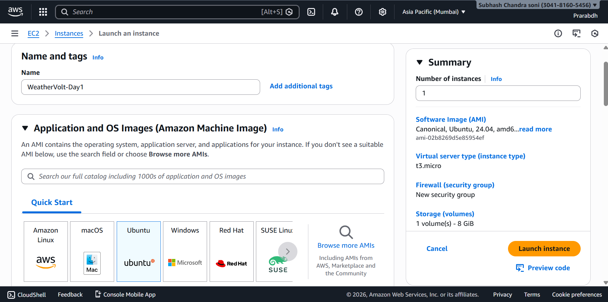
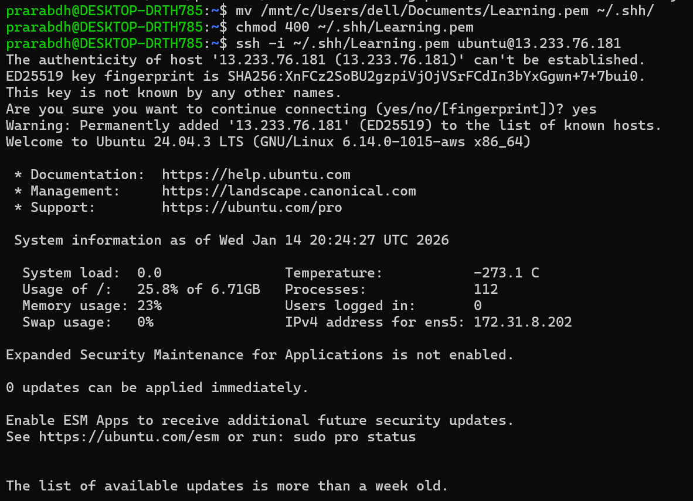

# 🚀 Day 1 - Manual EC2 Setup (Zero Automation)
- Project: Weather Volt – AWS EC2 Hands-on Journey
- Author: Prarabdh Soni

## 🎯 Objective
Launch an Ubuntu EC2 instance manually, configure SSH access, set security rules, install NGINX and host a live Weather Volt landing page.

1. Launch Ubuntu EC2
  - AMI
  - Ubuntu Server 22.04 LTS
  - Instance Type
  - t2.micro
  - Auto Assign Public IP
  - Enabled



2. Create Key Pair
  - Name
  - weathervolt-key.pem
  - Type
  - RSA
  - Format
  - PEM

  ```Bash
  ~/.ssh/weathervolt-key.pem
  ```

  ```Bash
  chmod 400 ~/.ssh/weathervolt-key.pem
  ```

3. Create Security Group
  - Rule
  - Port
  - Source
  - SSH 22 My IP
  - HTTP 80 0.0.0.0/0


4. SSH into Instance

  ```Bash
  ssh -i ~/.ssh/weathervolt-key.pem ubuntu@<PUBLIC-IP>
  ```



5. Install NGINX

  ```Bash
  sudo apt update
  sudo apt install nginx -y
  ```

6. Host Weather Volt Website

  ```Bash
  cd /var/www/html
  sudo rm index.nginx-debian.html
  sudo nano index.html
  ```
  - Website deployed and accessible publicly using EC2 public IP.

7. Access From Browser

  ```
  http://<PUBLIC-IP>
  ```


## 🧠 Concepts Learned

| Topic | Understanding |
| --- | --- |
| AMI | OS template for instance |
| --- | --- | 
| Instance | States pending → running |
| --- | --- |
| Public IP | Changes after stop/start |
| --- | --- |
| Security Groups | Act as firewalls |
| --- | --- |
| SSH | Secure access to server |

## ✅ Result
- Successfully deployed Weather Volt Landing Page on AWS EC2 using manual setup with zero automation. 
