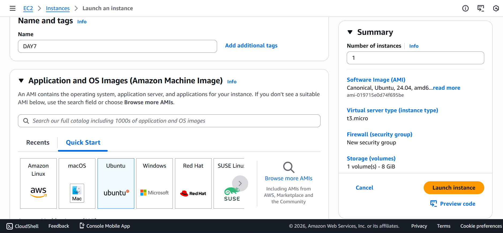
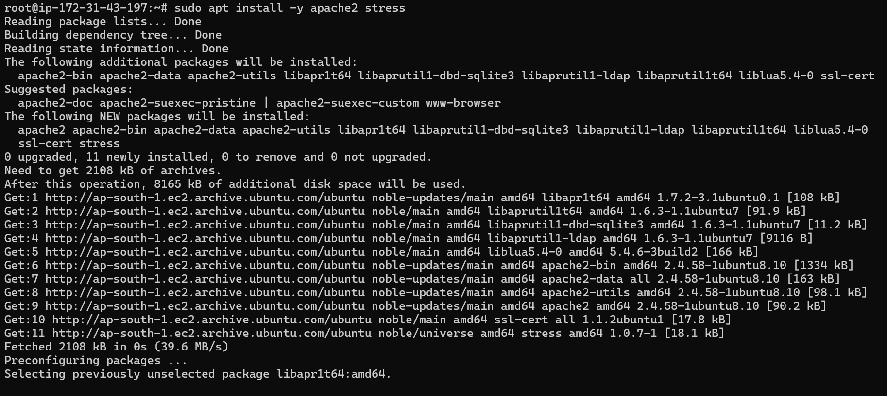
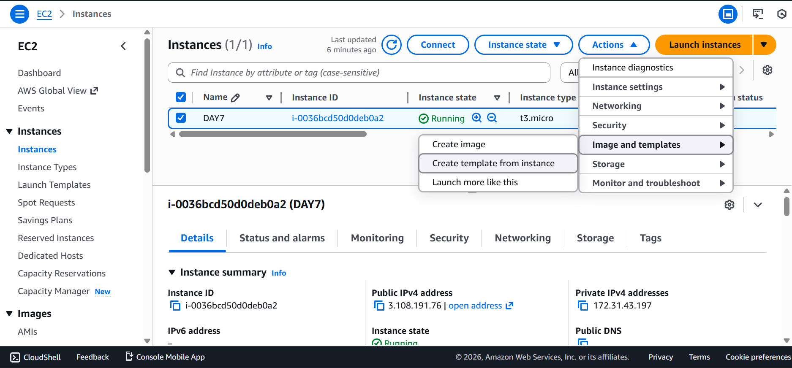
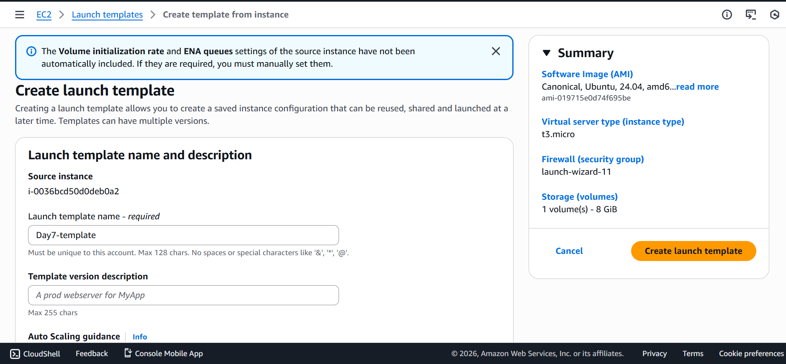
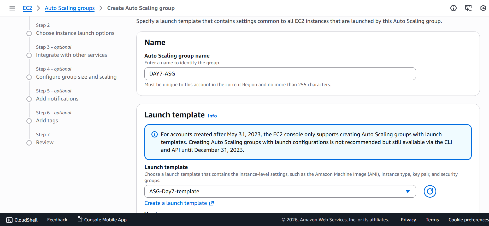
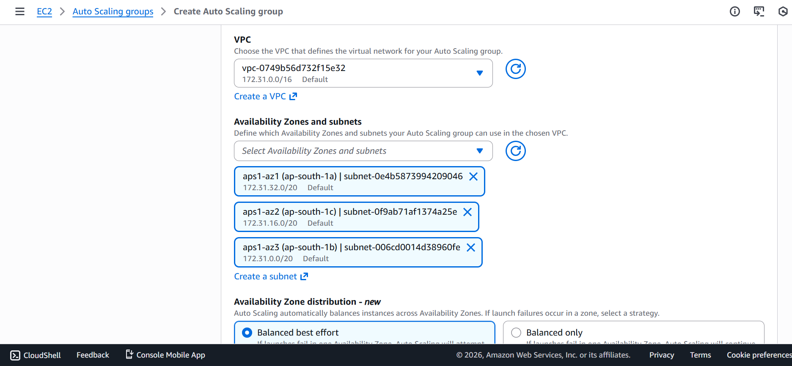
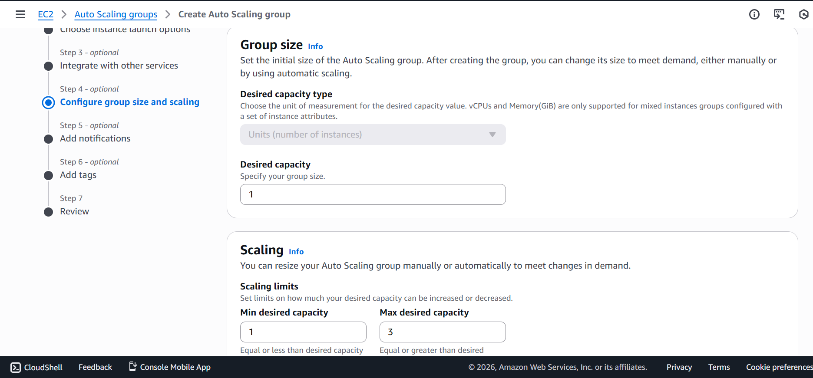
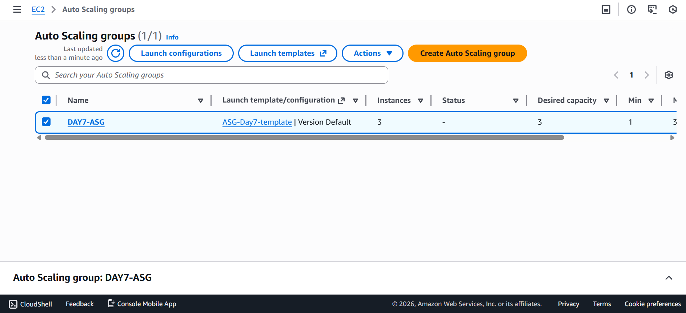
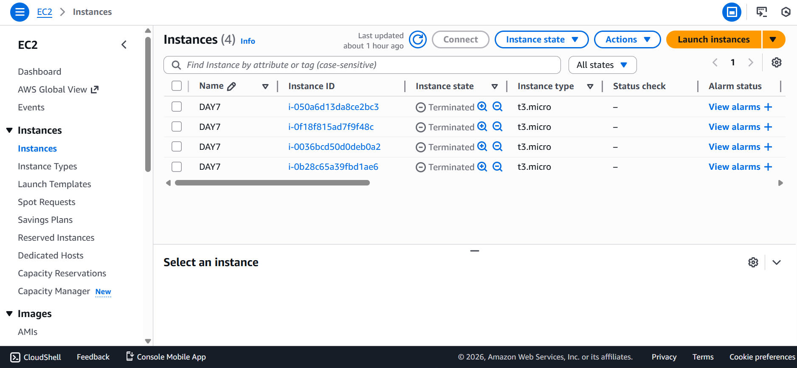

# Day 7 – Auto Scaling Group (ASG)

## 🚀 Objective
Implement automatic scaling of EC2 instances based on CPU utilization using **Launch Templates**, **Auto Scaling Groups**, and **CloudWatch metrics** — simulating real-world production traffic handling.

---

## 🧠 Concepts Covered
- Launch Template
- Auto Scaling Group (ASG)
- CloudWatch Metrics
- Target Tracking Scaling Policy
- Scale Out & Scale In
- Stateless EC2 Architecture

---

## 🏗️ Architecture Overview

| User Load |
| --- |
| ↓ |
| CloudWatch Alarm (CPU > 50%) |
| ↓ |
| Auto Scaling Group |
| ↓ |
| EC2 Instances (Min: 1 → Max: 3) |


---

## 🧩 Implementation Steps

### 1️⃣ Base EC2 Configuration



Installed required packages:

```bash
sudo apt update
sudo apt install -y apache2 stress
```
```bash
echo "ASG Instance - $(hostname)" | sudo tee /var/www/html/index.html
```

```bash
sudo systemctl start apache2
sudo systemctl enable apache2
```




---

### 2️⃣ Launch Template Creation

- Launch Template Name: `Day7-template`




- Configuration:

    - AMI: Ubuntu 22.04
    - Instance Type: t2.micro
    - Key Pair: existing key
    - Security Group: HTTP (80), SSH (22)


- User Data Script:

```bash
#!/bin/bash
apt update
apt install -y apache2 stress
echo "Auto Scaling Instance - $(hostname)" > /var/www/html/index.html
systemctl start apache2
systemctl enable apache2
```


This ensures every new EC2 instance configures automatically during launch.

---

### 3️⃣ Auto Scaling Group Setup




- ASG Configuration:

    - Minimum capacity: 1
    - Desired capacity: 1
    - Maximum capacity: 3
    - Subnets: multiple AZs (recommended)



---

### 4️⃣ Scaling Policy

- Policy Type: 
    - Target Tracking Metric: Average CPU Utilization
    - Target Value: 50%

- AWS automatically:
    - Scales out when CPU > 50%
    - Scales in when CPU < 50%


---

### 5️⃣ CPU Stress Testing

Installed stress utility:

```bash
sudo apt install stress
```

Triggered CPU load:

- ⚠️ Change cpu stress acording to type of instance

```bash
stress --cpu 4
```


---
## 🔍 Observations

- CPU utilization increased above 50%
- CloudWatch detected high usage
- Auto Scaling Group launched new EC2 instance automatically
- Load distributed across instances





- When stress stopped, extra instance terminated automatically

```bash
ctrl + c
```



---

## ✅ Result

- Successfully implemented auto-scaling infrastructure
- Achieved self-healing and elastic compute architecture
- Simulated real-world production traffic handling

## 🧠 Key Learnings

| Component | Purpose |
| --------- | ------- |
| Launch Template |	EC2 blueprint |
| ASG |	Manages instance lifecycle |
| CloudWatch |	Monitors metrics |
| Min Size | Always-on availability |
| Max Size | Cost control |
| Scaling Policy | Automation logic |

---

## 📌 Real-World Use Case

- Used in production systems to:
    - Handle traffic spikes
    - Maintain high availability
    - Optimize cost
    - Prevent manual server management
