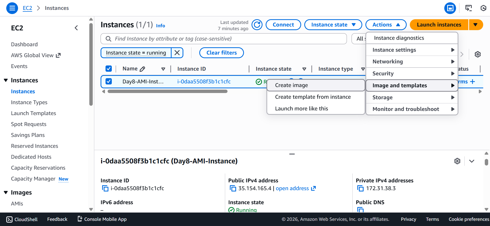
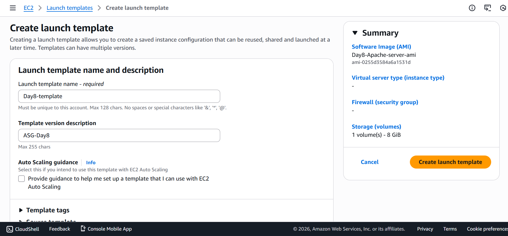
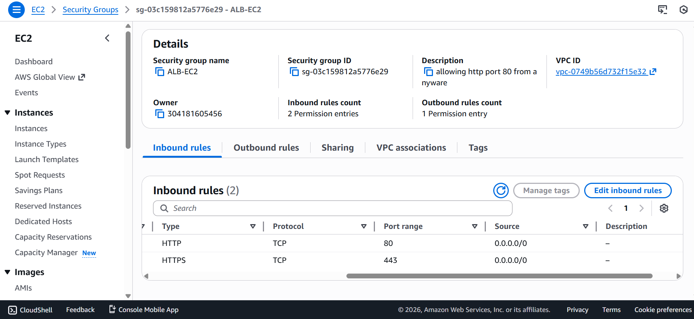
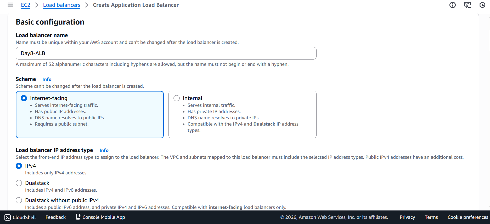
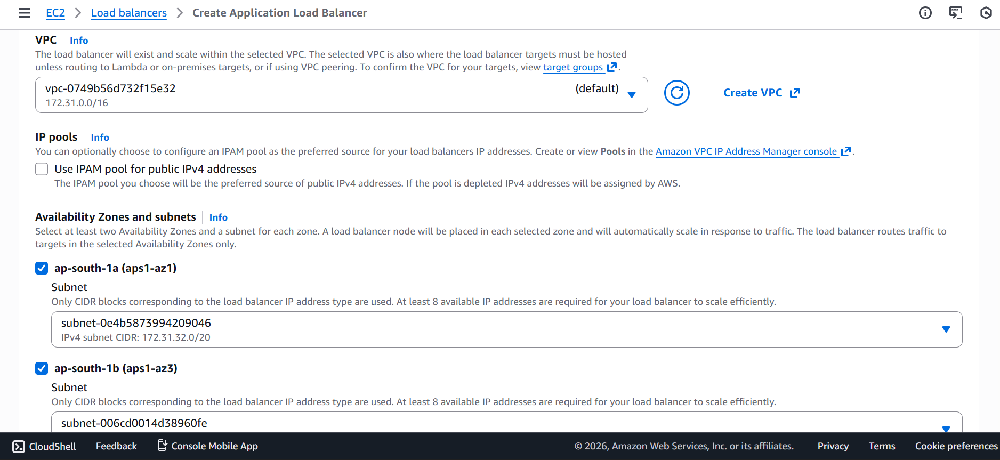
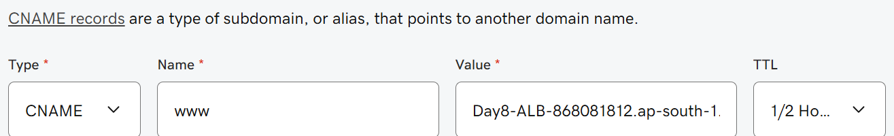
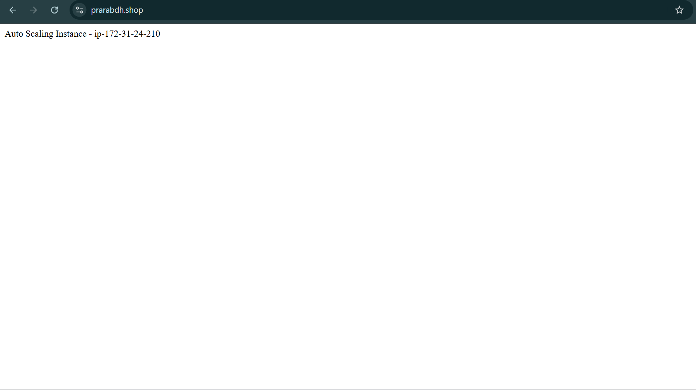

# 📘 Day 8 – Health Checks, Auto Healing & HTTPS (Production Level)

## 🚀 Topic
Health Checks & Instance Replacement using Auto Scaling Group (ASG)

---

## 🎯 Objective

- To understand how AWS automatically:
    - Detects unhealthy EC2 instances
    - Replaces failed instances automatically
    - Handles HTTPS using Application Load Balancer
    - Works with real domain DNS (GoDaddy + AWS)
    - Performs health checks in production
    - This day focuses on real-world cloud engineering behavior, not just theory.

---
## 🧠 Final Architecture
| User |
| --- |
| ↓ |
| Domain (prarabdh.shop / www.prarabdh.shop) |
| ↓ |
| DNS (GoDaddy / Route 53) |
| ↓ |
| Application Load Balancer (HTTPS termination) |
| ↓ |
| Target Group (HTTP health checks) |
| ↓ |
| Auto Scaling Group |
| ↓ |
| EC2 Instances (Apache running on port 80) |


---
## 🔧 Services Used

- EC2
- AMI
- Launch Template
- Application Load Balancer (ALB)
- Target Group
- Auto Scaling Group (ASG)
- AWS Certificate Manager (ACM)
- GoDaddy DNS
- Route 53 (conceptual understanding)

---
## ✅ Correct Production Configuration

Port Flow (VERY IMPORTANT)
| Layer | Protocol | Port |
| --- | ---| ---|
| User → ALB |	HTTPS |	443 |
| ALB → EC2	 | HTTP |	80 |
| Apache on EC2 | HTTP | 80 |

---
## ⚠️ Golden Rule

HTTPS must terminate at ALB — never at EC2.

---
## 🏗️ Implementation Steps

### Step 1: EC2 Setup (AMI Base)

Installed Apache and created a test page:

```bash
sudo apt update
sudo apt install -y apache2
echo "Auto Scaling Instance - $(hostname)" | sudo tee /var/www/html/index.html
sudo systemctl start apache2
sudo systemctl enable apache2
```

Verified via:

`http://EC2-PUBLIC-IP`

Created AMI from this instance.



---
### Step 2: Launch Template

- Used the created AMI
- No user-data required
- Instance type: t2.micro / t3.micro
- Security group attached




---
### Step 3: Security Groups

- ALB Security Group
    - HTTP 80 → 0.0.0.0/0
    - HTTPS 443 → 0.0.0.0/0
- EC2 Security Group
    - HTTP 80 → ALB Security Group only

- SSH 22 → My IP only

⚠️ EC2 must NOT allow public HTTP access as shown below.


---
### Step 4: Target Group

Configuration:-
- Type: Instance
- Protocol: HTTP
- Port: 80
- Health check path: /
- Once EC2 joined → target became healthy.

---
### Step 5: Application Load Balancer

Configuration:-
- Internet-facing
- Attached to minimum 2 public subnets
- Linked with target group

Listeners:

| Listener | Action|
|---|---|
| HTTP 80	| Forward to target group|
| HTTPS 443| Forward to same target group|





---
### Step 6: SSL Certificate (ACM)

- Requested public certificate for:

    - `prarabdh.shop`
    `www.prarabdh.shop`

- DNS validation used

- Certificate attached to ALB HTTPS listener

- After this:
✅ HTTPS started working securely

---
### Step 7: Auto Scaling Group

Configuration:
   - Launch Template selected
   - Target group attached
   - Desired: 1
   - Min: 1
   - Max: 3

ASG automatically registered instances with ALB.


### Step 8: DNS

- Copy DNS provided by Application Load Balancer
- Update DNS record





---
## 🔥 Core Experiment (Day 8 Main Goal)

- Manual Failure Test
- Manually terminated EC2 instance

---
## Observed:

- Target marked unhealthy
- ASG launched new EC2 automatically
- New instance registered to target group
- Website remained accessible

    ✅ This proves Auto Healing works.

---
## ❌ Mistakes Made (Very Important Section)

These mistakes helped understand real production behavior.

### ❌ Mistake 1: Using HTTPS (443) in Target Group


- Target group created on port 443
Why it failed
   - Apache was running on port 80
   - EC2 was not listening on 443
    - Health checks timed out

- Result

    - Target unhealthy
    - 504 Gateway Timeout

#### ✅ Fix

Target group must always be HTTP 80

---


### ❌ Mistake 2: Root Domain Not Working
https://www.prarabdh.shop → works
https://prarabdh.shop → not working


- Reason
    - GoDaddy does not support CNAME on root domain
    - ALB has no static IP

#### ✅ Real production solution:

- Change Nameserver
- Use Route 53 Alias records

---
## 🧠 Key Learnings

- ALB performs SSL termination
- EC2 never handles HTTPS directly
- Target groups must match actual service ports
- Health checks are strict
- DNS propagation takes time
- Root domain and www behave differently
- ASG auto-healing works without downtime

---
## 🏭 Production Best Practices

- Use Route 53 instead of third-party DNS
- Use Alias records for ALB
- Keep EC2 private behind ALB
- Always test failure scenarios
- Never hardcode IPs
- Monitor using CloudWatch

## 📌 Final Result

✅ HTTPS working

✅ ALB routing traffic

✅ Target group healthy

✅ Auto Scaling replacing failed instances

✅ Domain successfully connected

✅ Real-world cloud engineering experience gained