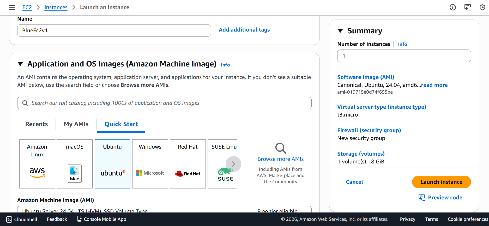
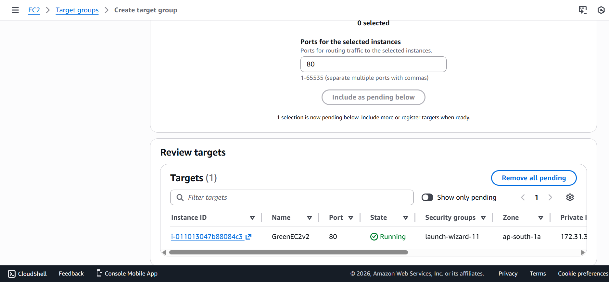
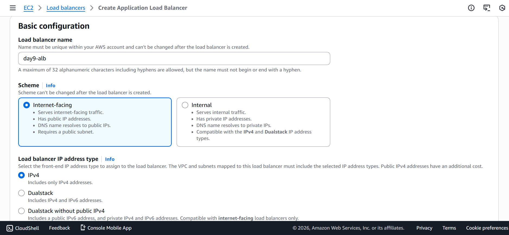
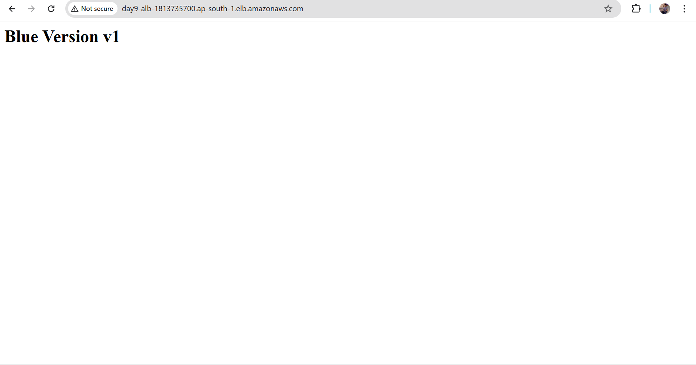
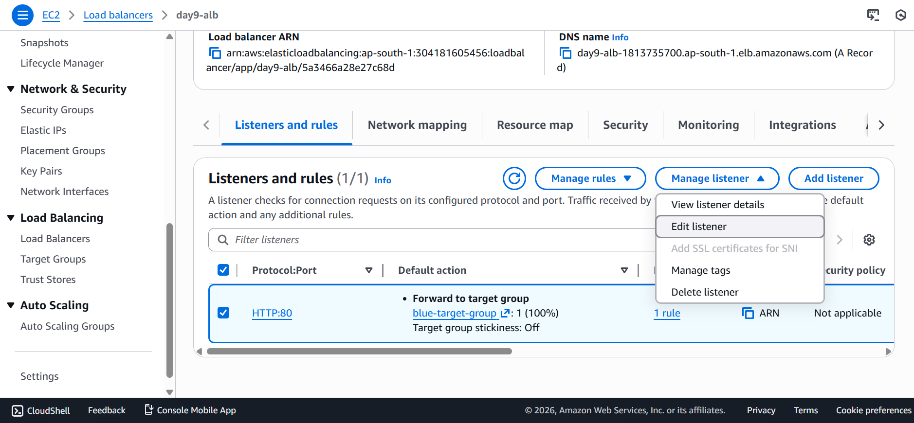

# Day 9 – Blue Green Deployment (Zero Downtime)

## 📌 Objective
Implement **Blue-Green Deployment** on AWS using **Application Load Balancer (ALB)** to deploy new application versions **without downtime** and enable **instant rollback**.

---

## 🧠 What is Blue-Green Deployment?

Blue-Green Deployment is a strategy where:

- **Blue (v1)** → current production environment  
- **Green (v2)** → new application version  

Traffic is switched between environments using a **load balancer**, ensuring:

- Zero downtime
- Safe deployment
- Immediate rollback if failure occurs

---

## 🏗️ Architecture

| Users |
| --- |
| ↓ |
| Application Load Balancer (ALB) |
| ↓ |
| Target Group v1 (Blue) / Target Group v2 (Green) |

Only the ALB listener is modified during deployment.

---

## 🧩 Components Used

- EC2 Instances (Ubuntu)
- Apache Web Server
- Application Load Balancer
- Two Target Groups
- VPC & Public Subnets
- Security Groups

---

## 🔵 Blue Environment (v1)




### Setup
```bash
sudo apt update
sudo apt install apache2 -y
```
```bash
sudo systemctl start apache2
sudo systemctl enable apache2
```

Application

`echo "<h1>Blue Version v1</h1>" | sudo tee /var/www/html/index.html`


This environment serves live production traffic initially.

---
## 🟢 Green Environment (v2)


### Setup

```bash
sudo apt update
sudo apt install apache2 -y
sudo systemctl start apache2
sudo systemctl enable apache2
```

Application

`echo "<h1>Green Version v2</h1>" | sudo tee /var/www/html/index.html`


Green environment is tested privately before switching traffic.

---
## 🎯 Target Groups

| Target Group | Purpose |
| --- | --- |
| tg-blue-v1 | Production environment |
| tg-green-v2 |	New application version |

Health Check Path: `/`

### Blue target group


### Green target group





Traffic is switched only after both target groups show healthy status.

---
## ALB (Application Load Balancer)

Create load balancer with Blue target group



Webpage with Blue V1


---
## 🔁 Traffic Switching (Zero Downtime)

- ALB Listener Rule:
    - Before deployment: `Forward → tg-blue-v1`
    - After deployment: `Forward → tg-green-v2`




This switch happens instantly with no downtime.

---
## 🔄 Rollback Strategy

- If any issue occurs: `tg-green-v2 → tg-blue-v1`

- Rollback time: < 5 seconds
- No EC2 restart required.

---
## ⚠️ Common Mistakes & Warnings

- Do not switch traffic if target group health is unhealthy

- Do not place both versions in the same target group

- Do not stop EC2 instances manually

- Always deploy using ALB listener rules

- Keep Blue environment until Green is fully verified

---
## ✅ Final Outcome

- Zero downtime deployment
- Instant rollback
- Production-grade deployment model

---
## 📚 Key Learning

- Real-world deployment strategy

- Load balancer–driven deployments

- High availability application design

- Professional cloud engineering workflow