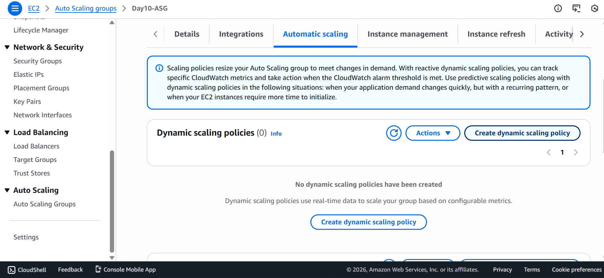
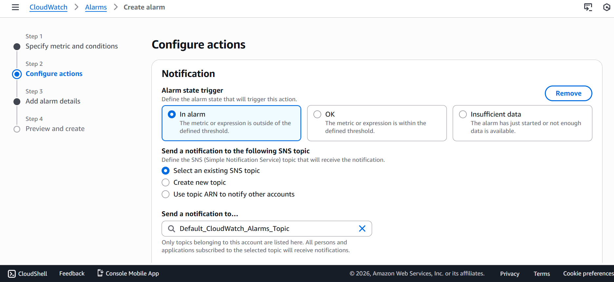
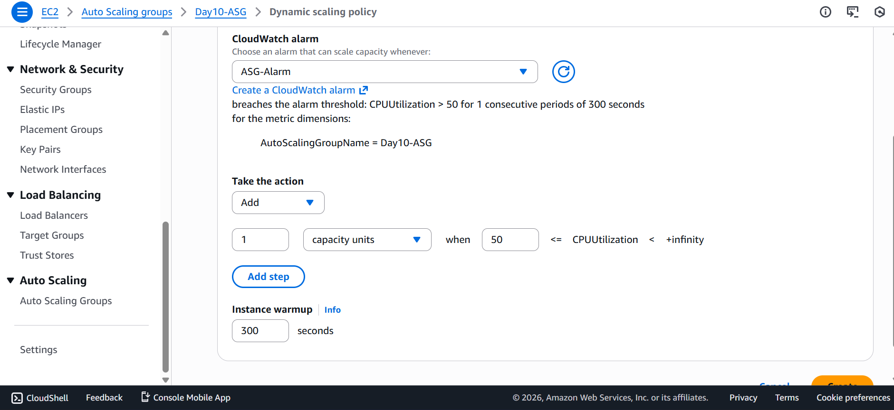

# 📘 Day 10 – Monitoring & Observability (AWS CloudWatch)

## 📅 Day 10 Goal
Understand how production systems are monitored, how issues are detected automatically, and how infrastructure reacts without manual intervention.

This day focuses on visibility, alarms, and automated remediation, not on creating new infrastructure.

---
## 🎯 Objectives

- Understand what monitoring means in real-world systems

- Learn CloudWatch metrics and alarms

- Understand Auto Scaling–CloudWatch integration

- Configure scale-out using CPU threshold

- Learn production-level monitoring practices

---
## 🔁 Revision from Previous Days

- From earlier days, the following infrastructure was already available:
    - EC2 instances
    - AMI (Golden Image)
    - Launch Template
    - Application Load Balancer
    - Target Group
    - Auto Scaling Group

Earlier, CloudWatch was used only to view EC2 metrics graphs.

Day 10 extends this into automated monitoring.

---
## 🧠 What is Monitoring?

- Monitoring means:
    - Continuously observing system health
    - Detecting abnormal behavior
    - Triggering automated actions
    - Alerting engineers only when needed

- Viewing graphs manually is not monitoring.
- Monitoring requires thresholds and automated response.

---
## ☁️ AWS CloudWatch Overview

- CloudWatch provides:
    - Metrics – numerical performance data
    - Alarms – trigger actions based on thresholds
    - Logs – application and system logs
    - Dashboards – single-view system health

---
## 📊 Important CloudWatch Metrics

- EC2 Metrics
    - CPUUtilization
    - NetworkIn / NetworkOut
    - StatusCheckFailed
- ALB Metrics
    - RequestCount
    - TargetResponseTime
    - HTTPCode_Target_5XX_Count
    - HealthyHostCount
- Auto Scaling Metrics
    - DesiredCapacity
    - InServiceInstances
    - Scaling activity history

---
## 🚨 Metrics vs Alarms

|Concept|Description|
|---|---|
|Metrics|Raw performance data|
|Alarms|Rules based on metrics|
|Monitoring|Metrics + alarms + automated action|

## 🔥 Scaling Scenario (Day 10)

- Requirement:
    - Scale out automatically when:
    - CPU > 50%
    - For 5 minutes continuously
- This ensures:
    - High availability
    - Automatic traffic handling
    - No manual intervention

---
## 🛠 Steps Followed

### Step 1: Open Auto Scaling Group

`EC2 → Auto Scaling Groups → Select ASG`

### Step 2: Create Scaling Policy
`Automatic scaling → Create dynamic scaling policy`

### Step 3: Choose Policy Type

`Step scaling (used for learning)`

### Step 4: Configure Scale-Out Policy

|Setting|Value|
|---|---|
|Metric|Average CPU utilization|
|Threshold|> 60%|
|Action|Add 1 instance|
|Cooldown|300 seconds|

AWS automatically created the required CloudWatch alarm.

### Step 5: Verification

- CloudWatch alarm created automatically
- Alarm state transitions:
- OK → ALARM
- Auto Scaling launches new EC2 instance
- Desired capacity increases

This demonstrates self-healing infrastructure.

---
## 🏭 Production-Level Monitoring Concepts

- Monitoring Layers
- Infrastructure Monitoring
- CPU, network, disk, status checks
- Load Balancer Monitoring
- Latency
- 5xx errors
- Healthy targets
- Auto Scaling Monitoring
- Capacity changes
- Scaling activities
- Application Monitoring
- Error rate
- Response time

---
## 🧠 Key Learnings

- Monitoring is not just viewing graphs
- Alarms enable automated detection
- Scaling belongs to Auto Scaling Group
- CloudWatch integrates monitoring with remediation
- Production systems must react automatically

---
## 🎯 Outcome

- Understood real meaning of monitoring
- Learned difference between metrics and alarms
- Configured automated scale-out
- Gained production-level monitoring mindset