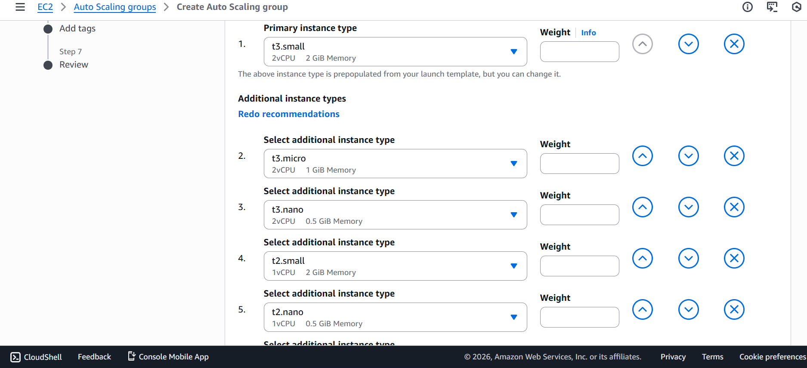
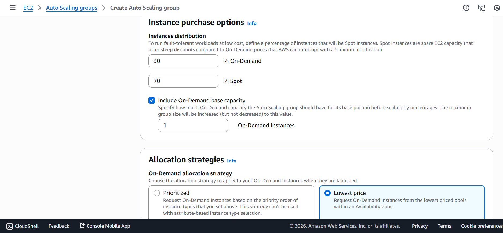
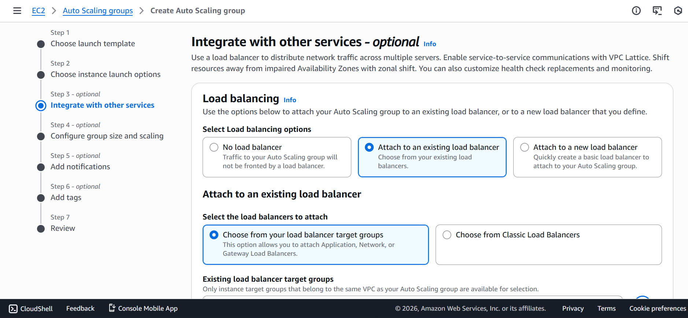
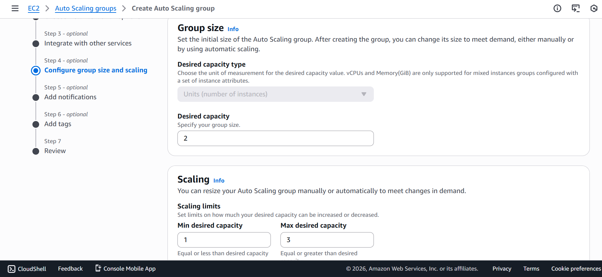
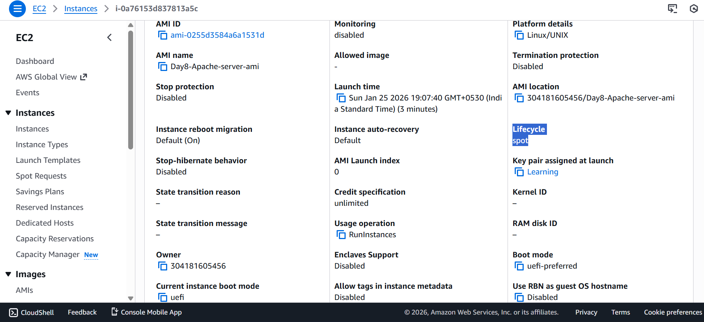
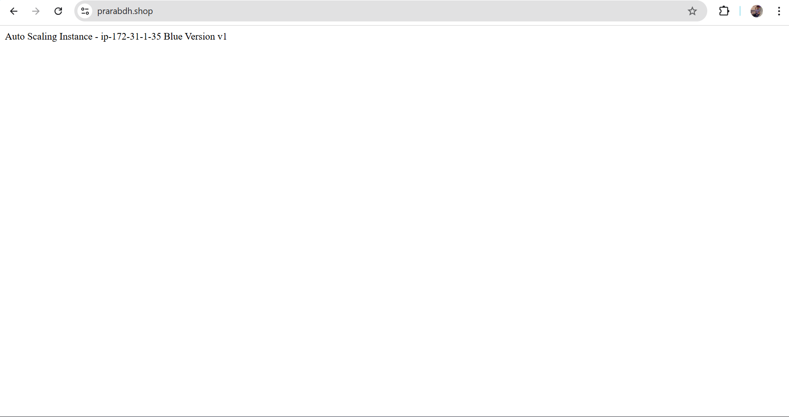

# 📘 Day 11 – Cost Optimization with Spot Instances

## 🎯 Objective
Learn how AWS Auto Scaling Groups (ASG) use Spot Instances to reduce infrastructure cost, and understand real-world behavior when Spot capacity is unavailable.

---
## 🧠 Concepts Covered

- On-Demand Instances
- Spot Instances
- Mixed Instance Policy
- Base On-Demand Capacity
- Allocation Strategy (Lowest Price)
- Spot Capacity Unavailability
- Auto Scaling fallback mechanism

---
## 🏗 Architecture

|User|
|---|
| ↓ |
|Application Load Balancer|
| ↓ |
|Auto Scaling Group|
| ├── On-Demand Instance (base capacity)|
| └── Spot Instance (if available)|

---
## ⚙️ Configuration Used

### Instance Purchase Options

- Instance Types
    - t3.small
    - t3.micro
    - t2.micro
    - (Multiple instance types added to increase Spot availability)

|Option|	Value|
|---|---|
|On-Demand|	30%|
|Spot|	70%|
|Base On-Demand capacity|	1|
| Allocation strategy|	Lowest price|

- Availability Zones `Multiple AZs selected`

- Reason: Spot capacity differs per AZ.

### Attach ELB

### Auto Scaling Group Settings

|Setting|	Value|
|---|---|
|Minimum capacity|	1|
|Desired capacity|	2|
|Maximum capacity|	4|

---
## 🔍 Verification Process

### Instance Details

- Instance → Details → Instance lifecycle
- If Spot, AWS displays:
    - This Spot instance may be interrupted with a two-minute warning.

---
## ⚠️ Important Observation (Real AWS Behavior)

Despite correct Spot configuration:

- All instances launched as On-Demand
- Lifecycle showed normal
- No Spot events appeared in Activity tab (ASG)

- Reason:
    - Spot capacity was unavailable in selected instance pools and Availability Zones.
    - AWS automatically launched On-Demand instances to maintain desired capacity.
    - This behavior is called: `✅ Spot Fallback Mechanism`
    - AWS prioritizes availability over cost.

---
## 🔥 Key Learning (Most Important)

- Configuring Spot instances does not guarantee Spot allocation.
- Spot instances are:
    - Best-effort only
    - Dependent on spare EC2 capacity
    - Region and AZ specific
    - Instance-family dependent

Auto Scaling Group will always maintain desired capacity, even if that means launching On-Demand instances.

---
## 📉 Cost Optimization Strategy (Industry Standard)

- Real production environments use:
    - On-Demand for baseline capacity
    - Spot for burst traffic
    - Auto Scaling + ALB for fault tolerance

This typically reduces compute cost by 60–80%.

---
## ✅ Final Outcome

- ASG configuration verified
- Spot requirement correctly defined
- On-Demand fallback observed
- Real-world AWS behavior understood
- This lab demonstrates production reality, not ideal conditions.