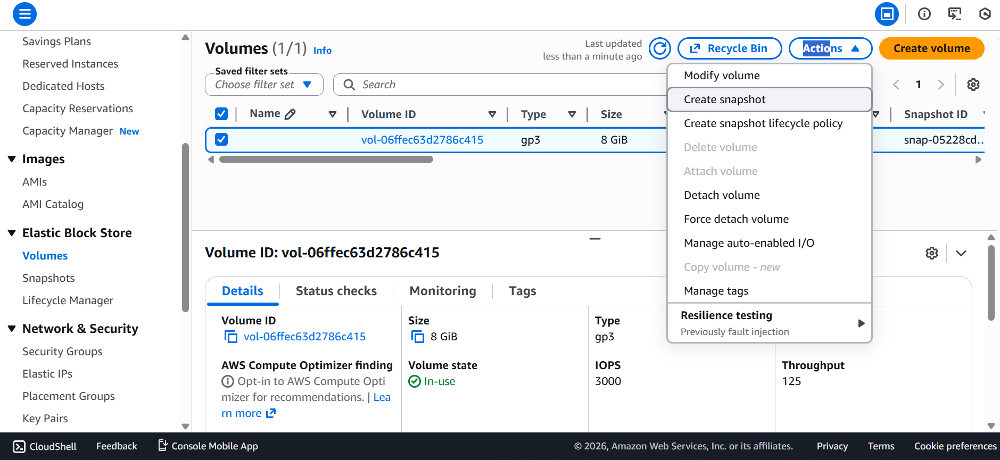
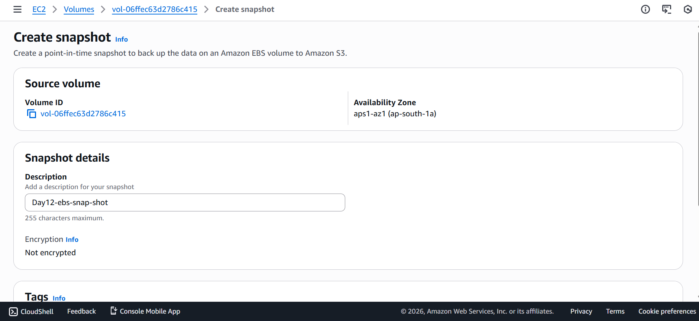
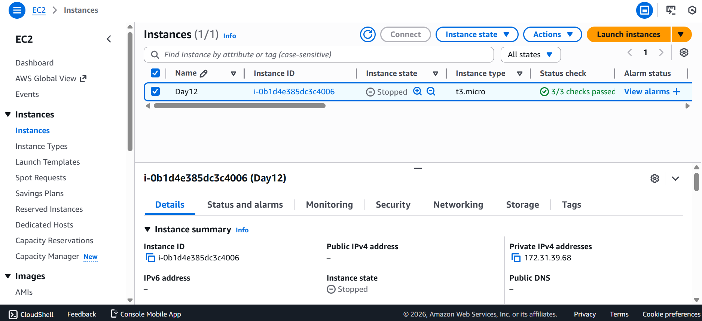
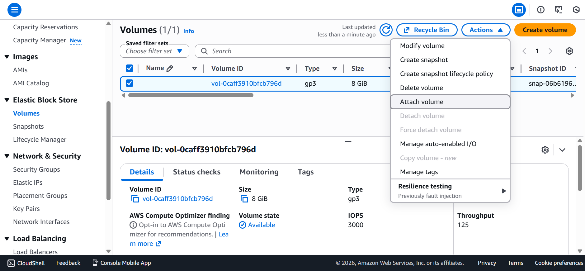
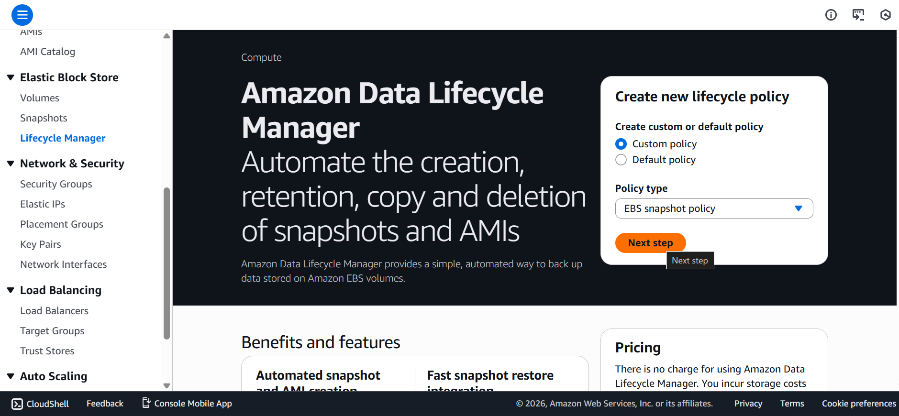
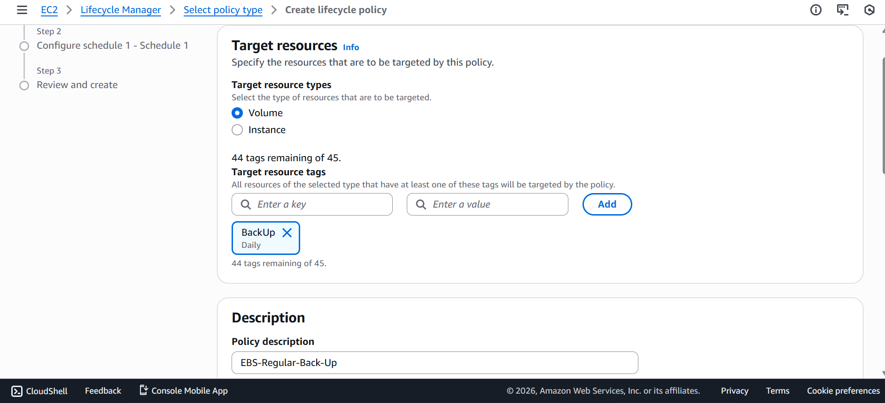
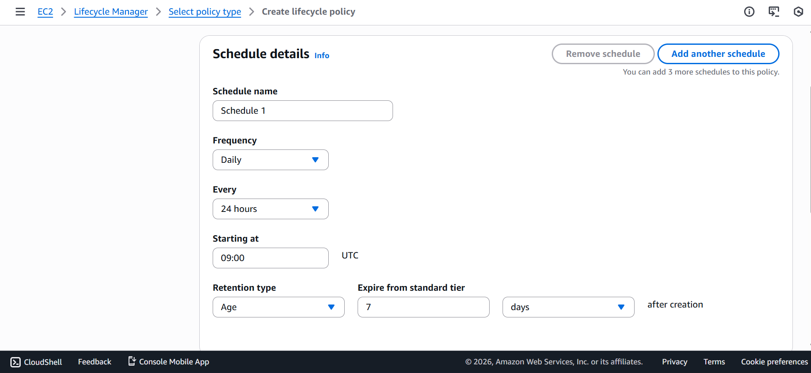

# Day 12 – Crash Simulation & Backup Automation (Disaster Recovery)

## 🎯 Objective

Understand how real production failures happen and how cloud engineers recover systems using:

- Manual disaster recovery
- Snapshot-based restoration
- Automated backup strategy

This day focuses on **Disaster Recovery (DR) thinking**, not just AWS services.

---

## 🔥 Scenario: Root Volume Deleted Accidentally

In real production environments, failures are often caused by:

- Human mistakes
- Incorrect commands
- Wrong resource deletion
- Late-night operations

Today’s simulation recreates one of the most common incidents:
**root EBS volume deletion.**

---

## 🧱 Architecture Before Crash

|EC2 Instance|
|---|
| | |
| └── Root EBS Volume (/dev/xvda) |
| | |
| └── Snapshot (Backup) |


---

## ✅ Part 1: Manual Disaster Recovery

### Step 1: Create Test Data

Connect to EC2 instance and create important data.

```bash
sudo mkdir /important-data
sudo nano /important-data/data.txt
```

Add:

`CRITICAL PRODUCTION FILE`

This simulates real production data.


### Step 2: Create Manual Snapshot

- Go to EC2 → Volumes

- Select root volume

- Actions → Create snapshot

- Name: `day12-root-backup`

This snapshot acts as the recovery point.




### Step 3: Simulate Crash
- Stop Instance first


- Detach root volume
- Delete the root volume

- At this stage:
    - Instance cannot boot
    - SSH access fails
    - OS is missing

This represents a real production outage.

### Step 4: Recovery Using Snapshot

- Go to EC2 → Snapshots

- Select snapshot

- Create new volume

- Choose same Availability Zone

### Step 5: Attach Restored Volume

- Go to EC2 → Volumes

- Attach volume to instance

- Device name: `/dev/xvda`(root name)


(Start instance afterward)

### Step 6: Verify Recovery

- Reconnect to instance and verify data:

```bash
cat /important-data/data.txt
```

If data exists, recovery is successful.


---
## 🧠 Key Learning (Manual DR)

- Root volume is a single point of failure

- EC2 alone does not protect data

- Snapshots are critical for recovery

- Manual recovery is slow and risky

- Disaster recovery must be planned in advance


## 🔥 PART 2: Backup Automation (Enterprise Baseline)

- Manual snapshots are dangerous because:
    - Humans forget
    - Engineers resign
    - Mistakes happen
    - Night-time failures occur

Therefore, enterprises use automated backup policies.

## ✅ Automated Snapshot using Lifecycle Manager (DLM)

### Steps:
- Go to EC2 → Lifecycle Manager
- Create lifecycle policy
- Resource type → EBS volume
- Target → Tag-based backup

- Example tag:
    - `Key: Backup``Value: Daily`


- Schedule:

    `Every 24 hours`

- Retention:

    `Keep last 7 snapshots`





- Add tag to EBS Volumes

## ✅ Benefits

- Fully automatic backups

- No manual dependency

- Consistent snapshot creation

- Safer production environment

- This is the baseline enterprise backup setup.


## 🧠 Final Learning

- Manual recovery teaches fundamentals
- Automation prevents disasters
- Backup strategy is mandatory
- Cloud engineering is about failure planning
- A system is not reliable because it works
- A system is reliable because it can recover.