# Day 13 – Custom VPC Architecture (AWS)

## 📘 Topic
Design and implement a **custom VPC** with **public and private subnets**, **Internet Gateway**, and **NAT Gateway** following **real production architecture**.

---

## 🎯 Objective
To understand how real companies design secure AWS networking instead of using the default VPC.

---

## 🏗️ Architecture Overview

|Internet|
|---|
| | |
|Internet Gateway|
| | |
|Public Subnet|
| | |
| NAT Gateway |
| | |
|Private Subnet|


---

## 🧠 Key Concepts

- Custom VPC
- CIDR planning
- Public Subnet vs Private Subnet
- Internet Gateway (IGW)
- NAT Gateway
- Route Tables
- Secure traffic flow

---

## 📐 CIDR Design

| Resource | CIDR |
|------|------|
| VPC | 10.0.0.0/16 |
| Public Subnet | 10.0.1.0/24 |
| Private Subnet | 10.0.2.0/24 |

---

## 🧩 Components Used

| Component | Purpose |
|--------|--------|
| VPC | Private AWS network |
| Public Subnet | Internet-facing resources |
| Private Subnet | Secure backend resources |
| Internet Gateway | Internet access |
| NAT Gateway | Outbound internet for private subnet |
| Route Tables | Control traffic flow |
| EC2 Instances | Connectivity testing |

---

## 🚀 Step-by-Step Implementation

---

### Step 1: Create Custom VPC

- Service: **VPC**
- Select: `VPC only`
- Name: `Day13-VPC`
- IPv4 CIDR: `10.0.0.0/16`
- Tenancy: Default

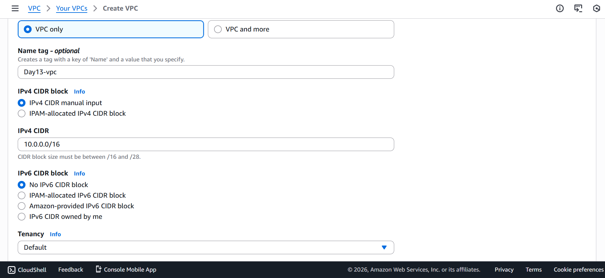
---

### Step 2: Create Subnets

#### Public Subnet
- Name: `Public-Subnet`
- AZ: ap-south-1a
- CIDR: `10.0.1.0/16`

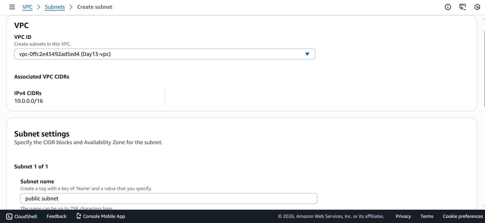
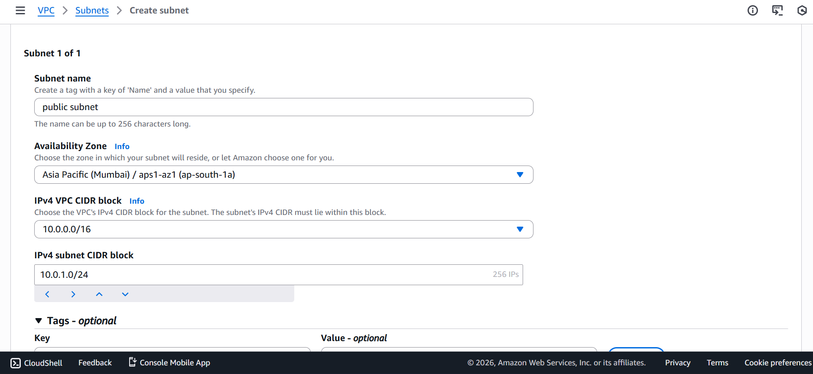


#### Private Subnet
- Name: `Private-Subnet`
- AZ: ap-south-1b
- CIDR: `10.0.2.0/16`

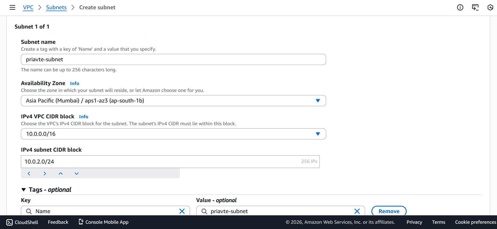


---

### Step 3: Create Internet Gateway

- Name: `Day13-IGW`
- Attach to: `Day13-VPC`

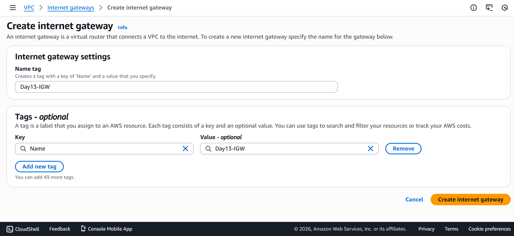
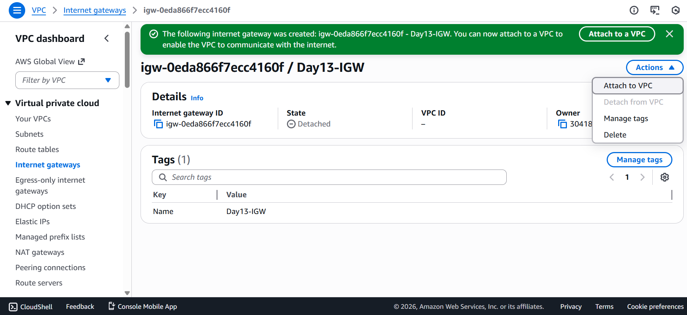

---

### Step 4: Configure Public Route Table

Create route table:
- Name: `Public-RT`
- VPC: `Day13-VPC`

Add route:

| Destination | Target |
|-----------|-------|
| 0.0.0.0/0 | Internet Gateway |

Associate:
- Public Subnet

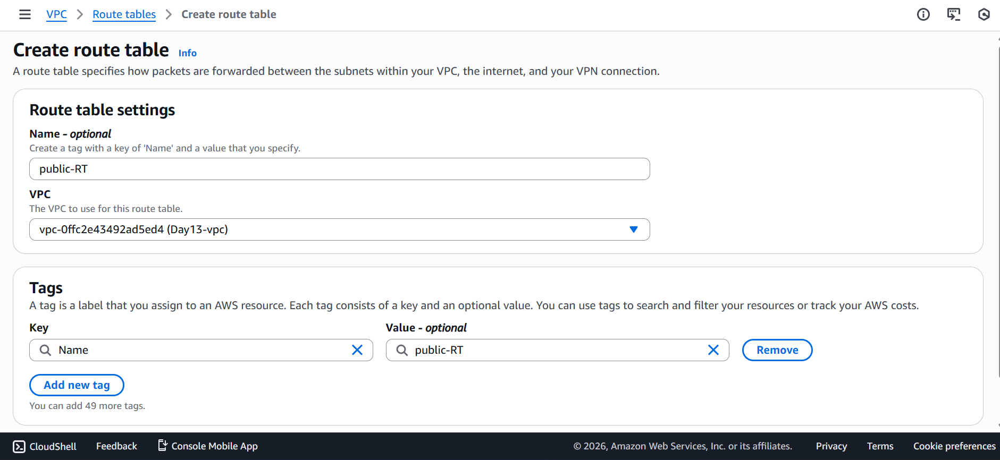
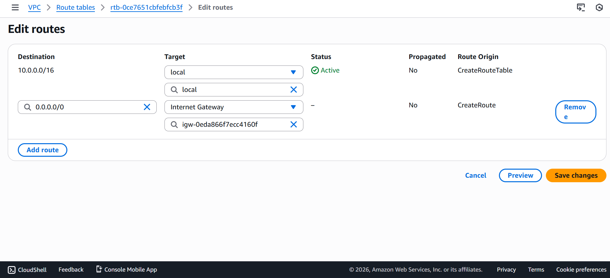


---

### Step 5: Create NAT Gateway

> NAT Gateway must always be created in a **public subnet**.

- Name: `Day13-NAT`
- Subnet: Public-Subnet
- Allocate Elastic IP
- Connectivity type: Public

Wait until status becomes **Available**.


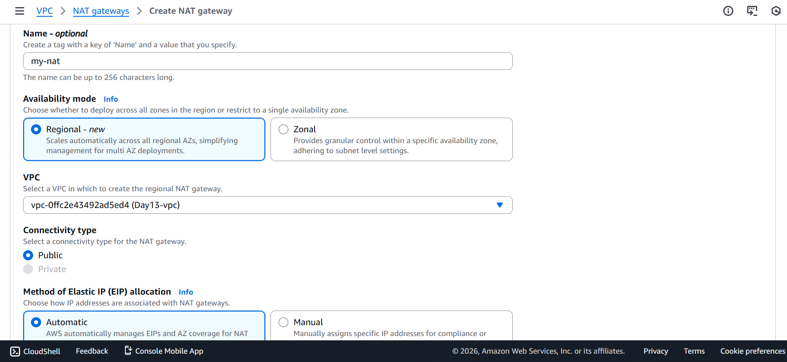
---

### Step 6: Configure Private Route Table

Create route table:
- Name: `Private-RT`
- VPC: `Day13-VPC`

Add route:

| Destination | Target |
|-----------|-------|
| 0.0.0.0/0 | NAT Gateway |

Associate:
- Private Subnet


---

### Step 7: Launch EC2 Instances

#### Public EC2
- Subnet: Public-Subnet
- Auto-assign public IP: Enabled
- Security Group:
  - SSH (22) → My IP
  - HTTP (80) → 0.0.0.0/0

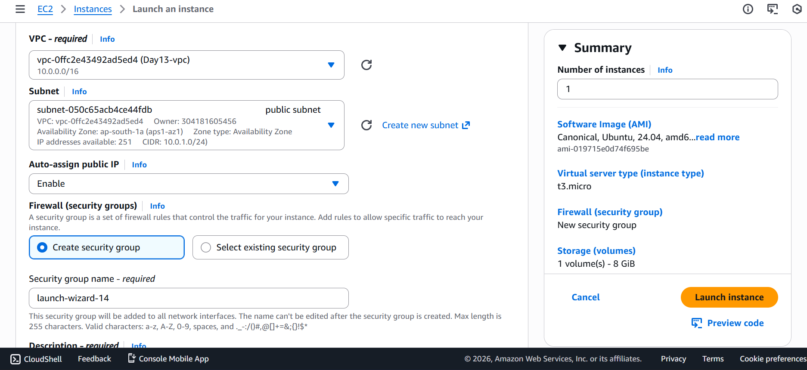
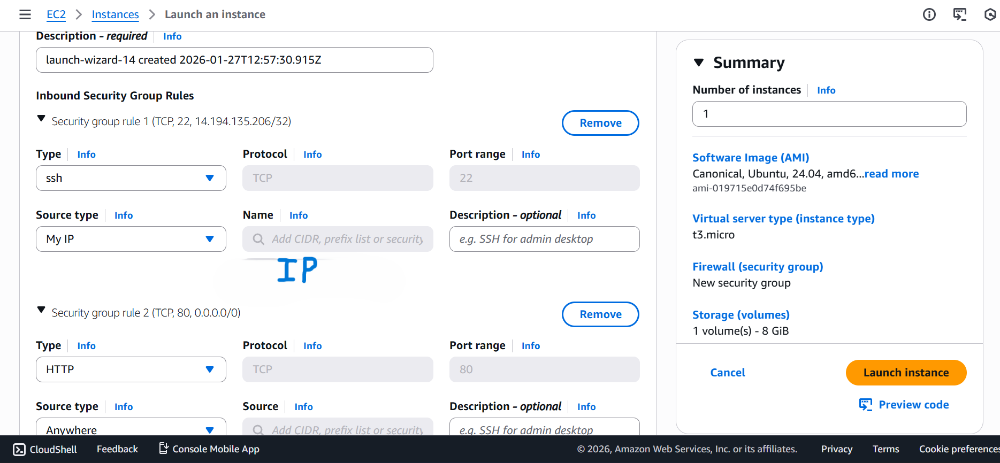

Test:
```bash
sudo apt update
```


✅ Internet access works.

#### Private EC2

- Subnet: Private-Subnet
- Auto-assign public IP: Disabled
- Security Group:
    - SSH allowed only from Public EC2 security group

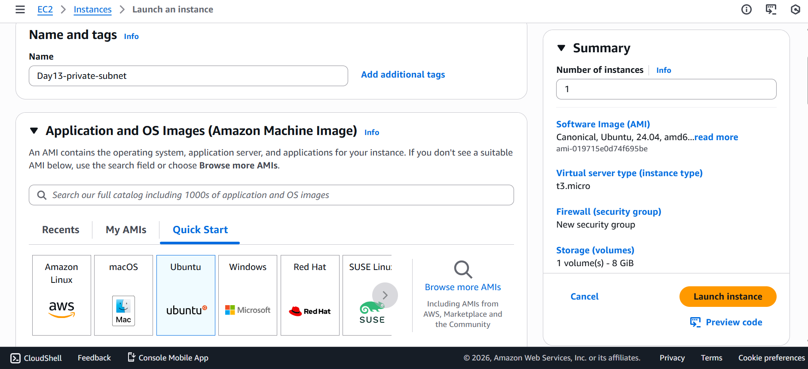
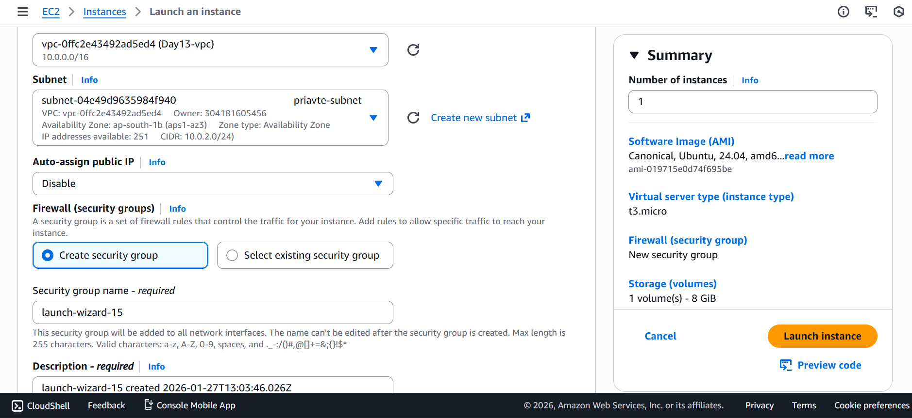
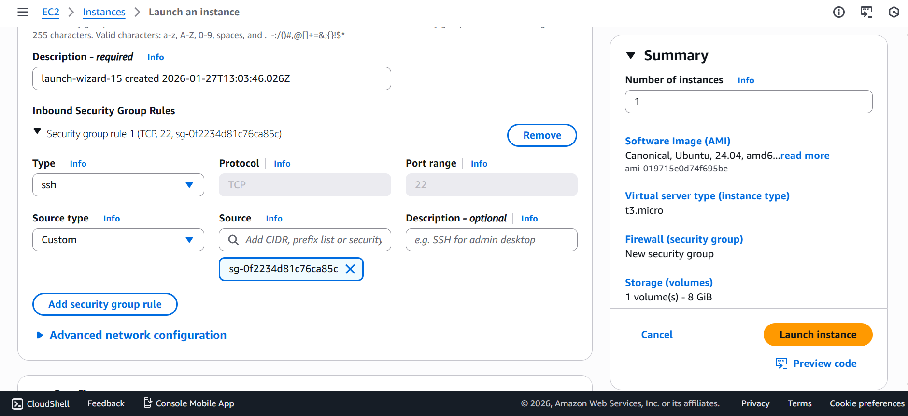

- For ssh into private EC2 firstly ssh into your public EC2 (Bastion Host) and then try ssh into private using .pem key

- For secure copy of .pem in Public EC2 to connect with private EC2 use below command

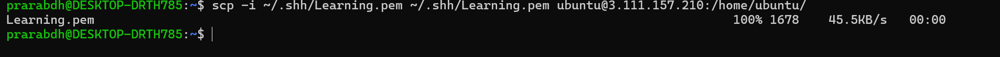
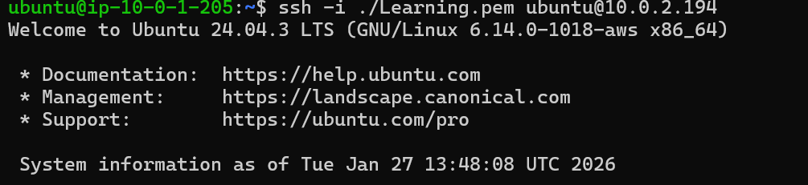

Test:
```bash
sudo apt update
```

 ✅ Internet works through NAT Gateway

 ❌ No direct internet inbound access


---
## 🔁 Traffic Flow Explanation

- Public Subnet
`Internet → IGW → Public Subnet`

- Private Subnet
`Private EC2 → NAT Gateway → IGW → Internet`

- Inbound internet traffic cannot reach private subnet, ensuring security.

## 🔐 Production Best Practices

- Keep application servers in private subnet
- Use Bastion Host for SSH access
- Place Load Balancer in public subnet
- Never expose databases publicly
- Use NAT Gateway for outbound access only

## ❌ Common Mistakes

- Creating NAT Gateway in private subnet

- Forgetting route table association

- Using IGW in private route table

- Assuming private subnet has no internet access at all

## ✅ Final Outcome

- Successfully created a custom VPC

- Implemented public and private subnet architecture

- Enabled secure outbound internet using NAT Gateway

- Understood real-world AWS networking design