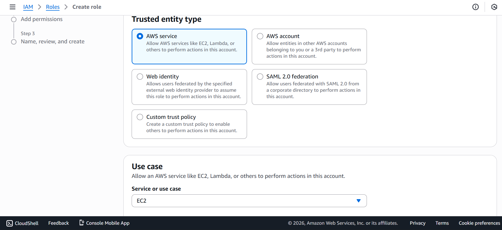
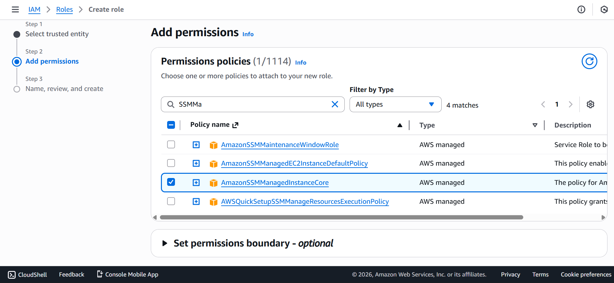
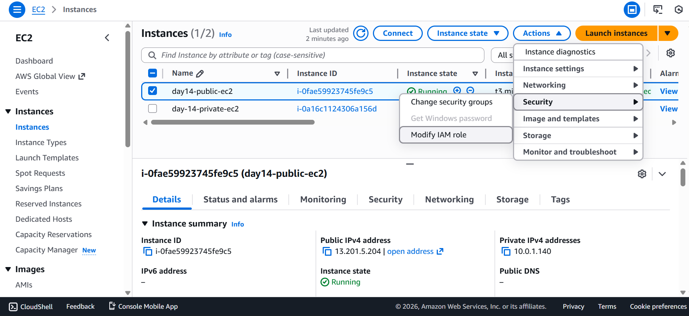
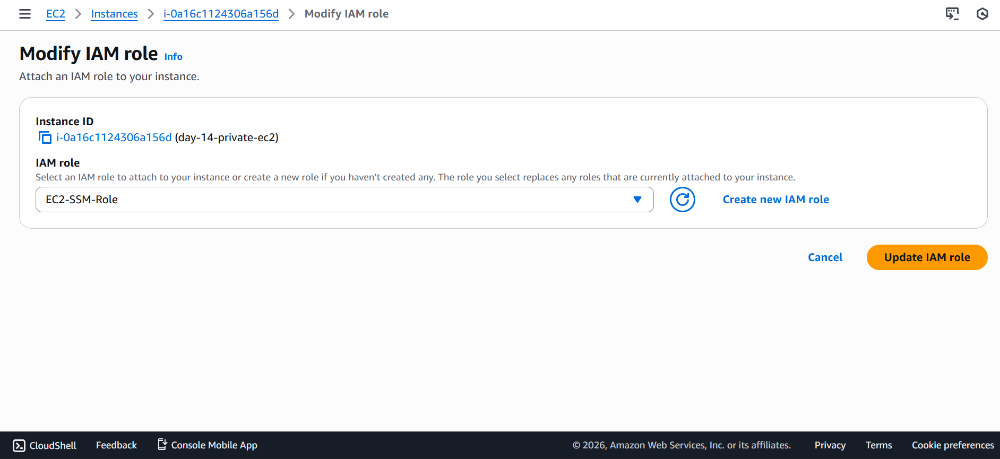
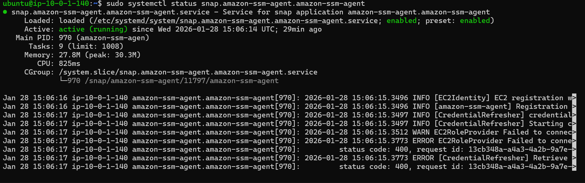
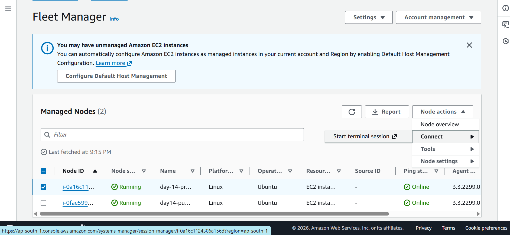
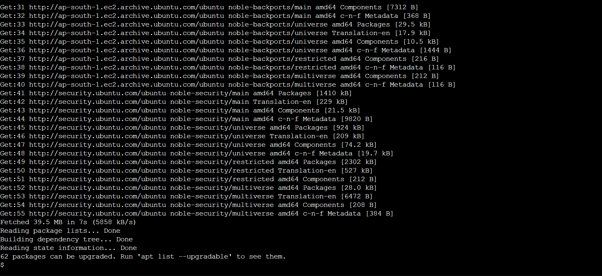

# 🟦 Day 14 – AWS SSM Session Manager (Zero SSH Architecture)

## 🎯 Objective
Implement **AWS Systems Manager Session Manager** to access EC2 instances **without SSH**, **without Bastion Host**, and **without inbound ports**, following AWS-recommended security architecture.

---

## 🚫 Problems With Traditional SSH

- Requires port **22 open**
- Needs **key pair management**
- Bastion host increases attack surface
- No centralized audit logging
- Difficult access revocation

Enterprises avoid this model.

---

## ✅ AWS Recommended Solution
**AWS Systems Manager – Session Manager**

Provides:
- IAM-based access
- No inbound traffic
- Encrypted sessions
- Full audit trail
- Works in private subnets

---

## 🧠 Final Architecture

| User (IAM Auth) |
| ---|
| | |
| AWS Console / CLI |
| | |
| SSM Session Manager |
| | |
| Private EC2 (No Public IP) |


---

## 🔐 Key Features

| Feature | Status |
|------|------|
| SSH | ❌ |
| Bastion Host | ❌ |
| Public IP | ❌ |
| Inbound Ports | ❌ |
| IAM-based login | ✅ |
| CloudTrail logging | ✅ |
| CloudWatch session logs | ✅ |

---

## 🧩 Prerequisites

- Day 13 **VPC**
- EC2 instance (Amazon Linux 2 / Ubuntu)
- Instance in **private subnet**
- NAT Gateway OR VPC Interface Endpoints
- IAM permissions

---

## 🔧 Implementation Steps

### Step 1 – Create IAM Role for EC2

- Service: `EC2`
- Policy attached: `AmazonSSMManagedInstanceCore`
- Role name: `EC2-SSM-Role`



---

### Step 2 – Attach IAM Role to EC2

> EC2 → Instance → Actions → Security → Modify IAM role

- Attach: `EC2-SSM-Role`




---
### Step 3 – Verify SSM Agent

#### Amazon Linux 2
```bash
sudo systemctl status amazon-ssm-agent
```

**OR**

#### Ubuntu
```bash
sudo snap install amazon-ssm-agent --classic
sudo systemctl start snap.amazon-ssm-agent.amazon-ssm-agent
```




Ensure agent is running.

---
### Step 4 – Verify Outbound Connectivity

- Private EC2 must reach AWS SSM endpoints via:
    > NAT Gateway (learning stage)
     > OR VPC Interface Endpoints (enterprise stage)


---
### Step 5 – Confirm Managed Instance

AWS Systems Manager → Fleet Manager → Managed instances


- Instance should appear as: `Online`



---
### Step 6 – Connect Using Session Manager

Systems Manager → Session Manager → Start session


- No SSH keys required.



---
### Step 7 – Remove SSH Access

- Security Group:
    - Remove inbound port 22

- Instance remains accessible via SSM.

---
## 🔐 Security Benefits

- Zero inbound architecture

- IAM-controlled access

- Easy access revocation

- No key pair leakage

---
## 🧠 Learnings

- SSM works at instance level

- IAM role is mandatory

- Outbound connectivity is required

- Bastion hosts are transitional

- SSM is AWS-preferred access model