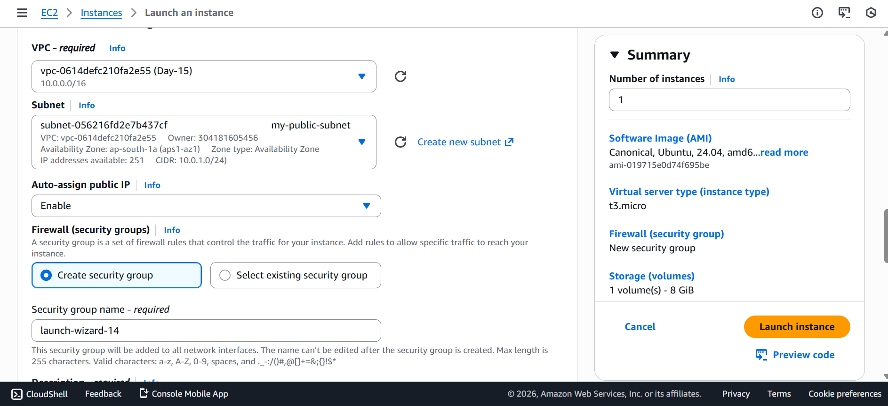
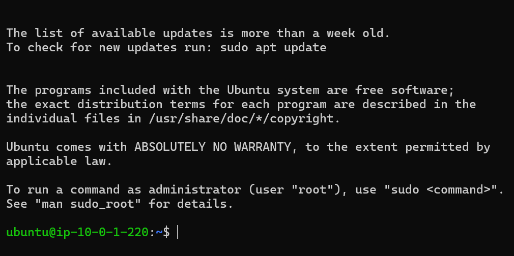
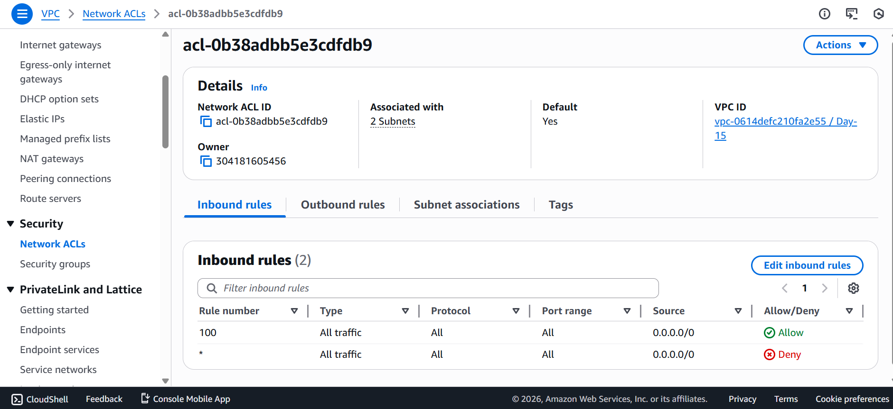
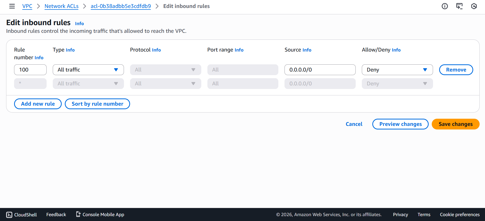
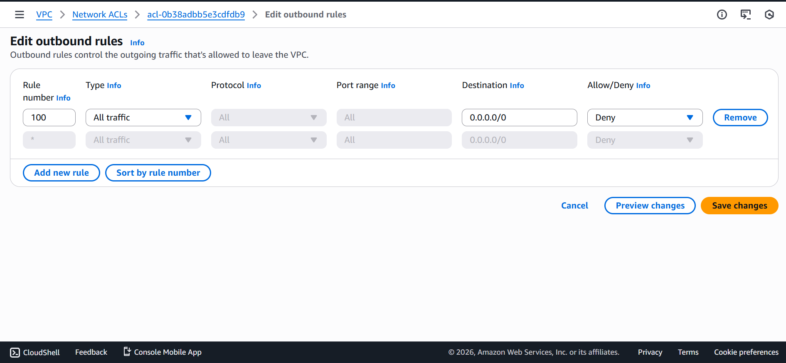
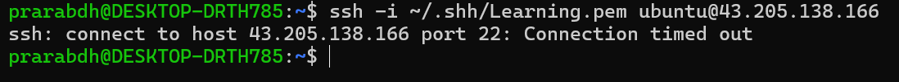

# 🟦 Day 15 – Security Groups vs Network ACL (NACL)

## 🎯 Objective
Understand the difference between **Security Groups** and **Network ACLs** by practically **blocking ports using NACL** and testing real-time behavior.

This lab demonstrates how traffic is filtered at the **subnet level** before reaching the EC2 instance.

---

## 🧠 Key Concepts

### Security Group
- Works at **EC2 instance level**
- **Stateful**
- Supports **ALLOW rules only**
- Automatically allows return traffic

### Network ACL (NACL)
- Works at **subnet level**
- **Stateless**
- Supports **ALLOW and DENY rules**
- Requires **both inbound and outbound rules**
- Rules are evaluated in **ascending order**

---

## ⚙️ Architecture Overview

| Internet |
| --- |
| | |
| Route Table |
| | |
| Subnet (NACL applied) |
| | |
| EC2 Instance |


---

## ✅ Prerequisites
- One public EC2 instance
- EC2 must be reachable via SSH
- Instance inside a public subnet
- Key pair available on local machine


---

## 🧪 Step 1: Verify SSH Connectivity

From local machine:

```bash
ssh -i key.pem ubuntu@<public-ip>
```

✅ SSH should connect successfully.



This confirms baseline connectivity.

---
## 🧪 Step 2: Identify Network ACL

- Go to VPC → Network ACLs

- Select the NACL associated with your subnet

- Note the NACL ID and subnet association

(Default NACL allows all traffic.)



---
## 🧪 Step 3: Block SSH Using NACL (Inbound)

Add an inbound rule:

|Rule No	|Type|	Protocol|	Port|	Source|	Action|
| --- |---| ---| ---| ---| ---|
|100|	SSH|	TCP|	22|	0.0.0.0/0|	DENY|

Ensure rule number is lower than ALLOW rules.


---
## 🧪 Step 4: Block SSH Using NACL (Outbound)

- Because NACL is stateless, outbound rules are mandatory.

Add outbound rule:

|Rule No	|Type	|Protocol	|Port	|Destination	|Action|
| --- | --- | --- | --- | --- | --- |
|100	|SSH	|TCP	|22	|0.0.0.0/0|	DENY|


---
## 🧪 Step 5: Test After Blocking

- From local machine:

```bash
ssh -i key.pem ubuntu@<public-ip>
```

### ❌ Result:
- Connection timed out
- This proves NACL blocked the traffic before it reached EC2.



---
## 🧪 Step 6: Verify Security Group

- Security Group still allows:
    - Inbound: SSH (22) from your IP

- Yet access fails because:

- Network ACL rules are evaluated before Security Groups.

---
## 🔓 Step 7: Restore Access

To regain access:
    - Delete DENY rules
OR
    - Change rule number to lower priority

Then test again:

```bash
ssh -i key.pem ubuntu@<public-ip>
```

✅ SSH access restored.

---
## 🧠 Final Comparison

|Feature	|Security Group	|Network ACL|
| --- | --- | --- |
|Level|	Instance|	Subnet|
|Type|	Stateful|	Stateless|
|Rules|	Allow only|	Allow & Deny|
|Rule Order|	Not required|	Mandatory|
|Return Traffic	|Automatic|	Must define|
|Scope|	Instance-level|	Subnet-level|

---
## 💡 Real-World Use Cases

- Security Groups
    - Application-level security
    - EC2 ↔ ALB ↔ RDS communication
    - Day-to-day access control

- Network ACL
    - Block malicious IP ranges
    - Emergency subnet lockdown
    - Compliance and audit control
    - Network-level firewall

---
## ✅ Learning Outcome
- Understood difference between SG and NACL
- Learned stateless vs stateful filtering
- Practically blocked SSH using NACL
- Observed real network-level traffic denial