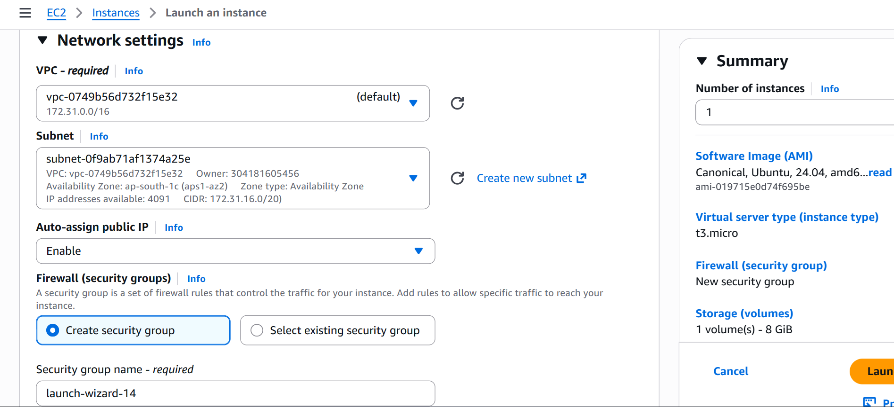
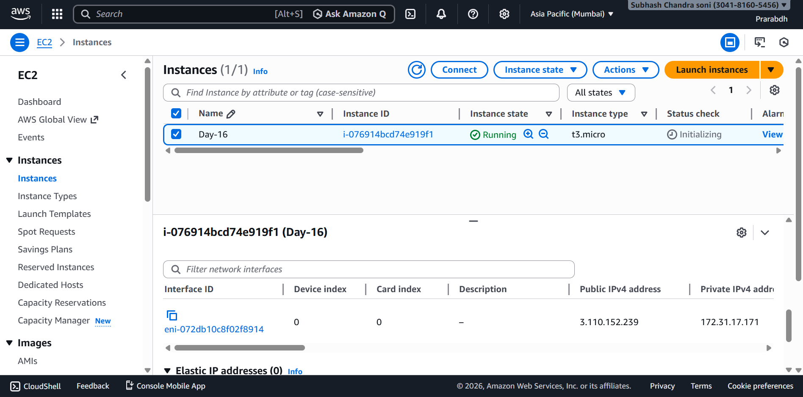
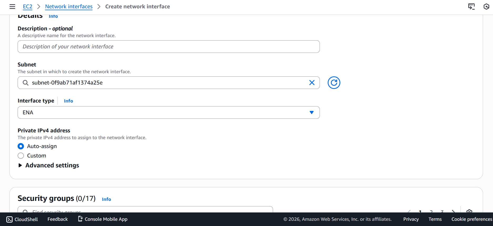
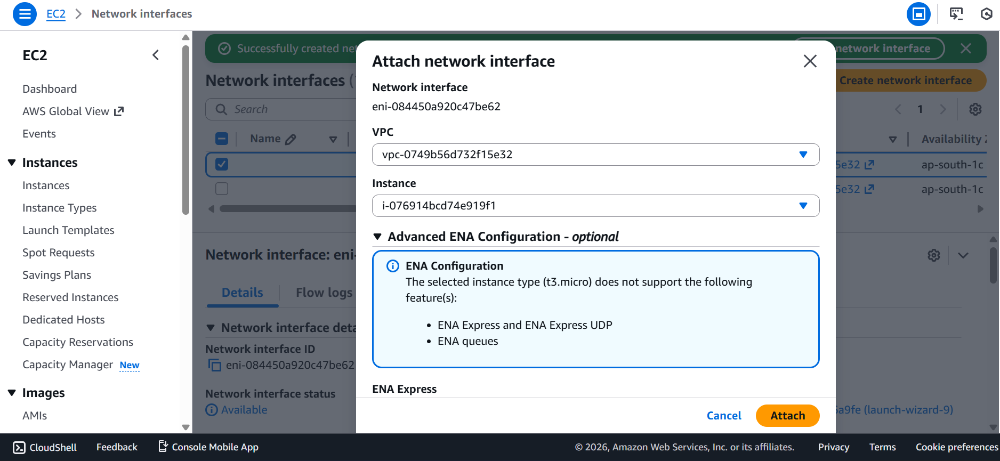
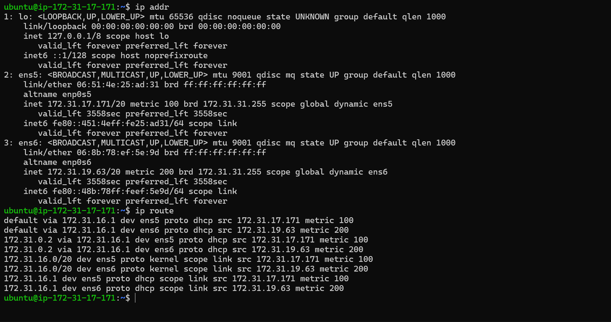
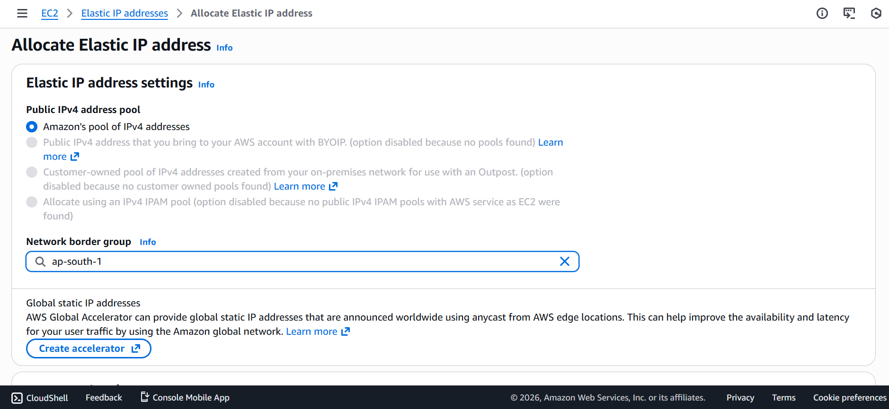
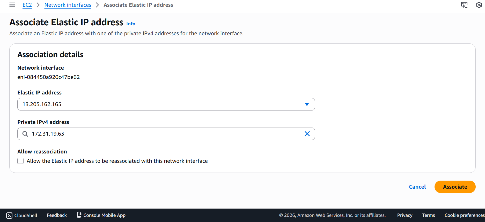
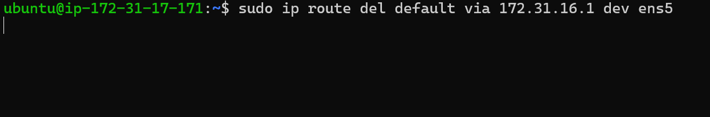
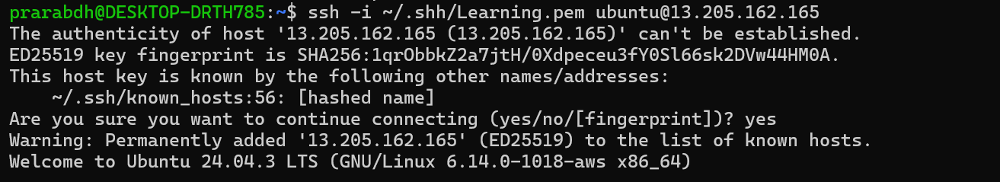
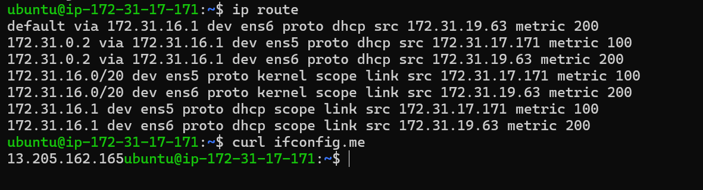

# 🟦 Day 16 – Elastic Network Interface (ENI)

## 🎯 Objective
- Understand Elastic Network Interface (ENI)
- Attach a second ENI to an EC2 instance
- Identify Linux network interfaces
- Understand routing behavior
- Learn why secondary ENI is not reachable by default
- Fix connectivity using Elastic IP

---

## 🔷 What is an ENI?

An **Elastic Network Interface (ENI)** is a virtual network card in AWS that can be attached to an EC2 instance.

Each ENI has:
- Private IPv4 address
- MAC address
- Security Groups
- Subnet binding
- Optional Elastic IP

An EC2 instance can have **multiple ENIs** depending on instance type.

---

## 🧠 Why ENI is Important

ENI allows:
- Network isolation
- Traffic switching
- Failover architecture
- Blue–Green deployment
- Zero-downtime recovery

In production:
- Compute (EC2) and Networking (ENI) are decoupled.

---

## 🏗 Architecture

| EC2 Instance|
| --- |
| │ |
| ├── eth0 → Primary ENI (default) |
| │ |
| └── eth1 → Secondary ENI (attached manually) |


Linux naming (Ubuntu):
- eth0 → ens5
- eth1 → ens6

---

## ⚠️ Important Rules

- Primary ENI cannot be detached
- Secondary ENI can be attached/detached
- ENI must be in the same VPC
- ENI must be in the same Availability Zone
- Auto-assign public IP works only for primary ENI

---

## 🪜 Step-by-Step Procedure

---

### ✅ Step 1: Launch EC2 Instance

- AMI: Ubuntu 22.04
- Instance type: t2.micro
- VPC: Default or custom
- Subnet: Any public subnet
- Auto-assign Public IP: Enabled
- Security Group:
  - SSH (22)
  - HTTP (80)

This creates **primary ENI automatically**.



---

### ✅ Step 2: Create Second ENI

Go to:

EC2 → Network Interfaces → Create network interface

- Same VPC as EC2
- Same subnet / same AZ as EC2
- Attach security group allowing SSH

Create ENI.



---

### ✅ Step 3: Attach ENI

- Select ENI
- Actions → Attach
- Choose EC2 instance
- Device index: `1`

AWS mapping:
    - device index 0 → eth0
    - device index 1 → eth1


---

### ✅ Step 4: Verify Inside EC2

SSH into EC2 and run:

```bash
ip addr
```


#### Output shows:

|AWS|	Linux name|	IP|
|---|---|---|
|eth0|	ens5|	172.31.17.171|
|eth1|	ens6|	172.31.19.63|

This confirms second ENI is attached successfully.

---
## 🔍 Routing Check

```bash
ip route
```

Example output:
    - default via 172.31.16.1 dev ens5 metric 100
    - default via 172.31.16.1 dev ens6 metric 200


#### Explanation:

- Lower metric = higher priority
- ens5 is primary interface
- ens6 is standby interface
- Linux automatically prefers the primary ENI.


---
## 🔥 Important AWS Concept

- Auto-assign public IP works only for primary ENI

- Secondary ENIs never get public IP automatically

- Secondary ENIs require Elastic IP


---
## Attach Elastic IP

- Steps:
    - EC2 → Elastic IPs
    - Allocate Elastic IP
    - Associate Elastic IP
    - Choose Network Interface
    - Select secondary ENI

    
    
- Now ENI has:
    - Private IP
    - Public Elastic IP
    - SSH works using Elastic IP.


---
## ⚠️ Routing Warning

- Running this command while connected via primary ENI:

```bash
sudo ip route del default via 172.31.16.1 dev ens5
```


will disconnect SSH immediately.

- Reason:

    - You removed the route used by your active SSH session
    - This is not a crash — only a network disconnect.

## Verification

- SSh with elastic ip in network interface




---
## 🧠 Best Practice

- In real production:
    - Engineers do NOT change Linux routing manually

- Traffic switching is done using:
    - Elastic IP
    - ENI reassociation
    - Load Balancer
    - Route 53
    - Linux routing is mainly for learning and debugging.


---
## ✅ Day 16 Completed ✅

✔ Attached second ENI

✔ Verified Linux interfaces

✔ Understood routing metrics

✔ Learned private vs public IP behavior

✔ Learned real enterprise networking design