# 🟦 Day 17 – Route Tables Debugging (AWS)

## 🎯 Objective
Understand how AWS Route Tables control network traffic by **intentionally breaking internet access** and **fixing it manually**, just like real production incidents.

---

## 🔹 Prerequisites
- Custom VPC
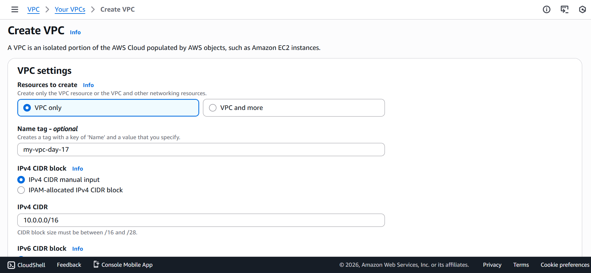
- Public Subnet
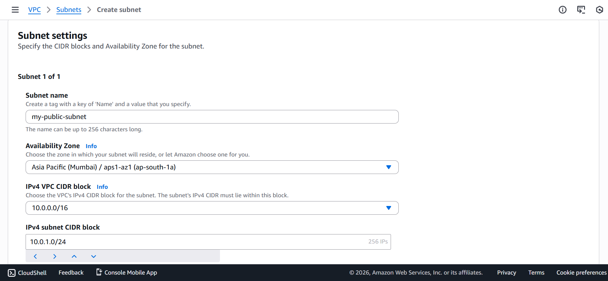
- Internet Gateway (IGW) attached to VPC
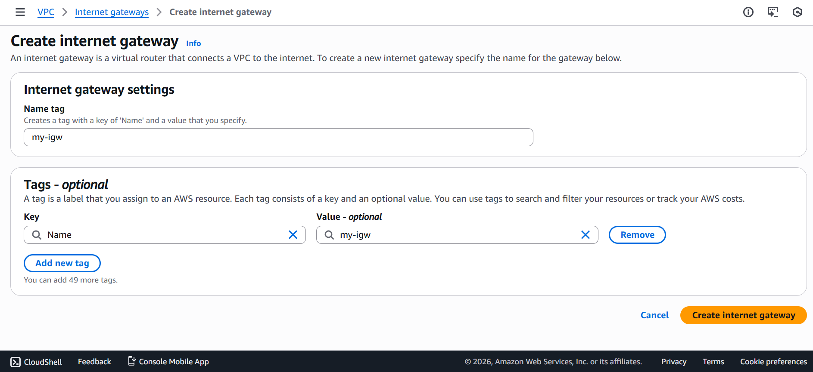
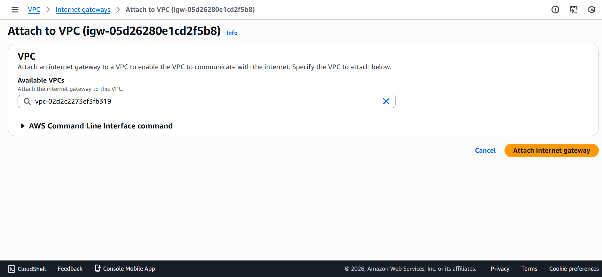
- Route Table
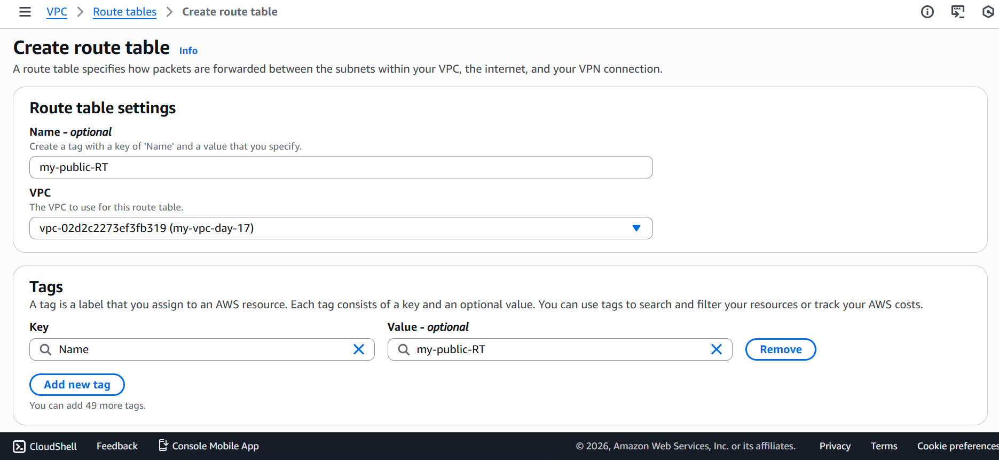
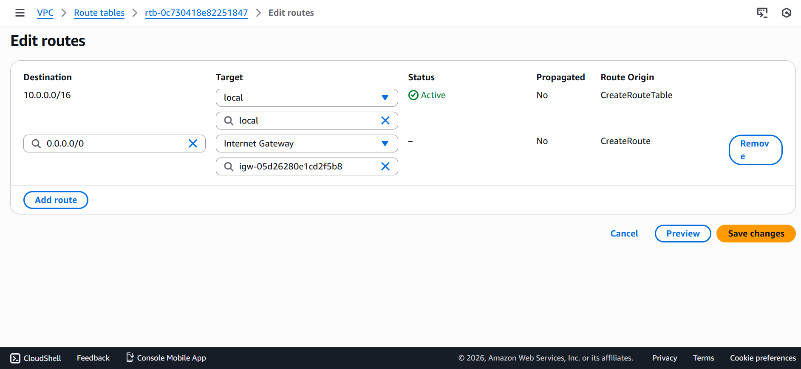
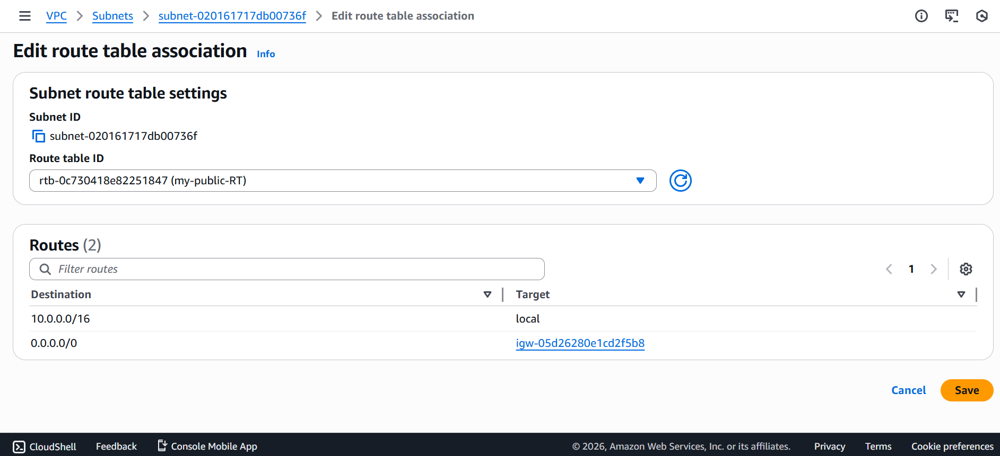
- EC2 instance running in public subnet
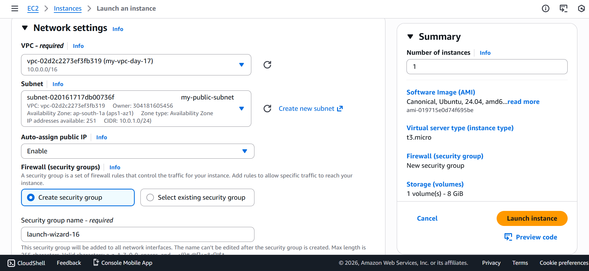

---

## 🧪 Part 1: Verify Baseline Connectivity

1. SSH into the EC2 instance:

```bash
ssh -i key.pem ubuntu@<public-ip>
```

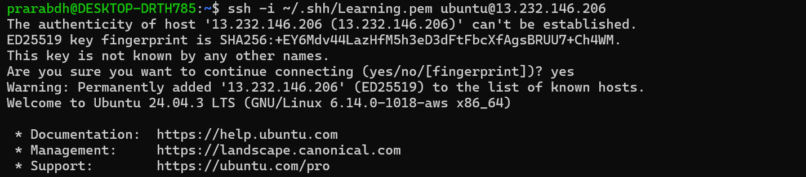

2. Test internet connectivity:

```bash
ping google.com
```
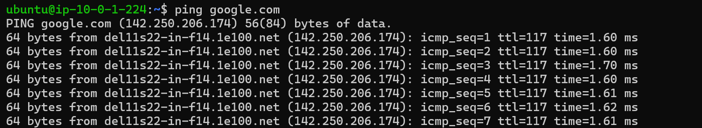

✅ Internet should be reachable.

---
## 💣 Part 2: Break the Internet (Intentional Failure)

- Step 1: Remove IGW Route

    - Go to VPC → Route Tables

    - Select the Public Route Table

    - Edit routes

    - Delete:

        - 0.0.0.0/0 → Internet Gateway (igw-xxxx)
    - Save changes

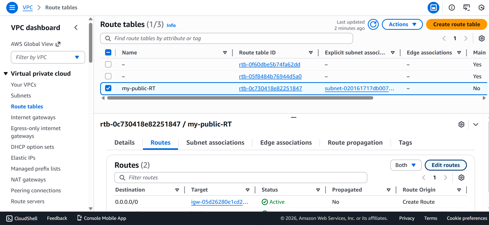
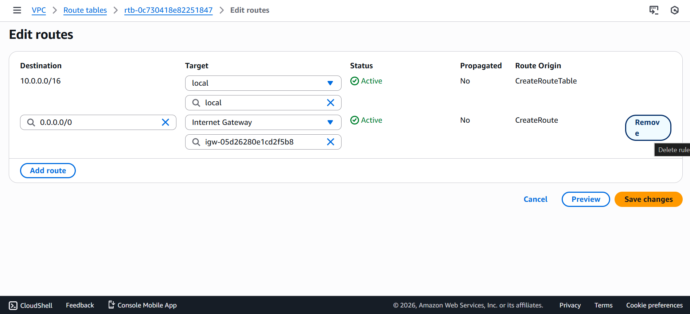

## Step 2: Test Again from EC2

```bash
ping google.com
```

## ❌ Internet will fail

- Possible errors:
    - Network unreachable
    - Temporary failure in name resolution

## 🧠 Part 3: Debugging Process (Engineer Mindset)

### 1️⃣ Check Subnet Association

- Ensure public subnet is associated with the correct route table

### 2️⃣ Check Default Route
- Destination: 0.0.0.0/0
- Target: ❌ Missing


🚨 Root cause identified: No outbound route

### 3️⃣ Verify Internet Gateway

- IGW must be attached to the VPC

### 4️⃣ Security Groups & NACLs

- Not modified → Not the issue

---
## 🛠️ Part 4: Manual Fix (Production Recovery)

### Step 1: 
- Add Internet Route Back
- Edit routes in public route table
- Add:
    - Destination: 0.0.0.0/0
- Target: 
    - Internet Gateway (igw-xxxx)


Save

### Step 2: Validate Fix

```bash
ping google.com
```

✅ Internet connectivity restored.

## 🧪 Bonus Failure Scenarios

### 🔥 Scenario 1: Wrong Route Table

- Associate private route table with public subnet

- Result: No internet access

### 🔥 Scenario 2: Blackhole Route

- IGW deleted but route still exists

- Route state becomes blackhole

### 🔥 Scenario 3: NAT Used Instead of IGW

- Public subnet routed to NAT Gateway

- Outbound may work, inbound traffic fails


---
## 🧠 Key Learnings

- Route Tables define traffic flow

- IGW is mandatory for public internet

- Subnet–Route Table association is critical

- Debug order:

    >Subnet → Route Table → IGW/NAT → Security Group → NACL