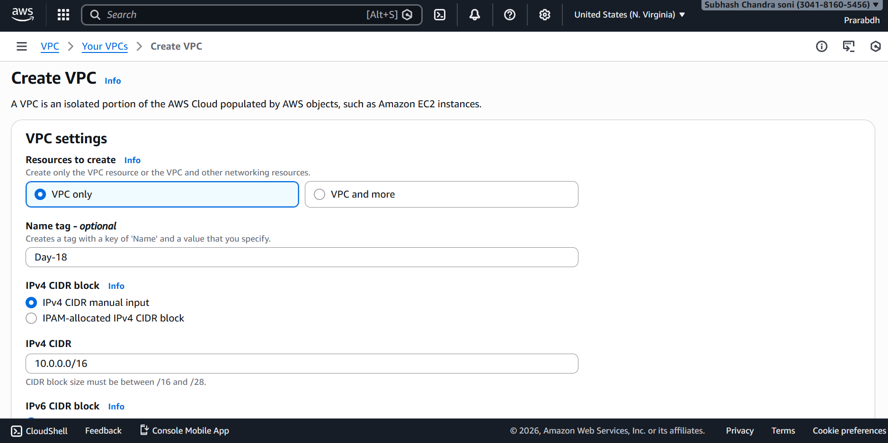
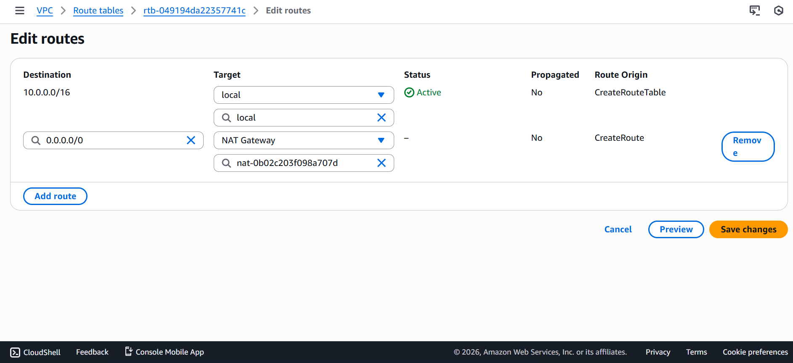
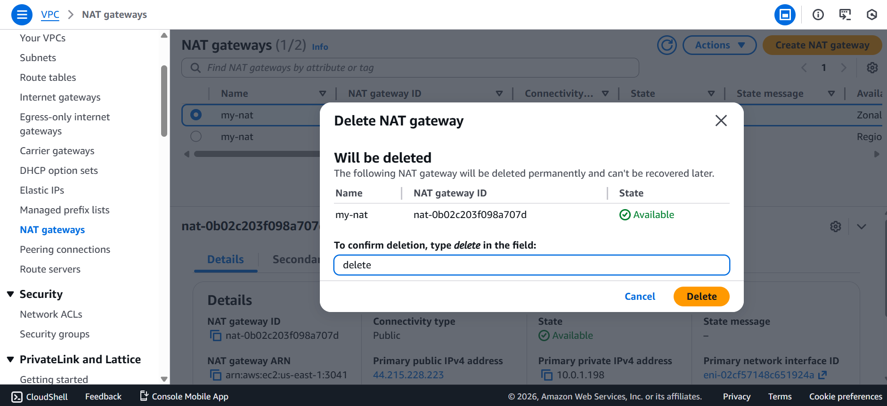
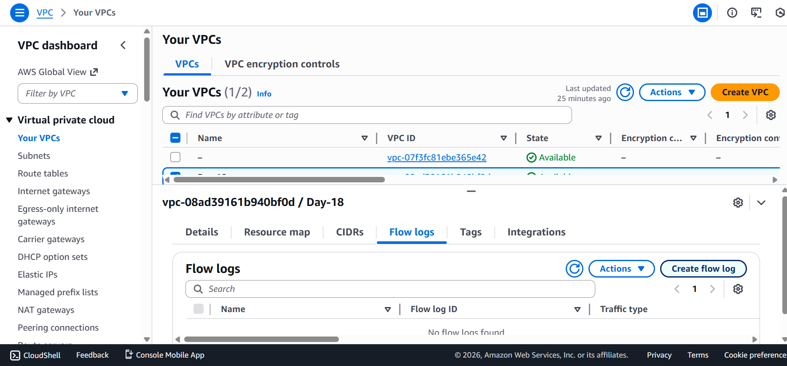
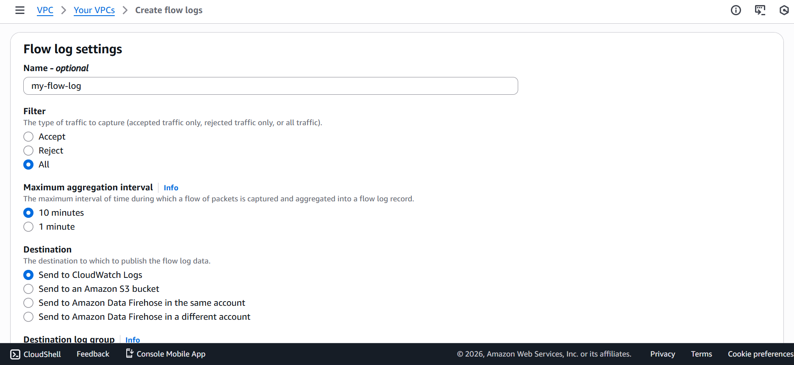

# 🟦 Day 18 – Private EC2 → Internet Access via NAT (Deep Dive)

## 🎯 Objective
Understand **how a private EC2 instance accesses the internet securely using a NAT Gateway**, and why NAT is **not just a route-table entry**, but a **network translation and architecture component**.

This day focuses on **behavior, failure, security, and best practices**, not basic setup.

---

## 🧱 Architecture Overview

|Private EC2|
| --- |
| ↓ |
|Private Subnet|
| ↓ |
|Private Route Table (0.0.0.0/0 → NAT Gateway) |
| ↓ |
| NAT Gateway (Public Subnet + Elastic IP) |
| ↓ |
| Internet Gateway |
| ↓ |
|Internet|


---

## ✅ Prerequisites
- Custom VPC
- Public subnet + Internet Gateway
- Private subnet (no public IPs)
- Public EC2 (optional, for comparison)
- Private EC2 (NO key pair attached)
- NAT Gateway created in **public subnet**
- Private route table associated with **private subnet**

---

## 🔹 Step 1: Validate Private EC2 Isolation

- Private EC2 has:
  - ❌ No public IPv4 address
  - ❌ No IGW route in its route table
- Security Group:
  - No inbound from `0.0.0.0/0`
  - Outbound allowed

### Test (Before NAT)

```bash
curl google.com
sudo apt update
```

❌ Internet access fails

---
## 🔹 Step 2: Configure NAT Gateway Routing

- In Private Route Table:
    - Destination: 0.0.0.0/0
    - Target: NAT Gateway

    

- Important:
    - Private route table is associated with private subnet
    - NAT Gateway itself is placed in public subnet

---
## 🔹 Step 3: Verify Outbound-Only Internet Access

- From private EC2:

```bash
curl google.com
ping 8.8.8.8
sudo apt update
```


✅ Internet works

- From local machine:

```bash
ssh private-ec2-ip
```

❌ Connection fails (no inbound access)

✔ Confirms egress-only connectivity

---
## 🔹 Step 4: NAT Gateway Failure Simulation

- Start continuous traffic from private EC2:
  - while true; do curl google.com; sleep 2; done
  - Delete NAT Gateway

- Result:
  - Internet access immediately fails



-Recreate NAT Gateway and update route table

- Result:
  - Traffic resumes

📌 Demonstrates single point of failure and importance of HA design.

---
## 🔹 Step 5: Prove NAT Address Translation (Flow Logs)

Enable VPC Flow Logs

Generate outbound traffic from private EC2

- Observe:
  - Source IP in logs = NAT Elastic IP
  - NOT private EC2 IP

✔ Confirms NAT performs address translation, not routing.





---
## 🔹 Step 6: AZ-Level Architecture Insight

NAT Gateway is AZ-specific

- Routing private subnets from another AZ:
  - Causes cross-AZ traffic
  - Adds latency and cost

- 📌 Best practice:
  - One NAT Gateway per AZ for production workloads

---
## 🔹 Step 7: Security Boundary Validation

- NAT Gateway:
  - No security groups
  - AWS-managed

- Security Groups control egress

- NACLs must allow ephemeral ports (1024–65535)

Blocking ephemeral ports → outbound traffic fails.

---
## 🔹 Step 8: Cost Awareness

- NAT Gateway incurs:
  - Hourly cost
  - Per-GB data processing cost

- Observation:
  - OS updates, Docker pulls, API calls all increase NAT cost

📌 Reason why organizations replace NAT with VPC Endpoints.

---
## 🔐 Access Without SSH Keys (Modern Practice)

Private EC2 was launched without a key pair.

- Access method:

  - AWS Systems Manager Session Manager
  - IAM Role: AmazonSSMManagedInstanceCore
  - No SSH
  - No bastion host
  - Full audit logging

✔ AWS-recommended secure access model

---
## 🧠 Key Learnings

- Route tables are associated with subnets, not EC2 or NAT
- NAT Gateway provides outbound-only internet
- NAT performs IP translation
- NAT is AZ-scoped
- NAT has cost and availability considerations
- SSM is preferred over SSH + keys


## 🧪 Common Mistakes Avoided

❌ Adding IGW to private route table

❌ Associating private route table with public subnet

❌ Expecting SSH without a key pair

❌ Assuming NAT is free