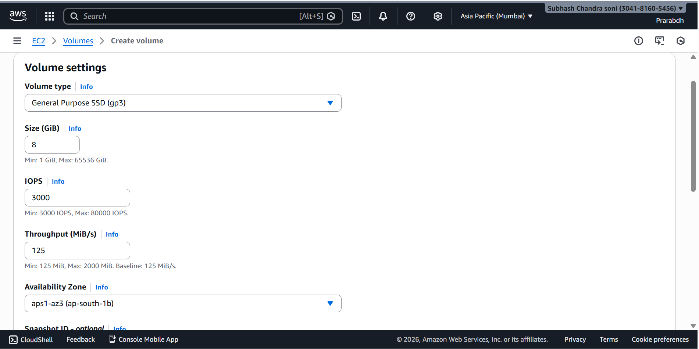
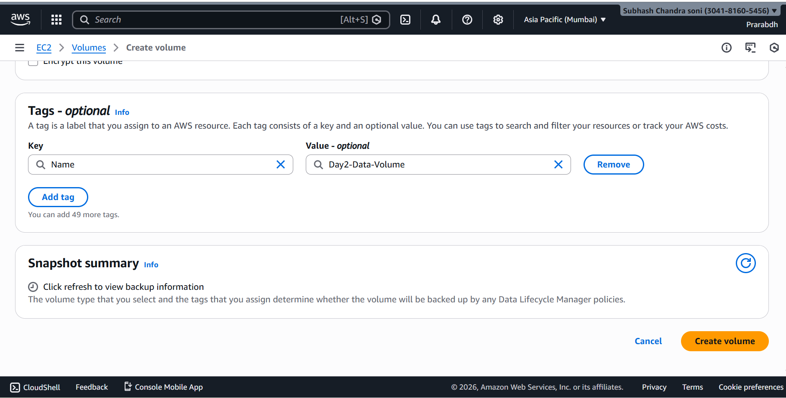
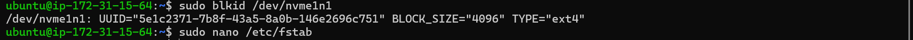
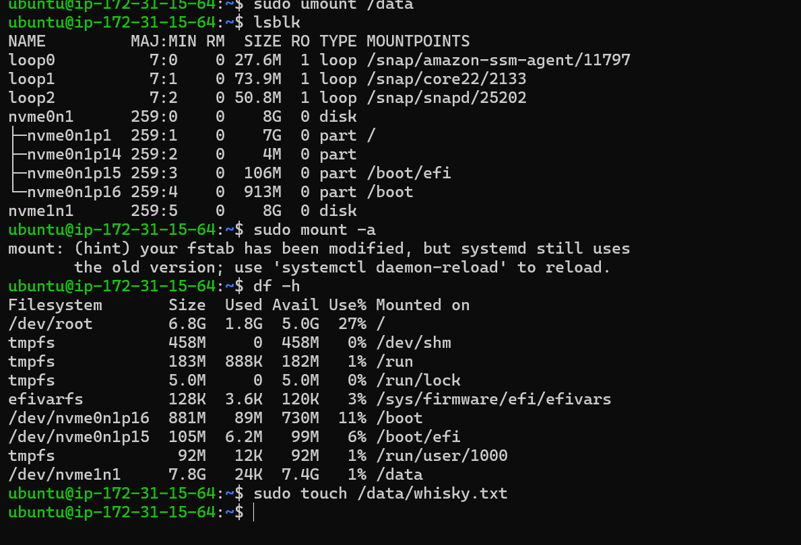
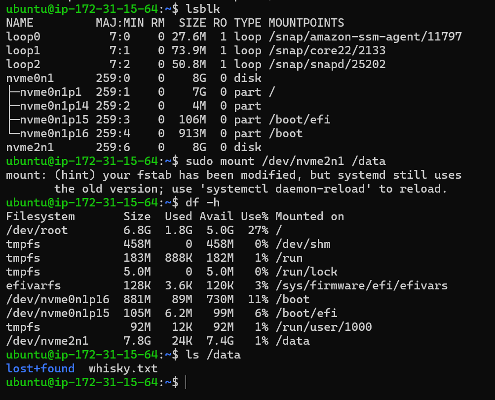

# Day 2 – EBS Storage Deep Dive (AWS EC2)

## 📌 Objective
To understand the complete lifecycle of an **Amazon EBS volume** by creating, attaching, formatting, mounting, persisting, backing up, deleting, and restoring storage on an EC2 instance — simulating a real-world production and disaster recovery scenario.

---

## 🛠️ Environment Details
- **OS**: Ubuntu 22.04 LTS
- **EC2 Type**: t2.micro
- **Volume Type**: gp3
- **Region**: AWS (same AZ for EC2 and EBS)
- **User**: ubuntu

---

## 🔹 Step 1: Create EBS Volume
- Created a new **8 GB gp3** EBS volume.
- Ensured the volume was in the **same Availability Zone** as the EC2 instance.
- Added tag:  
  `Name = Day2-Data-Volume`



---

## 🔹 Step 2: Attach Volume to EC2
- Attached the volume to the running EC2 instance.
- Device name shown in AWS console: `/dev/sdf`
- On Ubuntu, the volume appeared as:  
  `/dev/nvme1n1`


---

## 🔹 Step 3: Verify Disk Attachment
```bash
lsblk
```

## 🔹 Step 4: Format the Volume
```bash
sudo mkfs.ext4 /dev/nvme1n1
```

## 🔹 Step 5: Mount the Volume
```bash
sudo mkdir /data
sudo mount /dev/nvme1n1 /data
df -h
```


## 🔹 Step 6: Persist Mount Using fstab
- Fetched UUID:

```bash
sudo blkid /dev/nvme1n1
```

- Edited fstab:
```bash 
sudo nano /etc/fstab
```
- Added entry:
```ini
UUID=<volume-uuid>   /data   ext4   defaults,nofail   0   2
```


## 🔹 Step 7: Tested persistence:

```bash
sudo umount /data
sudo mount -a
df -h
```



## 🔹 Step 8: Data Validation

```bash
sudo touch /data/day2_success.txt
ls /data
```

## 🔹 Step 9: Snapshot Backup

- Created an EBS snapshot named: Day2-Backup-Snapshot

- Snapshot taken while volume was attached.


## 🔹 Step 10: Disaster Simulation

- Detached and deleted the EBS volume to simulate data loss.


## 🔹 Step 11: Recovery from Snapshot

- Created a new EBS volume from snapshot.

- Attached it to EC2.

- Mounted the volume again:

```bash
sudo mount /dev/nvme1n1 /data
ls /data
```



## 🎯 Key Learnings

- EBS volume lifecycle management

- NVMe naming in modern EC2 instances

- Filesystem creation and mounting

- Persistent storage using /etc/fstab

- Snapshot-based backup and disaster recovery

- Real-world production storage handling


