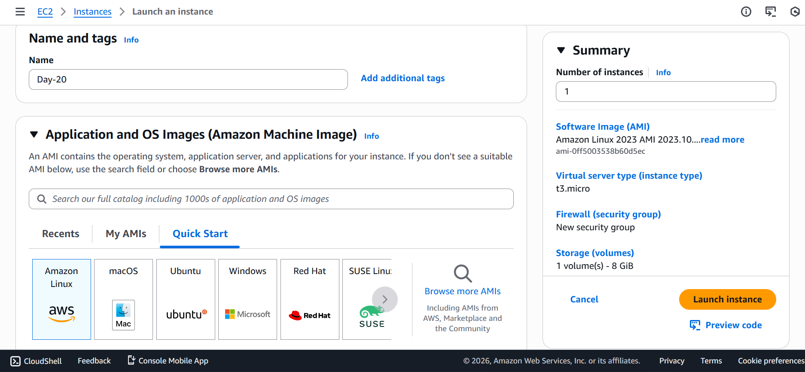
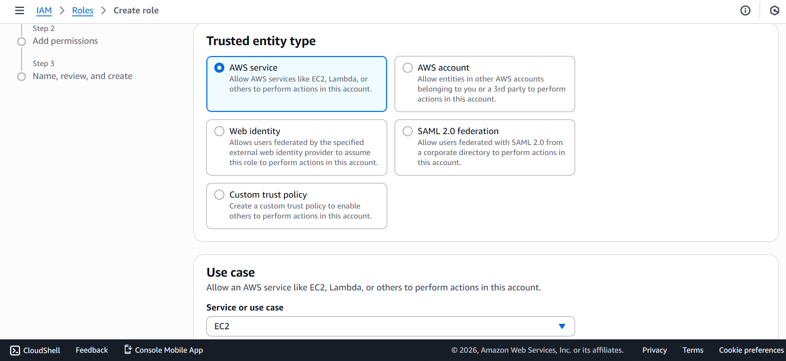
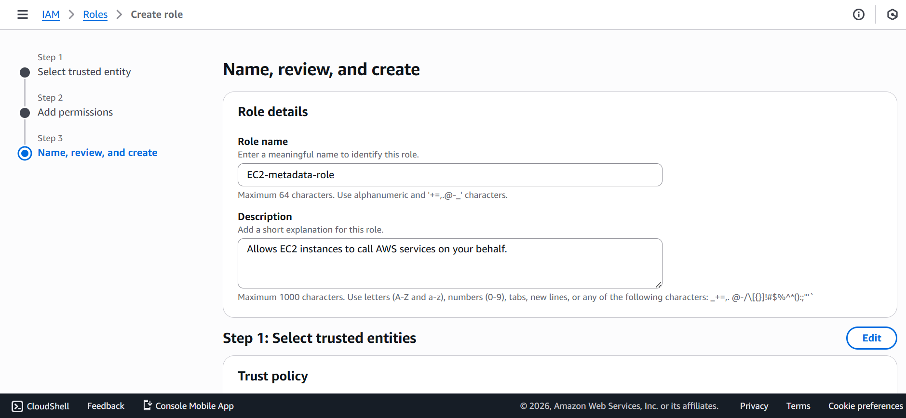
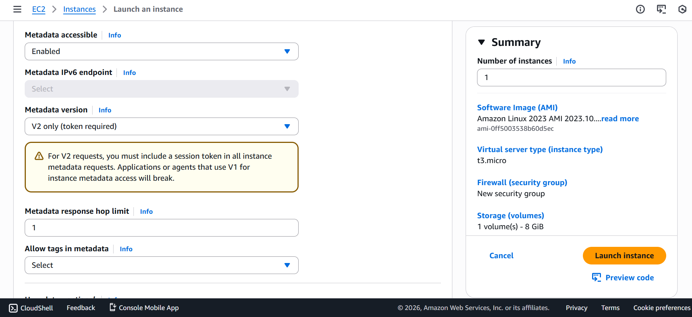

# 🚀 Day 20 – Instance Metadata Hacking (IMDSv2)

## 🎯 Objective
- Understand EC2 Instance Metadata Service (IMDS)
- Learn risks of IMDSv1
- Enforce IMDSv2 only
- Fetch metadata using token authentication
- Retrieve IAM role temporary credentials
- Understand security implications

---
## 🧠 What is Instance Metadata?

Instance Metadata Service is an internal AWS service available inside every EC2 instance.

Endpoint: `http://169.254.169.254`


It provides:
- Instance ID
- AMI ID
- Public / Private IP
- IAM role credentials
- Security groups
- User data scripts

Accessible only from inside the instance.

---

## ⚠️ IMDSv1 Security Risk

IMDSv1 allows direct metadata access without authentication.

Example:
```bash
curl http://169.254.169.254/latest/meta-data/
```

**Risk:**

If attacker gains:
- SSRF vulnerability
- Shell access

They can steal IAM credentials.

---
## 🔐 IMDSv2 Security Solution

IMDSv2 requires:

- Session-based token
- Limited TTL
- Protection against SSRF attacks


---
## 🧪 Step 1 – Launch EC2 Instance

1. Go to AWS EC2 Console
2. Launch Instance
3. Choose AMI (Amazon Linux / Ubuntu)
4. Select instance type
5. Attach IAM Role


---
## 🧪 Step 2 – Create IAM Role

Navigate: `IAM → Roles → Create Role`

Configuration:
 - Trusted entity → EC2
 - Permission → AmazonS3ReadOnlyAccess
 - Role Name → EC2-Metadata-Role

Attach role to instance.




---
## 🧪 Step 3 – Enable IMDSv2 Only

Method 1 – During Launch

```
Advanced Details → Metadata Options
Require IMDSv2 → Enabled
```



Method 2 – Modify Existing Instance
```
EC2 → Instances → Select Instance
Actions → Security → Modify Instance Metadata Options
Require IMDSv2 → Enabled
```

---
## 🧪 Step 4 – Connect to EC2

```bash
ssh -i key.pem ec2-user@PUBLIC-IP
```

---
## 🧪 Step 5 – Verify IMDSv1 Blocked

```
curl -v http://169.254.169.254/latest/meta-data/
```

Expected Output:

```
401 Unauthorized
```

---
## 🧪 Step 6 – Generate IMDSv2 Token

```bash
TOKEN=$(curl -X PUT "http://169.254.169.254/latest/api/token" \
-H "X-aws-ec2-metadata-token-ttl-seconds: 21600")
```

Verify Token:

```bash
echo $TOKEN
```

---
## 🧪 Step 7 – Access Metadata Using Token

```bash
curl -H "X-aws-ec2-metadata-token: $TOKEN" \
http://169.254.169.254/latest/meta-data/

```

---
## 🧪 Step 8 – Fetch IAM Role Name

```bash
curl -H "X-aws-ec2-metadata-token: $TOKEN" \
http://169.254.169.254/latest/meta-data/iam/security-credentials/
```

---
## 🧪 Step 9 – Retrieve Temporary AWS Credentials

```bash
curl -H "X-aws-ec2-metadata-token: $TOKEN" \
http://169.254.169.254/latest/meta-data/iam/security-credentials/EC2-Metadata-Role
```

Response includes:
 - AccessKeyId
 - SecretAccessKey
 - SessionToken
 - Expiration


## 🧪 Step 10 – Verify Role Using AWS CLI

```bash
aws sts get-caller-identity
```

## 🧪 Step 11 – Access S3 Using Role Permissions

```bash
aws s3 ls
```

--- 
## 🔥 Security Learning

IMDSv2 protects against:
 - SSRF attacks
 - Credential theft
 - Open proxy exploitation
 - Unauthorized metadata access

---
## 🧠 Real-World Attack Flow (Conceptual)

1. Attacker exploits web vulnerability
2. Sends SSRF request
3. Tries accessing metadata
4. Steals IAM credentials
5. Escalates privileges

IMDSv2 blocks unauthorized metadata access.

---
## 🧹 Cleanup Steps

1. Terminate EC2 Instance
2. Delete IAM Role (optional)
3. Remove Key Pair (optional)

---
## ⭐ Key Takeaways

- IAM Roles eliminate need for static credentials
- IMDSv2 improves EC2 security posture
- Metadata tokens prevent unauthorized access
- Temporary credentials auto-rotate

---
## 📘 Interview Talking Points

- Implemented IMDSv2 enforcement
- Demonstrated metadata credential retrieval
- Understood SSRF exploitation risks
- Practiced IAM role-based authentication