# ☁️ Day 23 – Advanced Chaos Engineering in AWS

## 🎯 Objective
Simulate real-world cloud failures and test system resilience using chaos engineering techniques.

---

## 🧪 Experiments Performed

1. Availability Zone (AZ) Failure Simulation
2. Partial Instance Failure Simulation
3. CPU Stress Testing Using SSM
4. Load Balancer Target Disruption

---

## ⚙️ Pre-Requisites

- Minimum 2 EC2 instances in different Availability Zones

Server 1
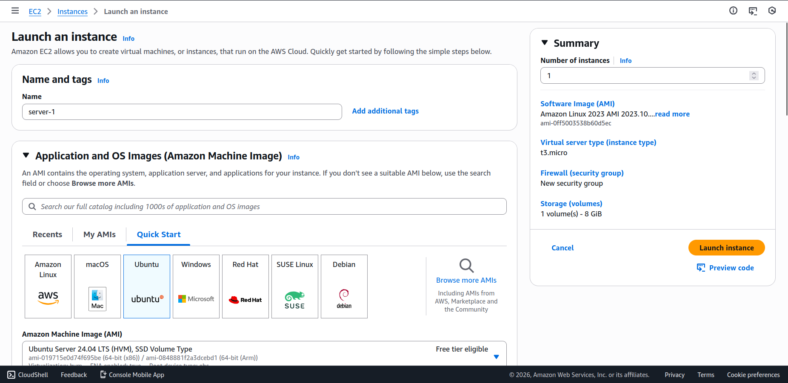
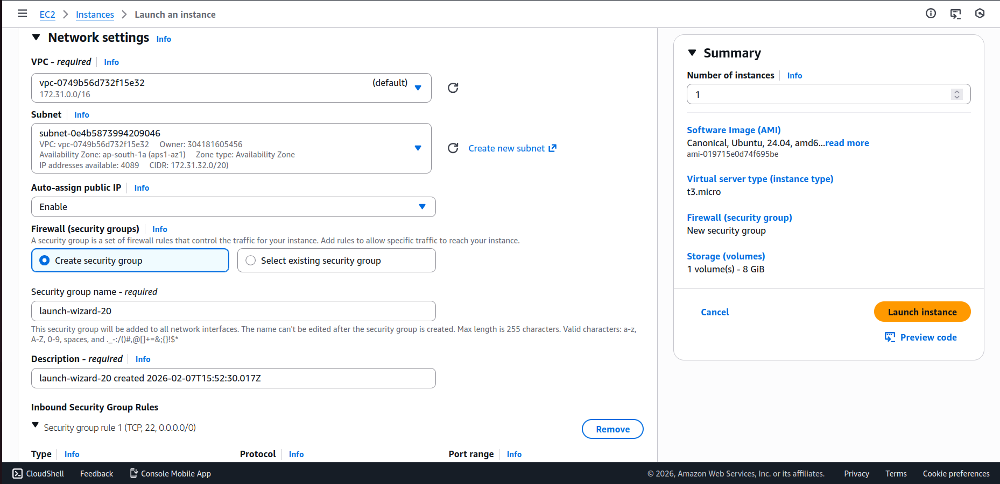

Server 2
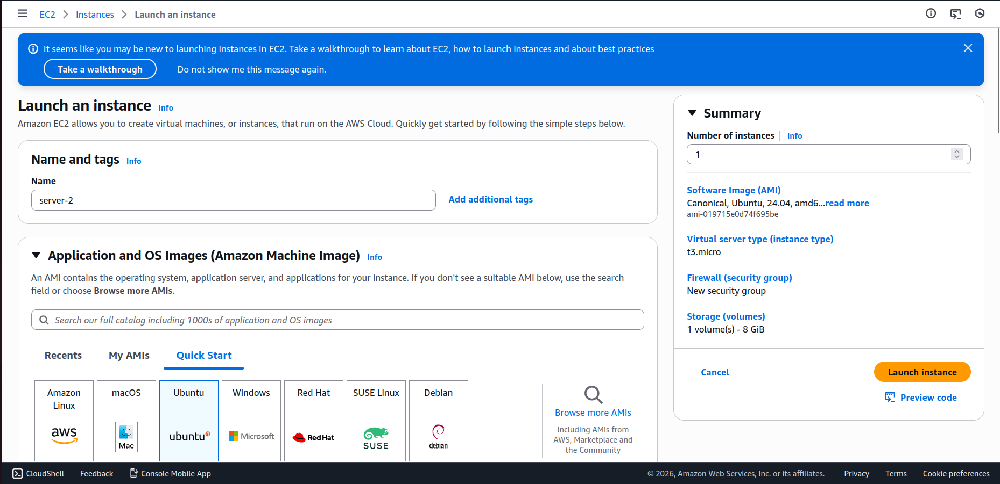
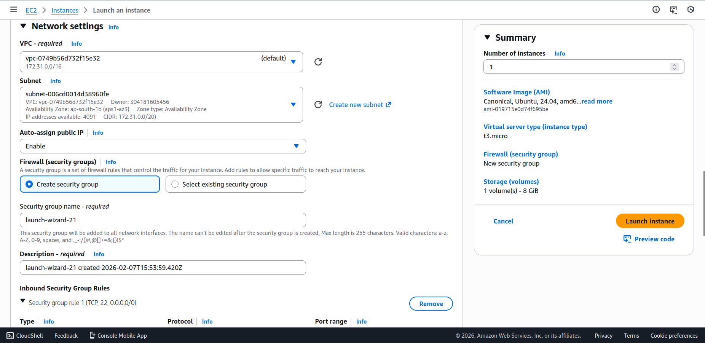

- Instances attached to same Load Balancer Target Group

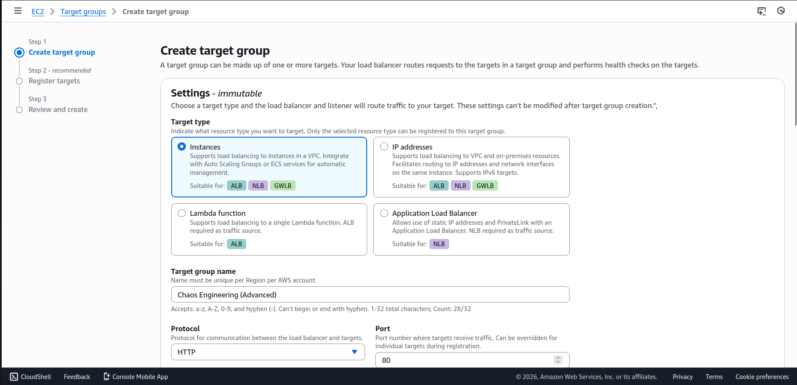
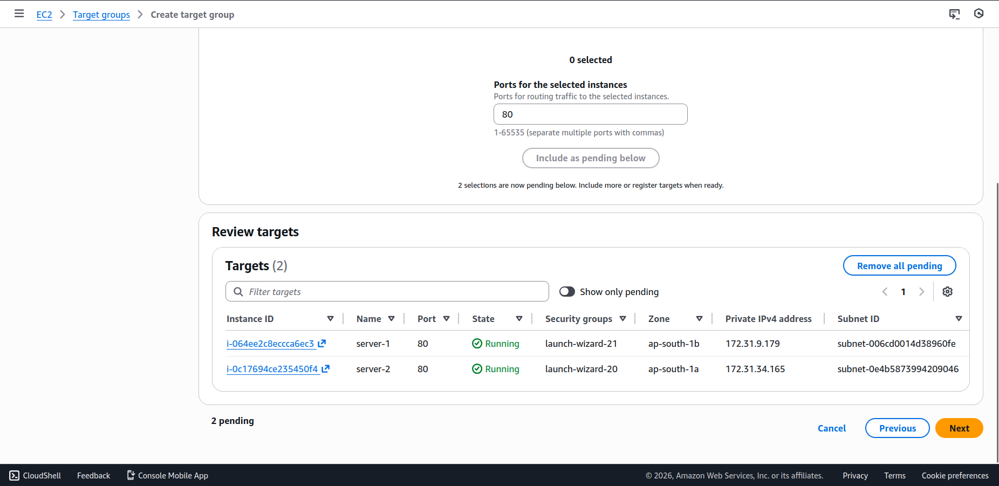

- AWS Systems Manager (SSM) configured
- IAM Role: `AmazonSSMManagedInstanceCore`

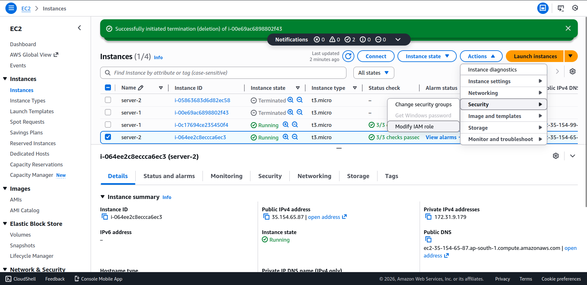
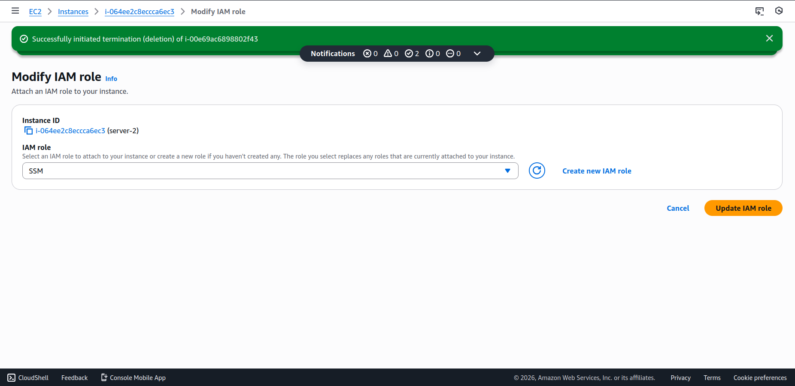

- Health checks enabled on Load Balancer

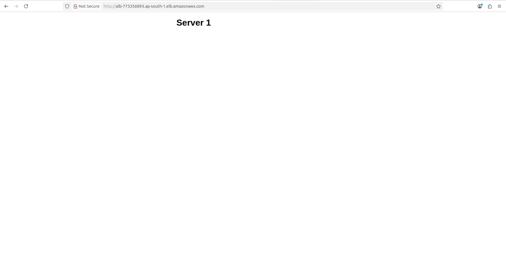


---

# 🔥 Experiment 1 – Kill Instances in One AZ

## Purpose
Simulate complete Availability Zone outage.

## Steps

### 1. Identify Availability Zones
Go to:

EC2 Dashboard → Instances


Check Availability Zone column.

---

### 2. Filter Instances
Select all instances in one AZ  
Example:

ap-south-1a


---

### 3. Terminate Instances

Instance State → Terminate


---

### 4. Observations
- Traffic shifts to remaining AZ
- Load Balancer continues serving requests
- High Availability architecture validated

---

# 🔥 Experiment 2 – Stop Instance (Partial Failure)

## Purpose
Simulate temporary server failure or OS crash.

---

## Steps

### 1. Select Running Instance

---

### 2. Stop Instance
Instance State → Stop Instance

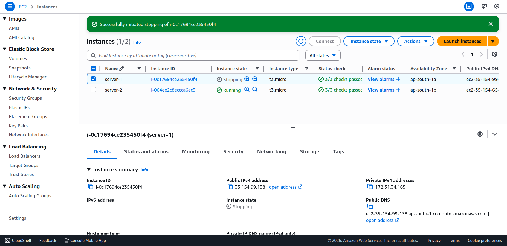

---

### 3. Monitor Impact

Check:

### Load Balancer
- Target becomes unhealthy

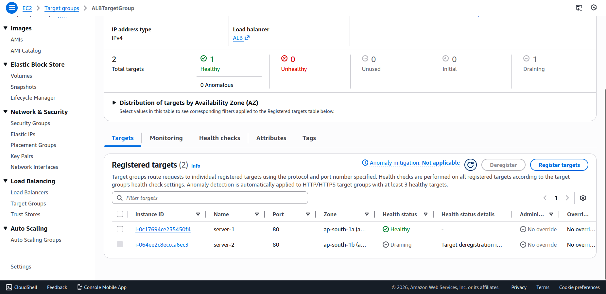

### CloudWatch Metrics
- HealthyHostCount
- UnHealthyHostCount

---

### 4. Restart Instance

Instance State → Start Instance


Observe recovery behaviour.

---

# 🔥 Experiment 3 – CPU Stress Using SSM Run Command

## Purpose
Test system behaviour under high CPU usage.

---

## Steps

### 1. Open Run Command

Systems Manager → Run Command → Run Command


Select:

AWS-RunShellScript


---

### 2. Install Stress Tool

```bash
sudo yum install stress -y || sudo apt install stress -y
```

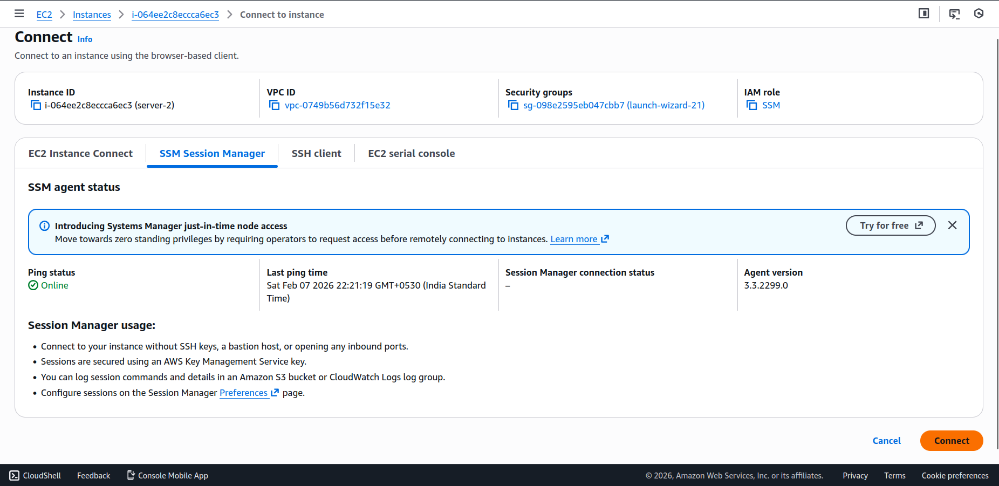
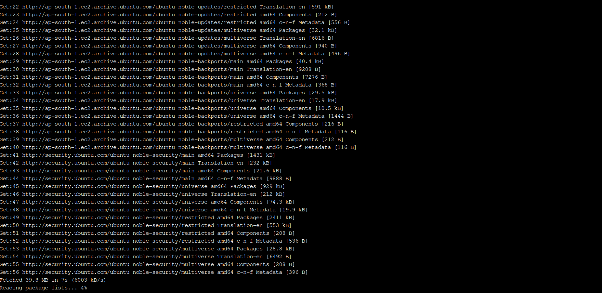

---

### 3. Generate CPU Load

```bash
stress --cpu 3 --timeout 600
```

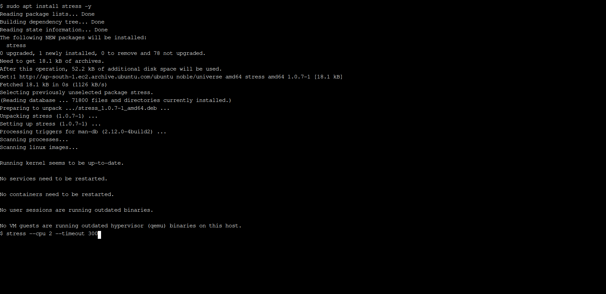

### Parameters
- `--cpu 3` → Uses 4 CPU cores
- `--timeout 600` → Runs for 10 minutes

---

### 4. Monitor Metrics
Go to:

CloudWatch → EC2 Metrics


Observe:
- CPUUtilization spike
- Response latency
- Auto Scaling reaction

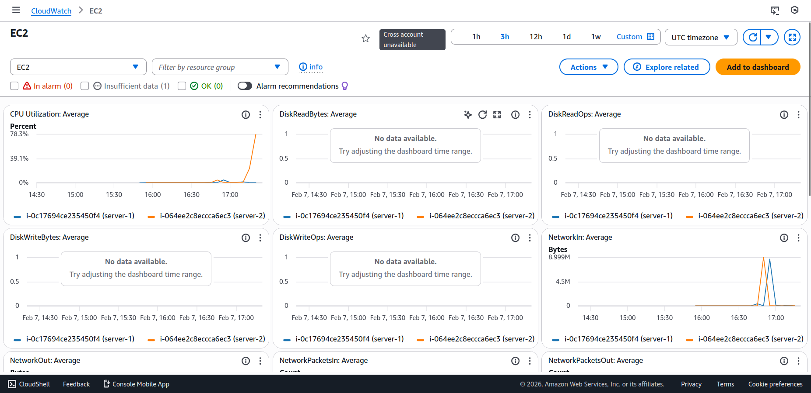

---

# 🔥 Experiment 4 – Random Load Balancer Target Removal

## Purpose
Simulate sudden instance or service failure.

---

## Steps

### 1. Open Target Group
EC2 → Target Groups


---

### 2. Deregister Target
Targets Tab → Select Instance → Deregister

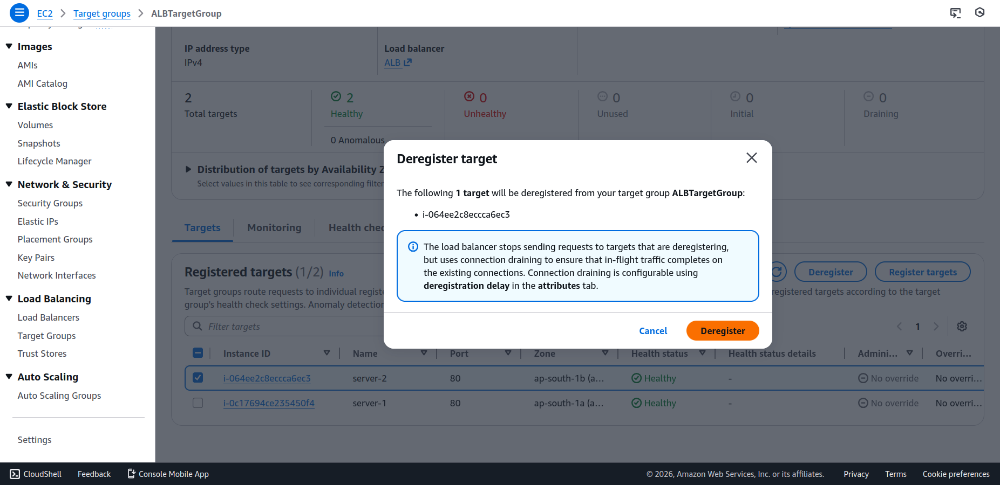

---

### 3. Observations
- Load Balancer reroutes traffic
- Remaining targets handle requests
- Health checks update automatically

---

### 4. Re-Register Target
Register Targets → Add Instance Back


---

# 📊 Key Learning Outcomes

| Experiment | Learning |
|------------|-------------|
| AZ Failure | Multi-AZ architecture ensures high availability |
| Stop Instance | Load balancer detects partial failure |
| CPU Stress | Helps evaluate auto scaling triggers |
| Target Removal | Validates traffic rerouting capability |

---

# 🧠 Industry Relevance

Chaos engineering is used by companies like Netflix using tools such as:

- Chaos Monkey
- AWS Fault Injection Simulator (FIS)

These tools help in validating system resilience.

---

# ✅ Conclusion

Day 23 introduced advanced chaos engineering techniques by simulating real infrastructure failures. These experiments help ensure high availability, fault tolerance, and production readiness of cloud systems.

---
