# ☁️ Cloud Engineering Lab – Day 24  
## 🚀 Performance Tuning – Benchmarking IOPS using FIO

---

## 📌 Objective
The goal of this lab is to measure and analyze storage performance by benchmarking **IOPS (Input/Output Operations Per Second)** using AWS EBS volumes and the FIO benchmarking tool.

---

## 🧠 Concepts Covered

- Storage Performance Tuning
- IOPS vs Throughput
- AWS EBS Volume Performance
- Disk Benchmarking using FIO
- Linux Storage Mounting & Permissions
- Cloud Monitoring Basics

---

## 🏗️ Architecture Overview

| EC2 Instance|
| --- |
| ▼ |
| Attached|
| ▼ |
| EBS Volume (gp3)|
| ▼ |
| Mounted on /data|
| ▼ |
| FIO Benchmark Testing |


---

## ⚙️ Lab Setup

### ✅ Step 1 – Launch EC2 Instance
- AMI: Ubuntu / Amazon Linux
- Instance Type: t2.micro / t3.medium
- Configure Key Pair and Security Group

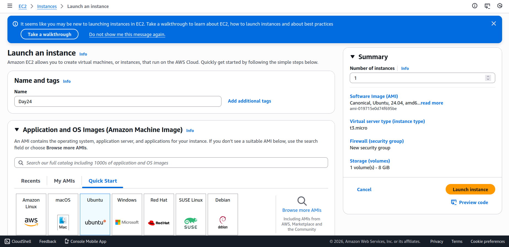

---

### ✅ Step 2 – Create and Attach EBS Volume

1. Navigate to **EC2 → Volumes**
2. Create new volume:
   - Volume Type: gp3
   - Size: 10 GB
   - Availability Zone: Same as EC2 instance

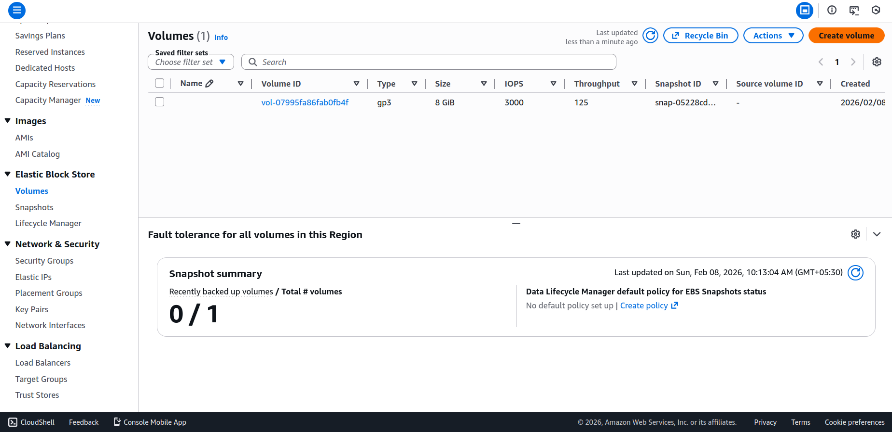
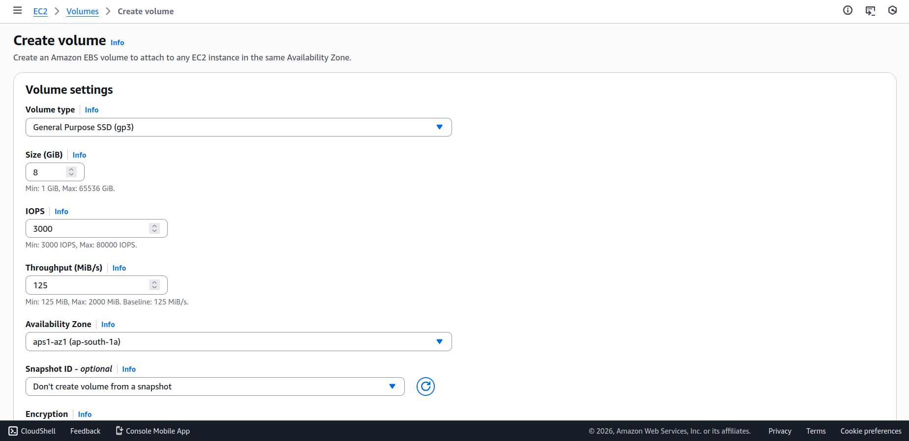

3. Attach volume to instance

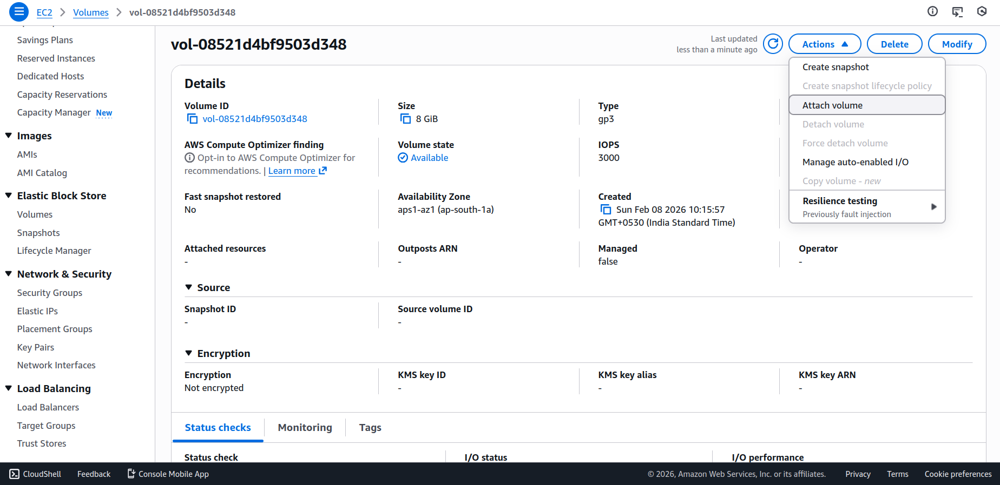
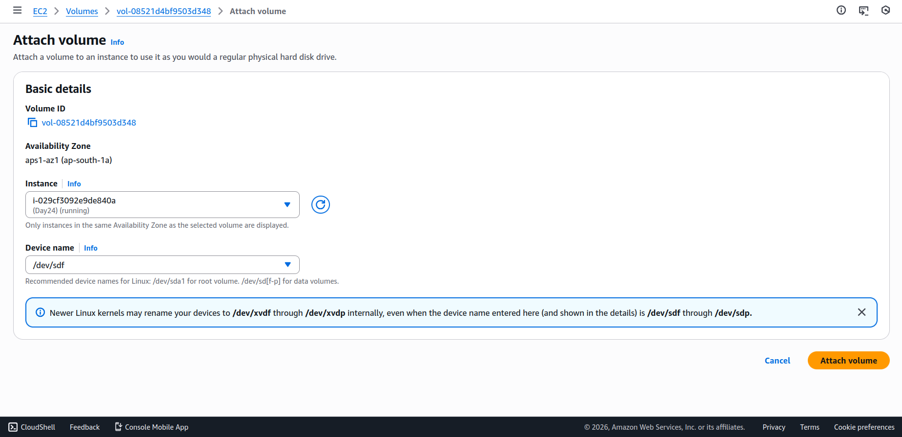

---

### ✅ Step 3 – Connect to EC2

- Modify IAM for SSM

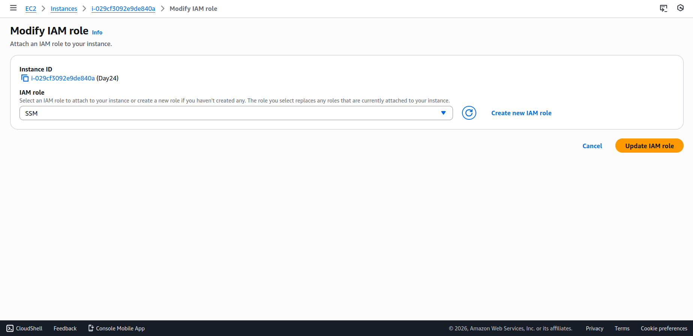


### 💽 Storage Configuration

🔹 Check Attached Disk

```bash
lsblk
```

🔹 Format Disk (Run Once)

```bash
sudo mkfs.ext4 /dev/nvme1n1
```

🔹 Create Mount Directory

```bash
sudo mkdir /data
```

🔹 Mount Volume

```bash
sudo mount /dev/nvme1n1 /data
```

🔹 Verify Mount

```bash
df -h
```

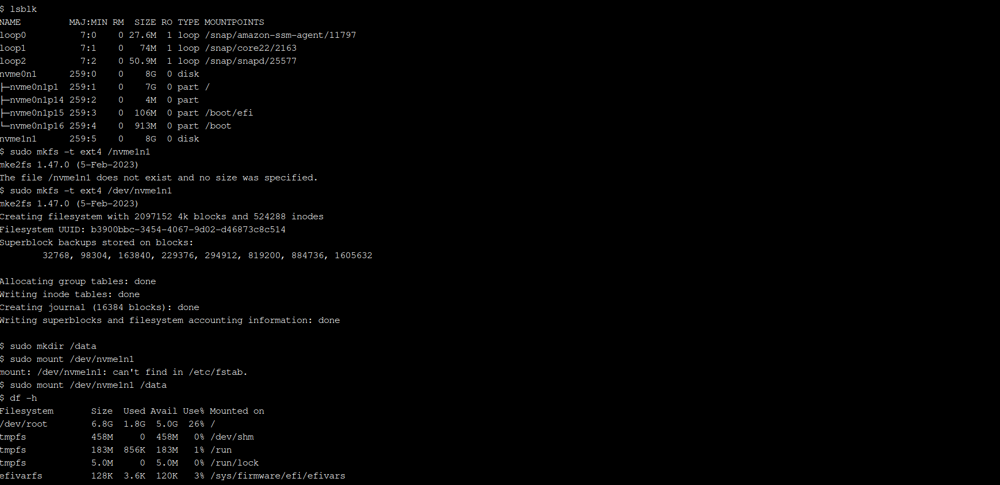

---
## 🧪 Installing Benchmark Tool

```bash
sudo apt update 
sudo apt upgrade
sudo apt install fio -y
```

---
## 🔥 Running Performance Tests

### 📊 Random Read Test

```bash
sudo fio --name=randread --filename=/data/testfile --size=1G --bs=4k --rw=randread --iodepth=64 --runtime=60 --numjobs=4 --time_based --group_reporting
```

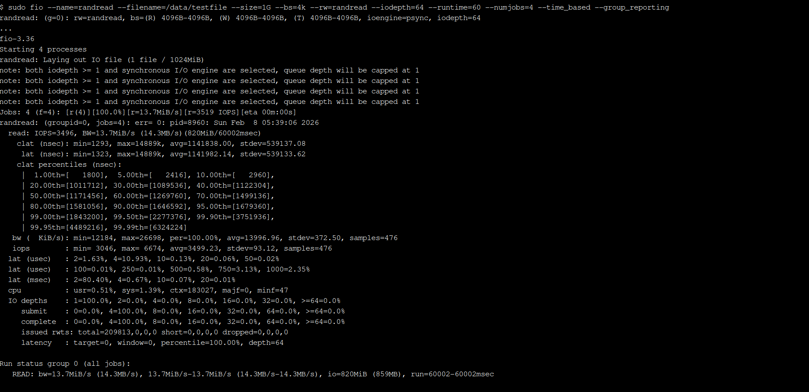

### 📊 Random Write Test
```bash
sudo fio --name=randwrite --filename=/data/testfile --size=1G --bs=4k --rw=randwrite --iodepth=64 --runtime=60 --numjobs=4 --time_based --group_reporting
```

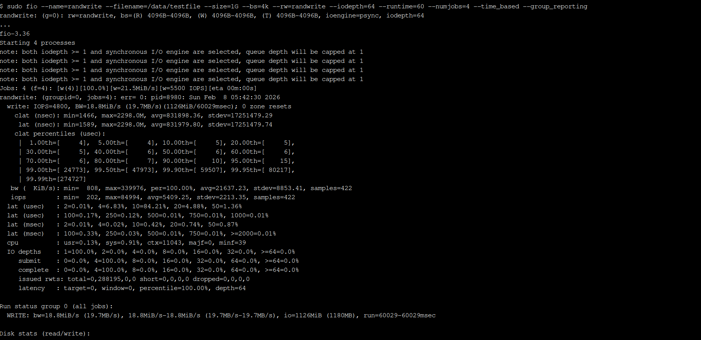

---
## 📈 Key Metrics Observed
|Metric|	Description|
| --- | ---|
|IOPS|	Number of read/write operations per second|
|Bandwidth	|Data transfer speed|
|Latency|	Delay per operation|
|Queue Depth|	Number of outstanding I/O requests|

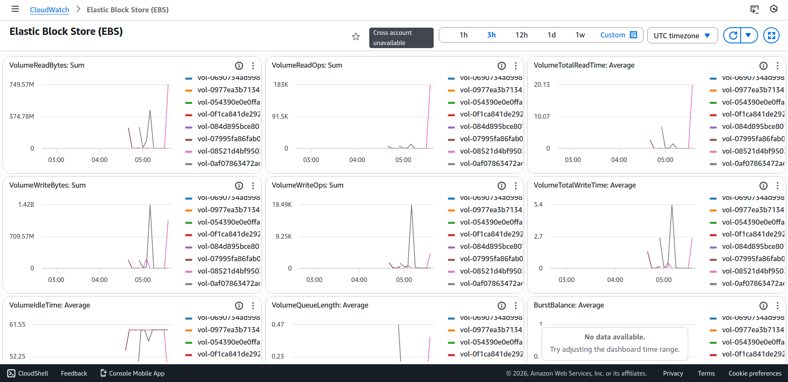

---
## Compare Performance

- Try changing:
    - Volume type → gp2 / gp3 / io2
    - IOPS value
    - Block size (bs=4k, bs=16k, bs=64k)

👉 Observe performance change

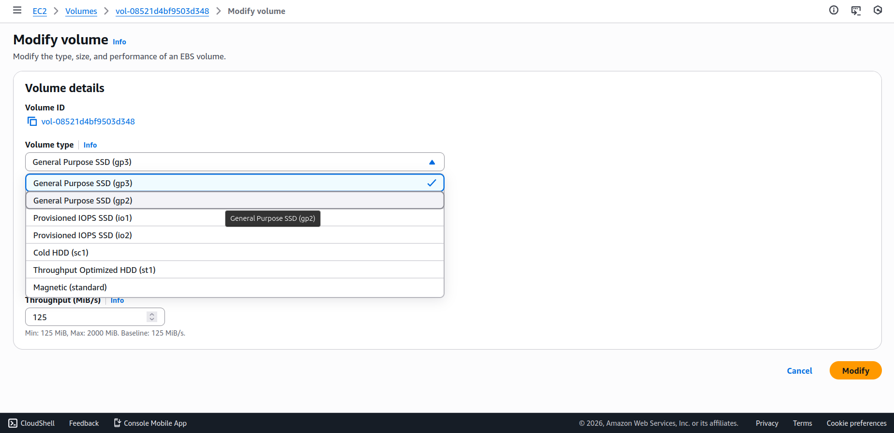
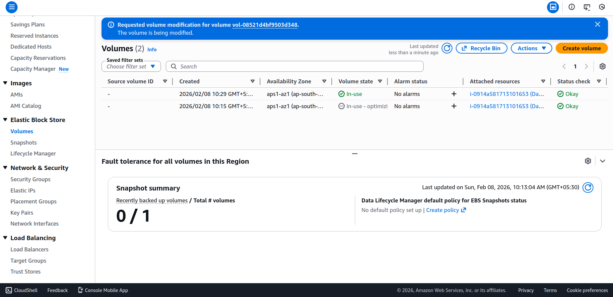

> Initial benchmarks showed similar performance between gp2 and gp3 under moderate workloads. This is expected, as both volumes provide ~3,000 baseline IOPS. Performance differences became visible only when gp3 IOPS were explicitly increased or under sustained high-write workloads

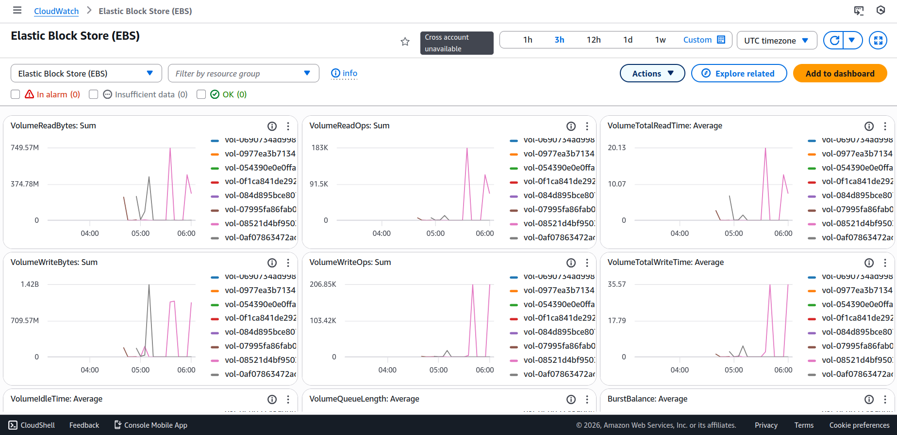

---
## 🔍 Observations

- Smaller block sizes generate higher IOPS
- Write operations generally have higher latency
- Performance depends on EBS volume type and configuration
- Storage tuning plays critical role in database and application performance

---
## 🧹 Cleanup Steps

```bash
sudo umount /data
```

Detach EBS volume

Delete EC2

Delete unused resources to avoid AWS charges