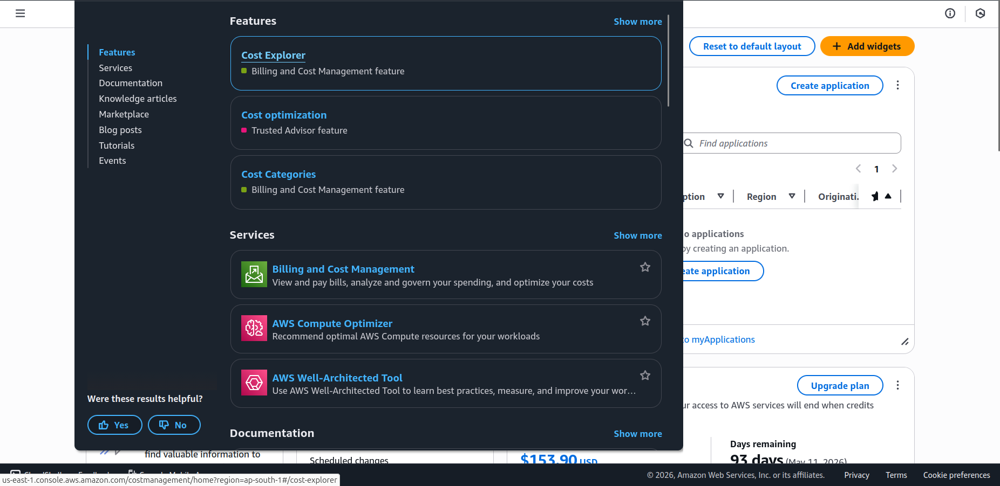
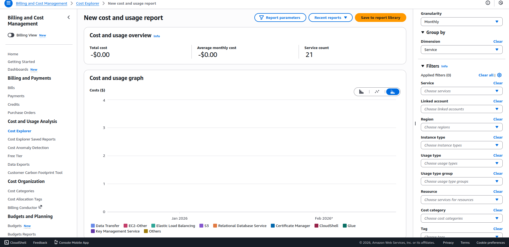
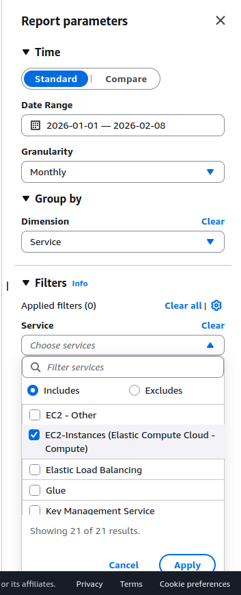
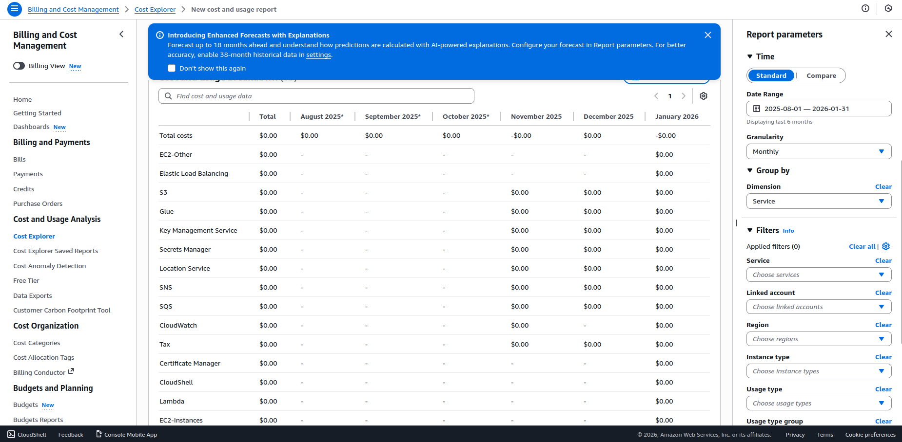

# 📅 Day 25 – AWS Cost Breakdown using Cost Explorer

## 🎯 Objective
Understand how to monitor, analyze, and manage AWS cloud spending using **AWS Cost Explorer**. This experiment focuses on exploring billing dashboards, cost visualization, and cost monitoring techniques used in real-world cloud environments.

---

## 🧠 What is AWS Cost Explorer?

AWS Cost Explorer is a billing and cost management tool that helps users:

- Visualize AWS spending trends
- Analyze service-wise resource costs
- Track usage over time
- Identify cost optimization opportunities
- Monitor unexpected cost spikes

---

## 🛠️ Services Used

- AWS Billing Dashboard
- AWS Cost Explorer
- AWS Cost Anomaly Detection

---

## 📋 Steps Performed

### ✅ Step 1 – Enabled Billing Access
- Logged into AWS Console  
- Navigated to **Billing & Cost Management**  
- Verified IAM billing access permissions  

---

### ✅ Step 2 – Opened AWS Cost Explorer
- Accessed **Cost Explorer Dashboard**
- Explored cost visualization graphs
- Observed usage and cost reporting interface

---

### ✅ Step 3 – Explored Cost Analysis Features

#### 📊 Grouping Cost by Service
Analyzed how AWS distributes cost across different services such as:
- EC2
- S3
- EBS
- Data Transfer

---

#### 📅 Time Range Analysis
Tested different date filters:
- Last 7 days
- Last 30 days
- Custom range

---

#### 🔍 Cost Filtering
Explored filtering options to analyze cost by:
- AWS Services
- Region
- Usage Type

---
### ✅ Step 4 – Report Configuration
- Explored saving reusable cost reports
- Learned how organizations monitor long-term cloud spending trends

---
## 📚 Key Learnings

- Learned importance of **FinOps (Financial Operations)** in cloud computing
- Understood how to monitor and visualize AWS spending
- Learned cost filtering and grouping strategies
- Understood cost optimization mindset used by cloud engineers

---

## ⚠️ Challenges Faced

- Free Tier usage showed minimal or zero billing data
- Learned that AWS billing data can take **24–48 hours** to update

---

## 💡 Real-World Use Cases

- Budget monitoring in production environments
- Cloud cost optimization
- Infrastructure usage analysis
- Financial transparency for clients
- Preventing unexpected billing spikes

---

## 🏁 Conclusion

AWS Cost Explorer is a powerful tool for understanding and controlling cloud expenditure. This experiment provided insights into cost monitoring techniques and highlighted the importance of financial awareness in cloud infrastructure management.

---

## 👨‍💻 Author

**Prarabdh Soni**  
Cloud & DevOps Learner ☁️  
GitHub: https://github.com/PrarabdhSoni

---
