# ☁️ Day 26 – Launch EC2 Instance Using AWS CLI

## 🎯 Objective
The goal of this lab was to launch and manage an AWS EC2 instance **entirely using AWS CLI**, without using the AWS Management Console.

This helps in understanding automation, Infrastructure as Code (IaC) concepts, and real-world cloud engineering workflows.

---

## 🧰 Services & Tools Used
- AWS EC2
- AWS CLI
- IAM User Access Keys
- Amazon Linux AMI
- Security Groups
- SSH

---

## 📌 Prerequisites

### 1️⃣ Install AWS CLI
Verify installation:

```bash
aws --version
```

If not installed:

```bash
sudo apt update
```

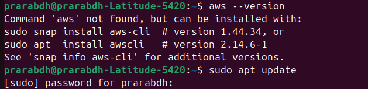

```bash
sudo apt install curl
```

```bash
curl "https://awscli.amazonaws.com/awscli-exe-linux-x86_64.zip" -o "awscliv2.zip"
```

```bash
unzip awscliv2.zip
```

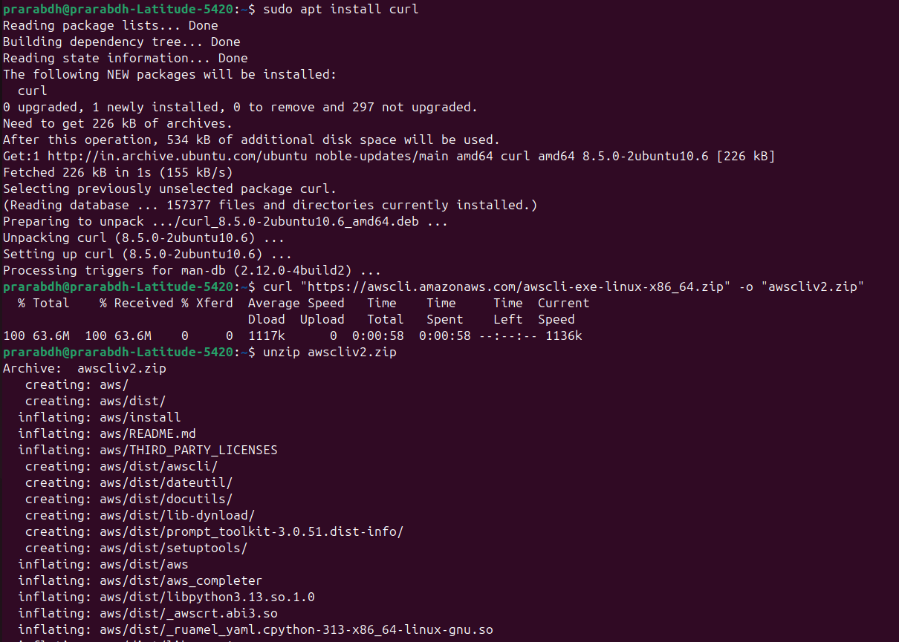

```bash
sudo ./aws/install
```


---
### 2️⃣ Configure AWS CLI

```bash
aws configure
```

- Provide:
    - Access Key
    - Secret Access Key
    - Region
    - Output format (json)

Get key from IAM Security Credentials

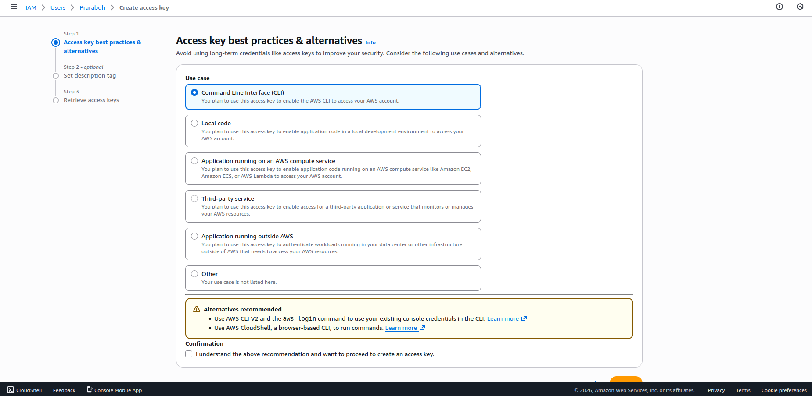
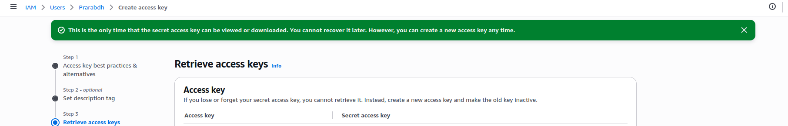


---
## 🧱 Implementation Steps

### 🔍 Step 1 – Find Amazon Machine Image (AMI)

```bash
aws ec2 describe-images --owners amazon --filters "Name=name,Values=amzn2-ami-hvm*" --query 'Images[*].[ImageId,Name]' --output table
```

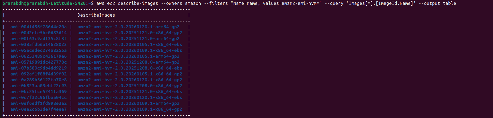

✔ AMI acts as OS template for EC2 instance.

---
### 🔑 Step 2 – Create Key Pair

```bash
aws ec2 create-key-pair --key-name awsKey --query 'KeyMaterial' --output text > awsKey.pem
```

Set permission:

```bash
chmod 400 awsKey.pem
```

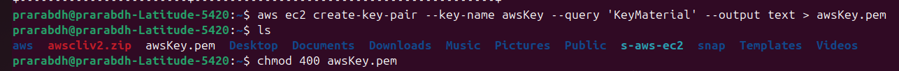

✔ Used for secure SSH login.

---
### 🌐 Step 3 – Create Security Group

```bash
aws ec2 create-security-group --group-name Day26SG --description "Security group for CLI instance"
```

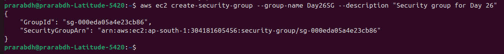

---
### 🔓 Allow SSH Access

```bash
aws ec2 authorize-security-group-ingress --group-id <SecurityGroupID> --protocol tcp --port 22 --cidr 0.0.0.0/0
```

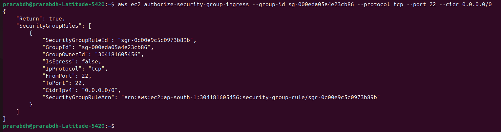

✔ Allows remote login.

---

### 🖥 Step 4 – Launch EC2 Instance Using CLI

```bash
aws ec2 run-instances --image-id <AMI-ID> --instance-type t4g.micro --key-name awsKey --security-group-ids <SecurityGroupID> --count 1
```

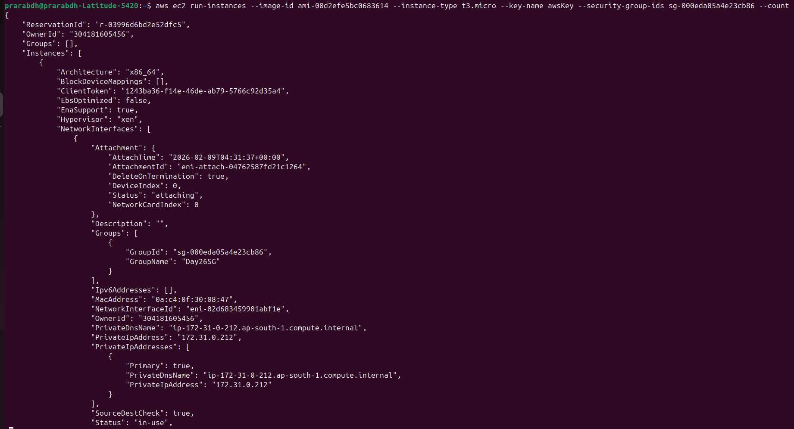
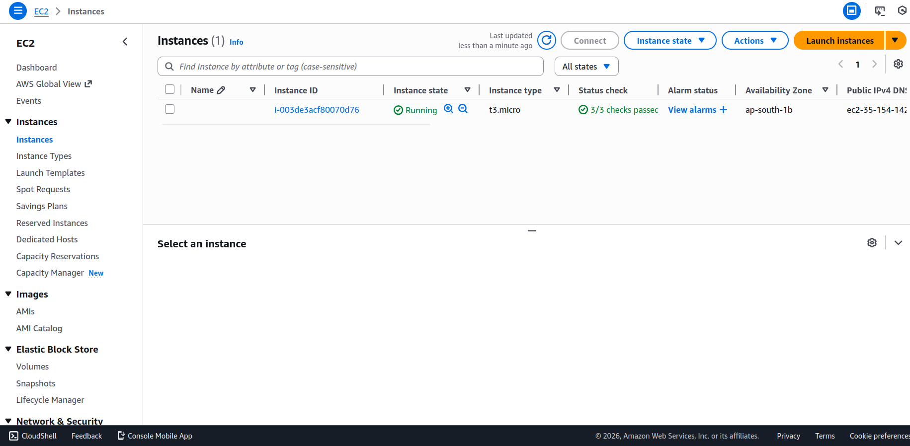

✔ Successfully launches EC2 instance.

---
### 🌍 Step 6 – Connect To Instance

```bash
ssh -i awsKey.pem ec2-user@<Public-IP>
```

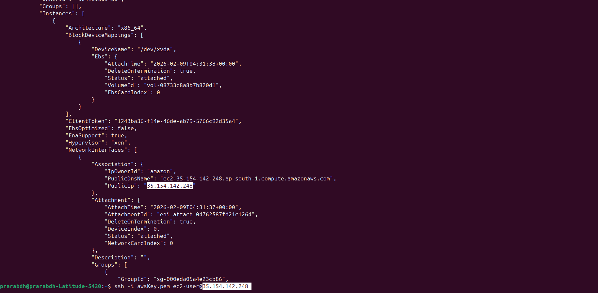

---
## 🧠 Key Learnings

Launch EC2 using AWS CLI!

Understand AMI architecture compatibility

Manage key pairs & security groups

Debug CLI region and permission issues

Importance of automation in cloud environments

---
## 🚀 Real World Use Case

- AWS CLI is widely used in:
    - DevOps automation
    - CI/CD pipelines
    - Infrastructure provisioning
    - Disaster recovery scripting

---
## 🏁 Conclusion
This lab demonstrated how cloud infrastructure can be deployed using CLI tools instead of manual console operations. This approach improves scalability, repeatability, and efficiency in cloud environments.