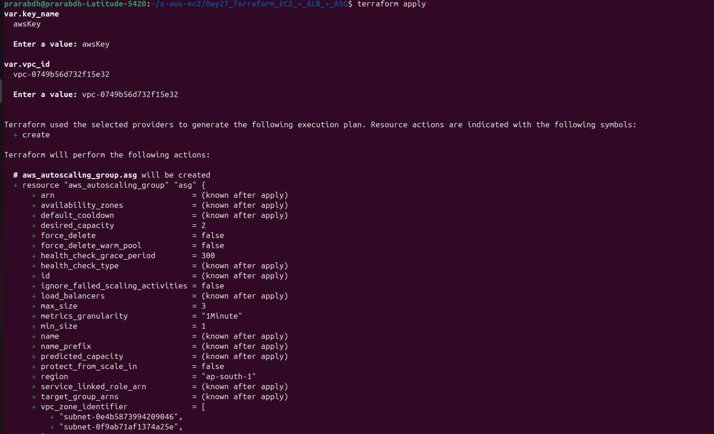
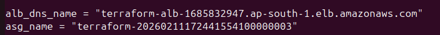

# 🚀 Day 27 – Terraform EC2 + ALB + ASG

---
## 📌 Project Overview

On Day 27 of my Cloud Engineering journey, I implemented Infrastructure as Code (IaC) using Terraform to deploy a highly available and scalable web infrastructure on AWS.

### This project automates the creation of:
- EC2 Instances
- Launch Template
- Auto Scaling Group (ASG)
- Application Load Balancer (ALB)
- Target Group & Listener
- Security Group

---
## 🎯 Objective

To understand how Terraform automates infrastructure deployment and how AWS services work together to provide:
- High Availability
- Auto Scaling
- Load Balancing
- Fault Tolerance
- Automated Infrastructure Provisioning

---
## 🏗️ Architecture

|User|
| --- |
|  ↓ |
|Application Load Balancer (ALB)|
|  ↓ |
|Target Group|
|  ↓  |
|Auto Scaling Group (ASG)|
|  ↓  |
|Multiple EC2 Instances|

---
## 🛠️ Technologies Used

- AWS EC2
- AWS Auto Scaling Group
- AWS Application Load Balancer
- AWS Security Groups
- Terraform
- AWS CLI
- Amazon Linux
- Apache Web Server

---
## 📂 Project Structure

|day27-terraform-asg/ |
| --- |
| │ |
| ├── main.tf |
| ├── variables.tf |
| ├── outputs.tf |
| ├── terraform.tfvars |
| └── README.md |

---
## ⚙️ Setup & Execution Steps

### 1️⃣ Install Terraform

```bash
sudo apt update
```

```bash
sudo apt install wget unzip -y
```

```bash
wget https://releases.hashicorp.com/terraform/1.6.6/terraform_1.6.6_linux_amd64.zip
```

```bash
unzip terraform_1.6.6_linux_amd64.zip
```

```bash
sudo mv terraform /usr/local/bin/
```

Verify installation:
- terraform -version

---
### 2️⃣ Configure AWS CLI

aws configure

- Provide:
    - AWS Access Key
    - Secret Key
    - Region

Output Format

---
### 3️⃣ Initialize Terraform
```bash
terraform init
```

---
### 4️⃣ Validate Configuration
```bash
terraform validate
```

---
### 5️⃣ Preview Infrastructure Plan
```bash
terraform plan
```

---
### 6️⃣ Deploy Infrastructure
```bash
terraform apply
```
Type: `yes`




---
### 7️⃣ Access Application

- Navigate to AWS Console
- Go to Load Balancers
- Copy ALB DNS Name
- Open it in browser

- Expected Output:
    - Hello from Terraform ASG




---
### 8️⃣ Destroy Infrastructure (Cost Saving)
```bash
terraform destroy
```

---
## 🔐 Security Configuration

- Security Group Rules:
    - HTTP (Port 80) → Public Access
    - SSH (Port 22) → Instance Access
    - All Outbound Traffic Allowed

---
## ⚡ Launch Template Features
- Amazon Linux AMI
- t2.micro Instance Type
- Apache Web Server Auto Installation
- Custom User Data Script

---
## 📈 Auto Scaling Configuration

SettingValueMinimum Instances1Desired Instances2Maximum Instances3

---
## 🌐 Load Balancer Configuration

- Application Load Balancer
- Multi-AZ Deployment
- HTTP Listener
- Target Group Integration

---
## 📊 Terraform Concepts Practiced

- Providers
- Resources
- Variables
- Outputs
- Infrastructure as Code

---
## 💡 Key Learnings

- Terraform automates infrastructure provisioning
- ASG ensures scalability and availability
- ALB distributes traffic efficiently
- User data automates instance configuration
- Terraform state tracks infrastructure lifecycle

---
## 🔥 Real-World Use Cases
- Production Web Applications
- Microservices Deployment
- Highly Available Systems
- Traffic Load Distribution
- Self-Healing Infrastructure

---
## 🔗 Author

Prarabdh Soni

Cloud Engineering Learner ☁️

GitHub: https://github.com/PrarabdhSoni