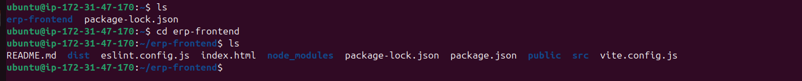
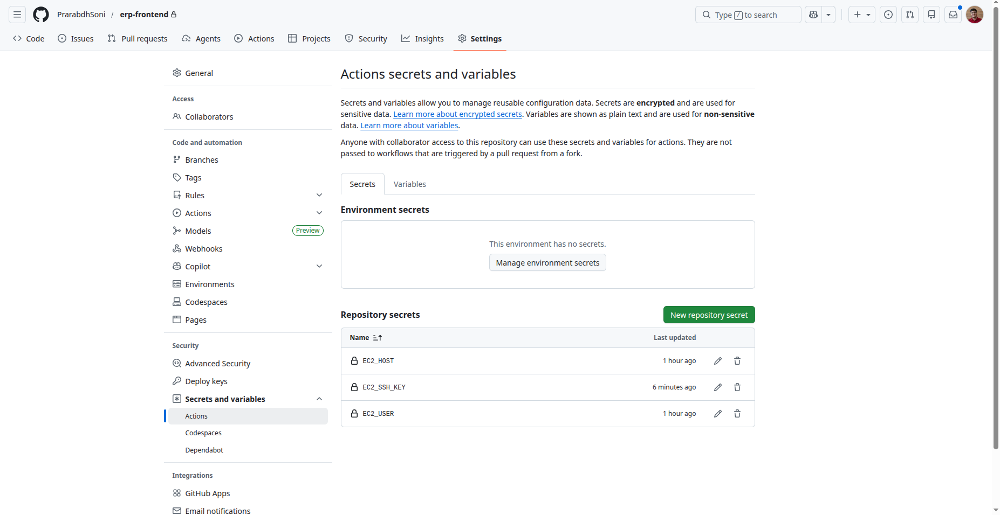
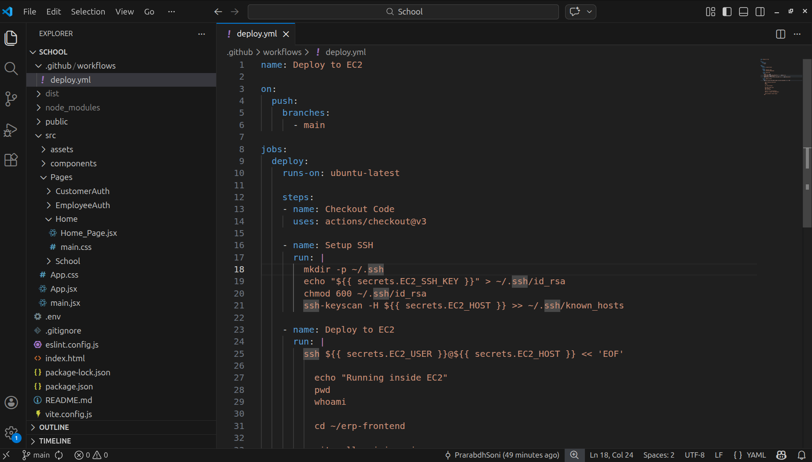
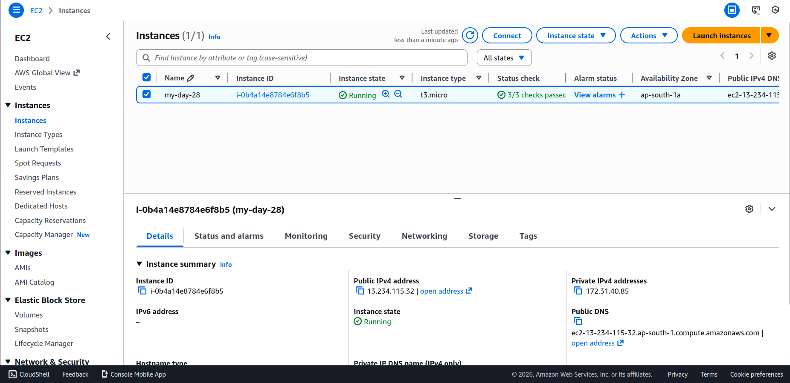
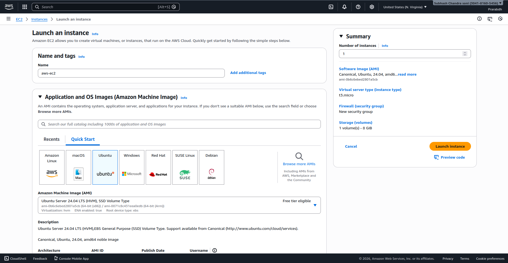
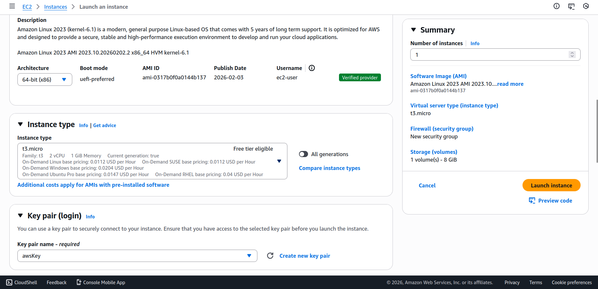
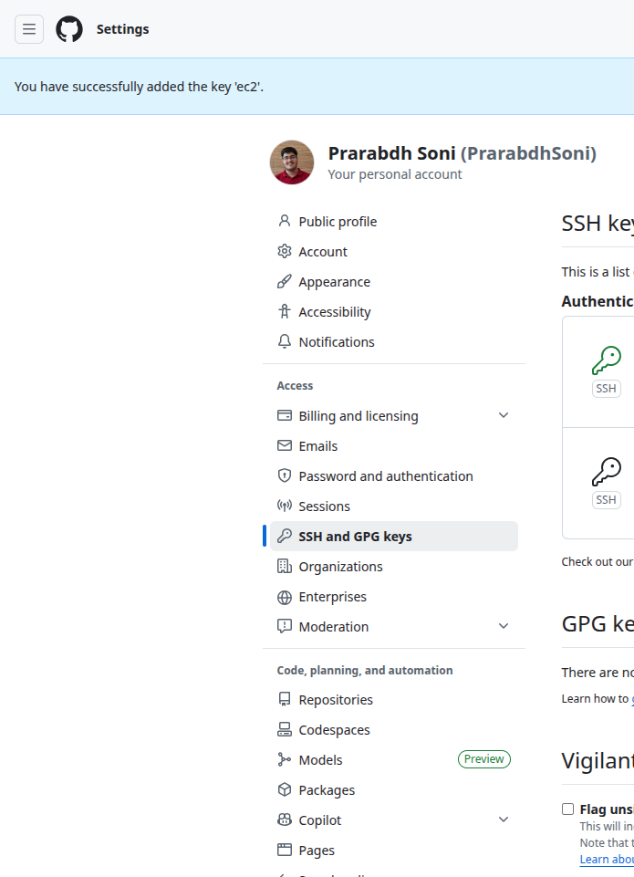
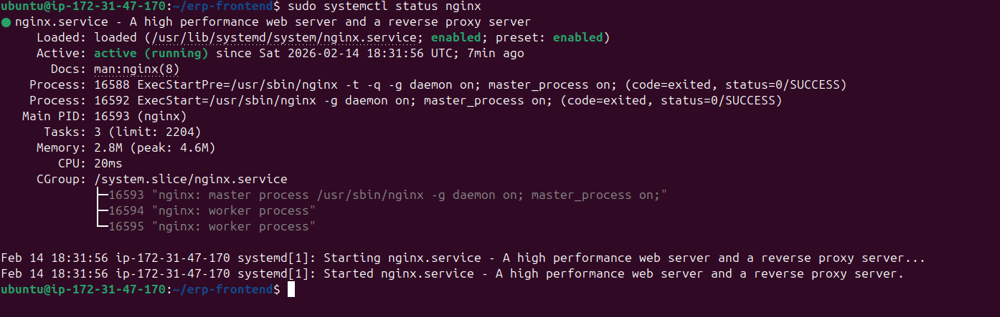
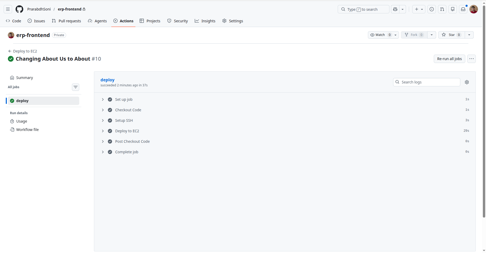

# 🚀 Day 28 – CI/CD GitHub → EC2 Auto Deployment

---
## 📌 Project Overview

This project demonstrates a **production-level CI/CD pipeline** that automatically deploys a frontend application from GitHub to an EC2 server using GitHub Actions and Nginx.

The pipeline automates:

- Pulling latest code from repository
- Installing dependencies
- Building production frontend
- Deploying build files to web server
- Restarting server automatically

---

## 🏗️ Architecture

Developer → GitHub Repository → GitHub Actions → EC2 Server → Nginx → Users


---

## ⚙️ Technologies Used

- GitHub Actions (CI/CD Automation)
- AWS EC2 (Cloud Server)
- Nginx (Web Server)
- Node.js & npm
- Vite / React (Frontend)

---

## 📁 Project Structure

| erp-frontend/|
| --- |
| │ |
| ├── src/ |
| ├── public/ |
| ├── dist/ # Production Build |
| ├── .github/ |
| └── workflows/ |
| └── deploy.yml |
| ├── package.json |
| └── vite.config.js |



---

## 🔐 GitHub Secrets Configuration

The following secrets are configured inside GitHub repository:

| Secret Name | Description |
|------------|------------|
| EC2_HOST | Public IP of EC2 instance |
| EC2_USER | SSH username |
| EC2_SSH_KEY | Private SSH key (.pem content) |



---
## 🚀 CI/CD Workflow

The CI/CD pipeline is triggered automatically when code is pushed to the **main branch**.

### Workflow Steps

1. Checkout latest repository code
2. Setup SSH connection
3. Connect to EC2 instance
4. Pull latest code
5. Install dependencies
6. Build frontend project
7. Copy build files to Nginx directory
8. Restart Nginx server

---

## 🧾 Deployment Workflow File

Create file deploy.yml in directory of .github/workflows if no directory present then create one

Location: `.github/workflows/deploy.yml`



---

## 🖥️ EC2 Server Setup





### Install Required Packages

```bash
sudo apt update

```bash
sudo apt install nginx -y
sudo apt install nodejs npm -y
```

### Clone Project for public repo

```bash
git clone <repository-url>
cd erp-frontend
npm install
```

### Clone project for private repo

#### Generate Key for ssh

```bash
ssh-keygen -t rsa
```

```bash
cat ~/.ssh/id_rsa.pub
```

Add the key into repo ssh settings



#### Add Key in GitHub Secrets

Go to:

- Repository Settings
- Secrets and Variables
- Actions
- New Repository Secret

Add:

- Name: EC2_SSH_KEY
- Value: (paste your private key id_rsa content)


Also add:

- EC2_HOST = your-ip
- EC2_USER = ubuntu


#### Clone now

```bash
git clone git@github.com:username/repository.git
```

---
## 🌐 Nginx Configuration

Default root directory:

```bash
/var/www/html
```
React/Vite Routing Support

---
## 📦 Build and Deployment Commands

```bash
cd ~/erp-frontend
git pull origin main
npm install
npm run build
sudo rm -rf /var/www/html/*
sudo cp -r dist/* /var/www/html/
sudo systemctl restart nginx
```



---
## 🔄 How CI/CD Works

Whenever a developer pushes code: `git push origin main`

GitHub Actions automatically:`Connects to EC2`

Builds application

Deploys latest version

Updates live website



---
## 🧪 Testing Deployment

After successful pipeline execution: `http://EC2-PUBLIC-IP`


---
## ⚠️ Common Issues Faced
|Issue	|Solution|
| --- | --- |
|SSH Permission Denied|	Verified .pem key inside GitHub Secrets|
|Build Not Updating|	Cleared Nginx directory before copy|
|Routing Errors|	Added try_files in Nginx|
|Cache Issues|	Used hard refresh|

---
## 📊 Learning Outcomes

- Understanding CI/CD pipeline design
- Automating production deployments
- Configuring Nginx as reverse proxy
- Managing SSH authentication securely
- Deploying Vite/React frontend in cloud environment

---
## 👨‍💻 Author
Prarabdh Soni

GitHub: https://github.com/PrarabdhSoni

---
## ⭐ Acknowledgement
This project was built as part of Cloud Engineering learning and hands-on DevOps practice.

