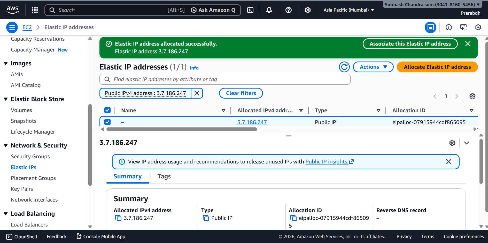
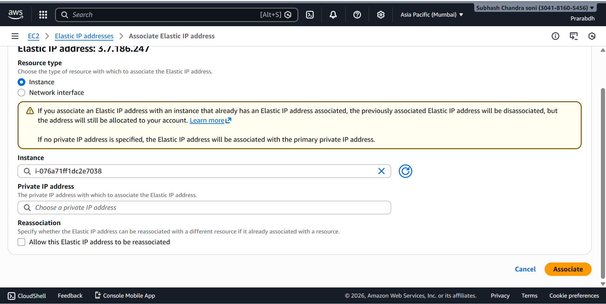

# Day 3 – Elastic IP & Recovery

## Overview
This lab focuses on understanding **Elastic IP (EIP)** in AWS and how it helps in **static IP design and disaster recovery**.  
The experiment simulates a real-world failure scenario where an EC2 instance is terminated and traffic is recovered using the same public IP.

---

## Objectives
- Understand why Elastic IP is required
- Learn static public IP design
- Practice EC2 recovery using Elastic IP
- Simulate real-world failure and recovery

---

## Architecture Concept

Normal Public IP:
EC2 Stop/Terminate → Public IP Changes

Elastic IP:
EC2 Terminate → Elastic IP Remains → Reassociate to new EC2

This design avoids DNS changes and enables fast recovery.

---

## Steps Performed

### 1. Allocate Elastic IP
- Navigated to **EC2 → Elastic IPs**
- Allocated a new Elastic IP address


---

### 2. Associate Elastic IP with EC2
- Selected Elastic IP
- Associated it with running EC2 instance
- Verified connectivity using browser and CLI


```bash
curl ifconfig.me
```


### 3. Simulate Failure

- Terminated the EC2 instance intentionally

- Observed that Elastic IP was not deleted

### 4. Launch New EC2 Instance

- Created a new Ubuntu EC2 instance

- Used same VPC and security group

### 5. Reassociate Elastic IP

- Reattached the same Elastic IP to the new instance

- Verified application access using the same IP




## Result

- Public IP remained unchanged

- New EC2 instance became accessible instantly

- No DNS update was required

## Key Learnings

- Elastic IP is a static IPv4 address managed by AWS

- Elastic IP is independent of EC2 lifecycle

- Helps in disaster recovery scenarios

- Enables fast failover for single-instance architectures

## Real-World Use Cases

- Production servers with fixed IP requirements

- Legacy systems

- Quick recovery during EC2 failure

## Cost Awareness

- Elastic IP is free when attached to a running EC2

- Charges apply if allocated but not associated

- Multiple Elastic IPs per instance may incur cost
