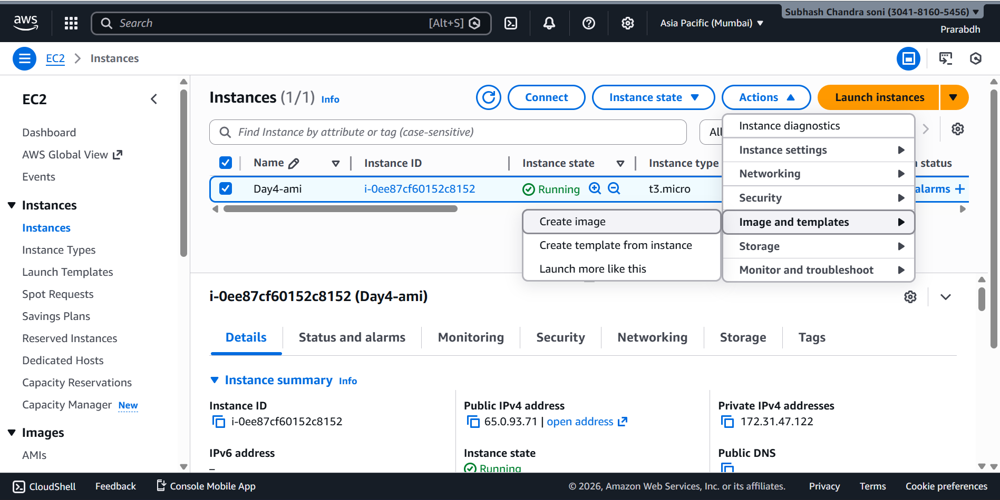
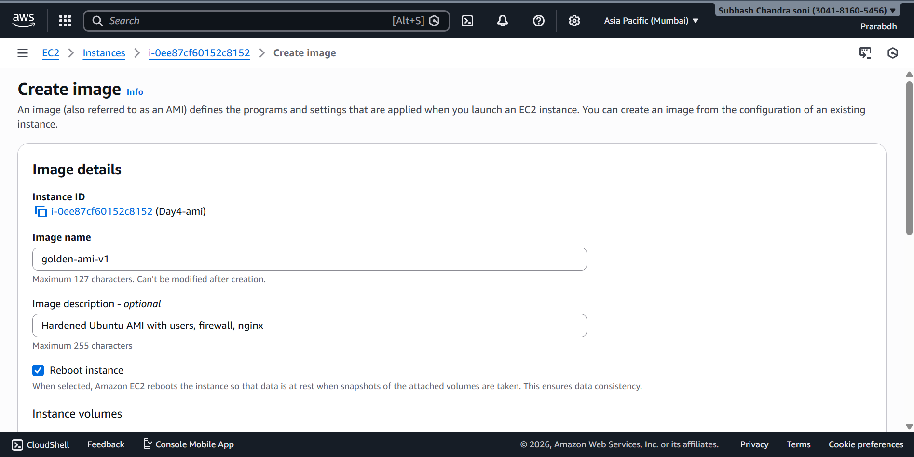
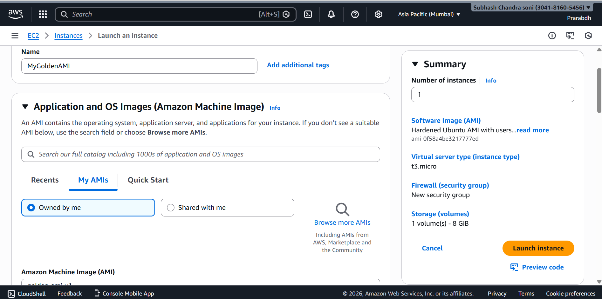
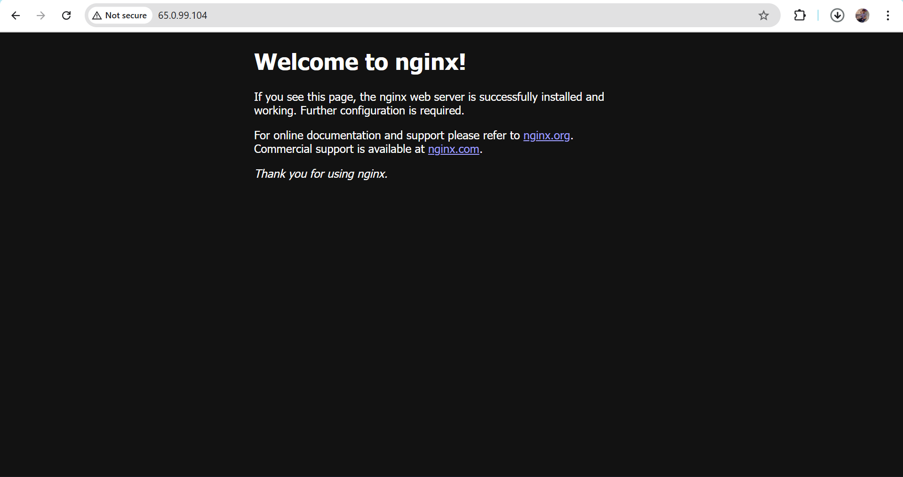

# 📘 Day 4 – AMI Engineering (Golden AMI Strategy)

## 🚀 Objective
To understand and implement **AMI Engineering** by hardening an EC2 instance, creating a **custom Golden AMI**, and launching new instances from it.

This practice reflects **real-world production DevOps workflows** used for scalability, security, and fast recovery.

---

## 🧠 Key Concepts Learned

- AMI lifecycle
- Golden AMI strategy
- OS-level security hardening
- User & permission management
- Firewall configuration
- Faster EC2 recovery and scaling

---

## 🛠️ Environment

- **Cloud Provider:** AWS
- **Service:** EC2
- **AMI Base:** Ubuntu 22.04 LTS
- **Instance Type:** t2.micro
- **Access:** SSH
- **Firewall:** UFW

---

## 🔐 Step 1: Instance Hardening

### System Update
```bash
sudo apt update && sudo apt upgrade -y
```

### Purpose:
   - Patch vulnerabilities
   - Update security packages

## 👤 Step 2: Create Users

```bash
sudo adduser devuser
sudo adduser adminuser
```

- Grant sudo access:
```bash
sudo usermod -aG sudo adminuser
```

### Verification:
- groups adminuser

- Implements least privilege access model


## 🔒 Step 3: Secure SSH Configuration

- Edit SSH configuration:

```bash
sudo nano /etc/ssh/sshd_config
```

### Update:
   - PermitRootLogin no
   - PasswordAuthentication no


## Restart SSH:

```bash
sudo systemctl restart ssh
```

- Prevents brute-force and root login attacks


## 🛡️ Step 4: Configure Firewall (UFW)

```bash
sudo ufw allow OpenSSH
sudo ufw allow 80
sudo ufw enable
```

### Check firewall status:

```bash
sudo ufw status
```

- Firewall rules:
- SSH (22)
- HTTP (80)

## 📦 Step 5: Install Common Production Packages

```bash
sudo apt install -y \
curl \
wget \
git \
net-tools \
unzip
sudo apt install -y nginx
```

## Enable service:

```bash
sudo systemctl start nginx
sudo systemctl enable nginx
```


## 🧹 Step 6: System Cleanup Before AMI

```bash
sudo apt clean
sudo rm -rf /tmp/*
history -c
```

- Reduces AMI size
- Improves launch speed

## 🧱 Step 7: Create Custom AMI

- EC2 → Instance
→ Actions
→ Image and templates
→ Create Image



- AMI Name: golden-ami-v1


- Description: Hardened Ubuntu AMI with users, firewall, and nginx



- Wait until AMI status becomes Available.

## 🔁 Step 8: Launch Instance from Custom AMI

- Navigate to AMIs

- Select custom AMI

- Launch new EC2 instance



## Verification:

```bash
ufw status
systemctl status nginx
```



- Instance launches fully configured
- No manual setup required

# 🏆 Final Outcome

- Created a hardened EC2 instance

- Built a reusable Golden AMI

- Launched production-ready EC2 from AMI

- Learned enterprise AMI engineering workflow

# 🎯 Golden AMI Strategy (Production Use)

- Base OS
- Security Hardening
-  ↓
- User & Permission Setup
- ↓
- Monitoring / Tools
- ↓
- Golden AMI
- ↓
- Auto Scaling / Launch Templates

# Benefits:

🚀 Faster deployments

🔐 Improved security

🔁 Easy rollback

⚙️ Consistency across servers