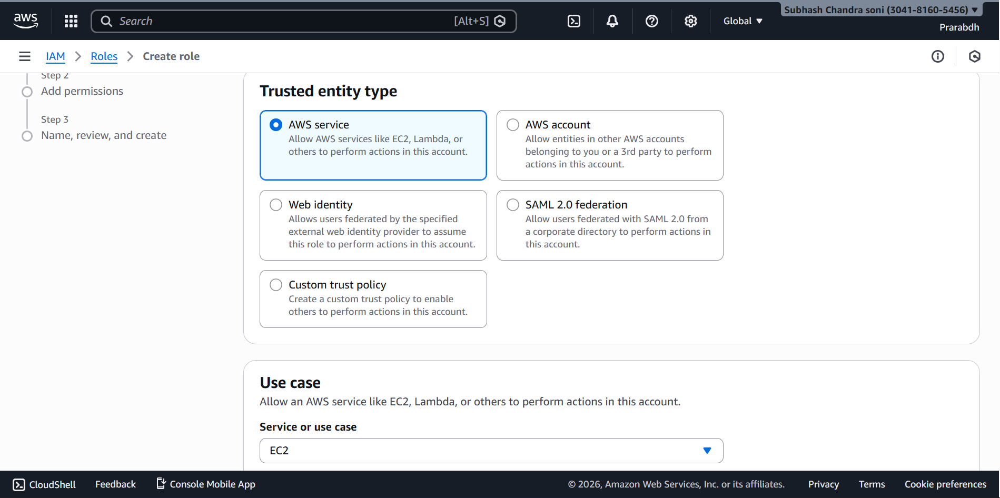
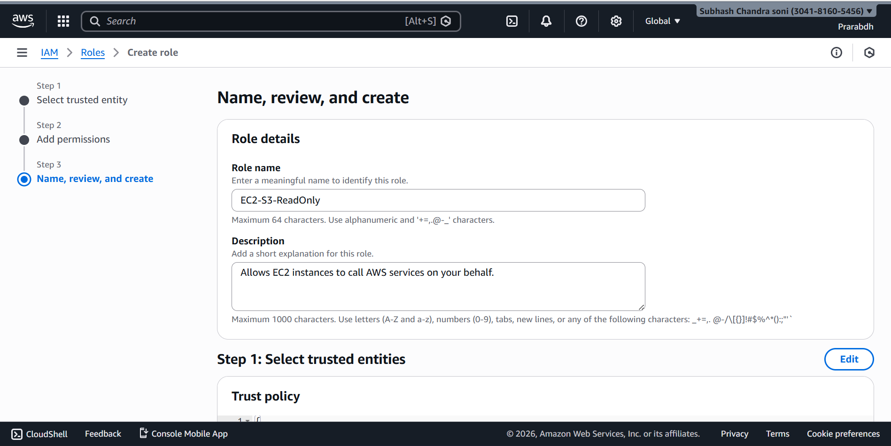
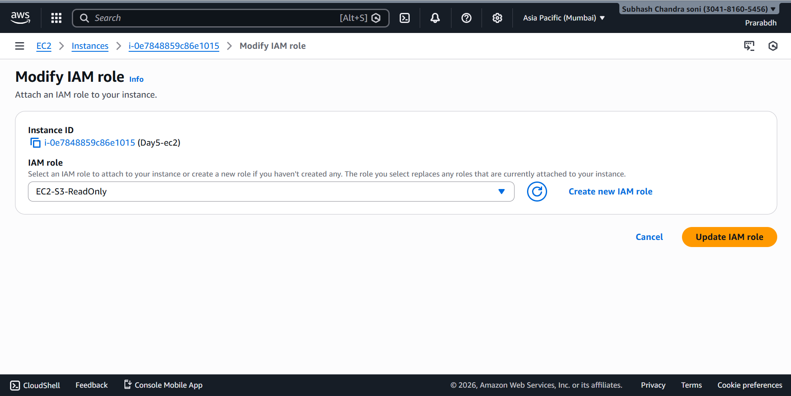
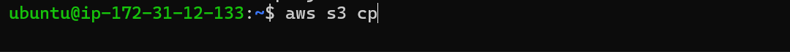
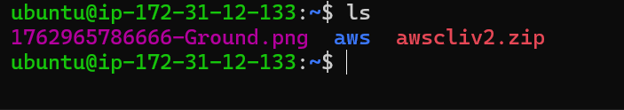

# ☁️ Cloud Engineer – Day 5  
## IAM Security Hardening

---

## 🎯 Objective

Understand how to securely allow an EC2 instance to access AWS services **without storing credentials**, using:

- IAM Roles  
- Instance Profiles  
- Temporary Security Credentials  

This is a **production-grade AWS security practice**.

---

## 🧠 Key Concepts Learned

- IAM Role vs IAM User  
- Instance Profile  
- Temporary credentials (STS)  
- Principle of Least Privilege  
- Why access keys should NEVER be stored on EC2  

---

## 🔐 Lab Architecture
- EC2 Instance
-  ↓
- IAM Role (Instance Profile)
-  ↓
- AmazonS3ReadOnlyAccess


EC2 accesses S3 securely using temporary credentials provided by AWS.

---

## 🧪 Hands-On Steps

### 1️⃣ Create IAM Role for EC2

1. Open **IAM → Roles → Create role**
2. Select **AWS Service**
3. Choose **EC2**
4. Attach policy: `AmazonS3ReadOnlyAccess`
5. Role name: **EC2-S3-ReadOnly**




✅ Role created successfully.

---

### 2️⃣ Attach IAM Role to EC2

1. Go to **EC2 → Instances**
2. Select the running instance
3. Click: **Actions → Security → Modify IAM role**
4. Attach: `EC2-S3-ReadOnly`




⏳ Wait 30–60 seconds for role propagation.

---

### 3️⃣ Verify Role Access (No Credentials Used)

Install aws cli first:

```bash
sudo apt update
```
```bash
sudo apt install unzip curl -y
```
```bash
curl "https://awscli.amazonaws.com/awscli-exe-linux-x86_64.zip" -o "awscliv2.zip"
```
```bash
unzip awscliv2.zip
```
```bash
sudo ./aws/install
```


Verify aws cli and run:

```bash
aws sts get-caller-identity
```

#### Output confirms:

- The instance is using an IAM role
- Credentials are temporary
- No access keys configured

---

### 4️⃣ Access S3 Without AWS Keys

- List S3 buckets:

```bash
aws s3 ls
```

- Download file from S3:
```bash
aws s3 cp s3://your-bucket-name/file.txt .
```


✅ Access works without:

- aws configure
- Access Key
- Secret Key

## 🔑 Important Observations

- No credentials exist in:
```bash
~/.aws/credentials
```

- Credentials are automatically:
    - Generated
    - Rotated
    - Expired
    - Managed by AWS STS internally


## 🎯 Final Learning Outcome

- Understood IAM Role architecture
- Learned instance profiles
- Used temporary credentials securely
- Implemented least-privilege access
- Followed AWS production security standards
