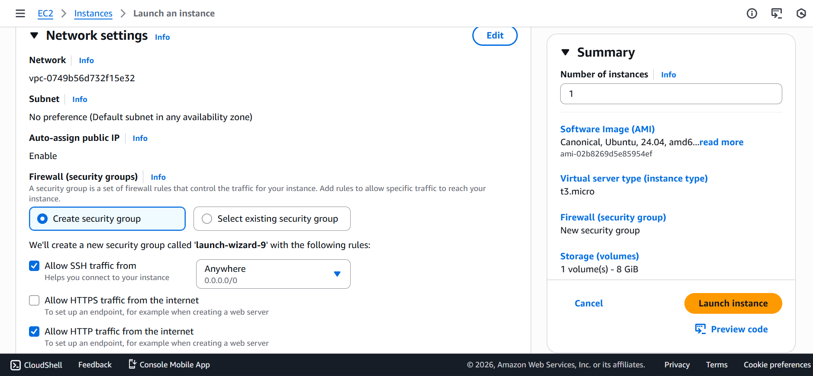
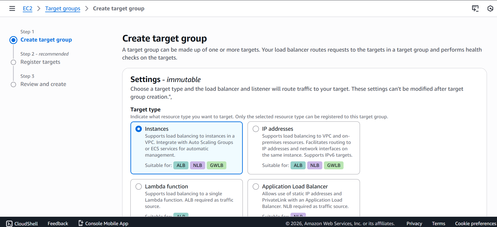
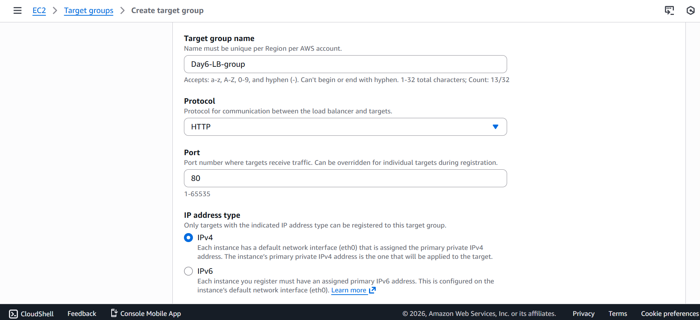
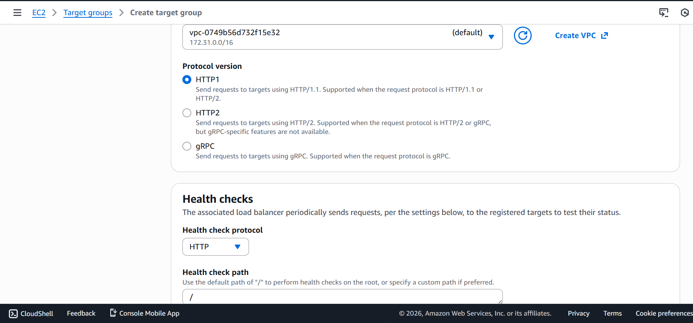
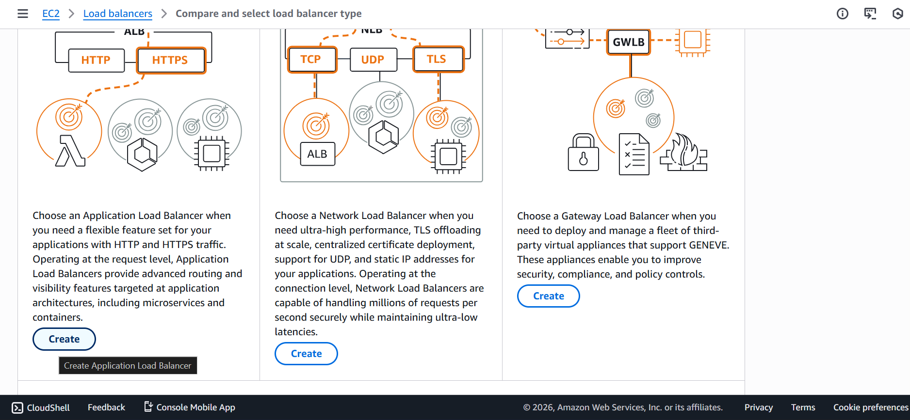
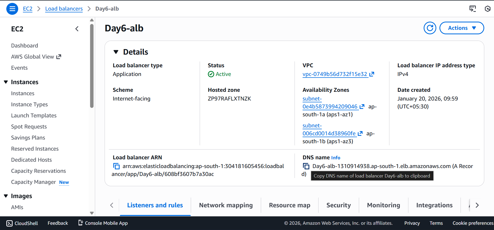
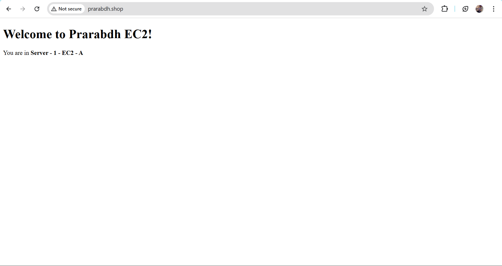

# Day 6 – Application Load Balancer (ALB)

## Objective
To configure an Application Load Balancer (ALB) that distributes incoming HTTP traffic across multiple EC2 instances, ensuring high availability and fault tolerance.

---

## Architecture Overview

| User |
| --- |
| ↓ |
| Application Load Balancer (ALB) |
| ↓ |
| Target Group |
| ├── EC2 Instance 1 (Web Server) |
| └── EC2 Instance 2 (Web Server) |

---

## Services Used
- Amazon EC2
- Application Load Balancer (ALB)
- Target Groups
- VPC
- Security Groups
- Custom Domain (Optional)
---

## Prerequisites
- Two running EC2 instances
- Web server installed (Nginx / Apache)
- HTTP (port 80) allowed in EC2 security group
- Instances launched in the same VPC




---

## Implementation Steps

### Step 1: Configure Web Servers

Installed Nginx on both EC2 instances:

```bash
sudo apt update
sudo apt install nginx -y
sudo systemctl start nginx
Updated the homepage on each instance to identify traffic routing.
```

EC2 Instance 1

```html
<h1>Server 1 - EC2 A</h1>
```

EC2 Instance 2

```html
<h1>Server 2 - EC2 B</h1>
```

Change web page interface so eaily differentiate

```bash
sudo nano /var/www/html/index.nginx-debian.html
```


### Step 2: Create Target Group

1. Target type: Instance
2. Protocol: HTTP
3. Port: 80
4. Health check path: /
5. VPC: Same as EC2
6. Registered both EC2 instances as targets.

 


      

### Step 3: Create Application Load Balancer

1. Load balancer type: Application Load Balancer
2. Scheme: Internet-facing
3. IP type: IPv4
4. Selected at least two public subnets
5. Listener: HTTP (80)
6. Forward traffic to the created target group
7. Created a dedicated security group allowing HTTP (80)
8. Step 4: Test Load Balancing
Used the ALB DNS name:

```
xxxxxx.ap-south-1.elb.amazonaws.com
```
- On refreshing the browser multiple times, traffic was routed alternately between:
    - Server 1 – EC2 A
    - Server 2 – EC2 B

- Create new Security Group for ALB allowing port 80




- Open the DNS provided by ALB
- use http:// ✅ https://❌



- Change Security Group of Both EC2 instance


- Change port 80 source to ALB Security Group


- This confirmed successful load balancing.

### Step 4: Your own Domain (optional)

- Buy Domain name:
    - Godaddy 
    - Route 53 aws
    - Hostinger

- Update DNS record


- Wait for few minutes


## Key Learnings

- ALB operates at Layer 7 (Application Layer)
- Uses DNS-based routing, not static IPs
- Automatically performs health checks
- Distributes traffic only to healthy targets
- Supports path-based and host-based routing
- Enables high availability architecture

## Production Notes

- In real-world architecture:
    - ALB is placed in public subnets
    - EC2 instances run in private subnets
    - EC2 instances do not require public IPs
    - ALB handles traffic entry and routing

## Outcome
Successfully implemented an Application Load Balancer that distributes user traffic across multiple EC2 instances, improving availability, scalability, and reliability.